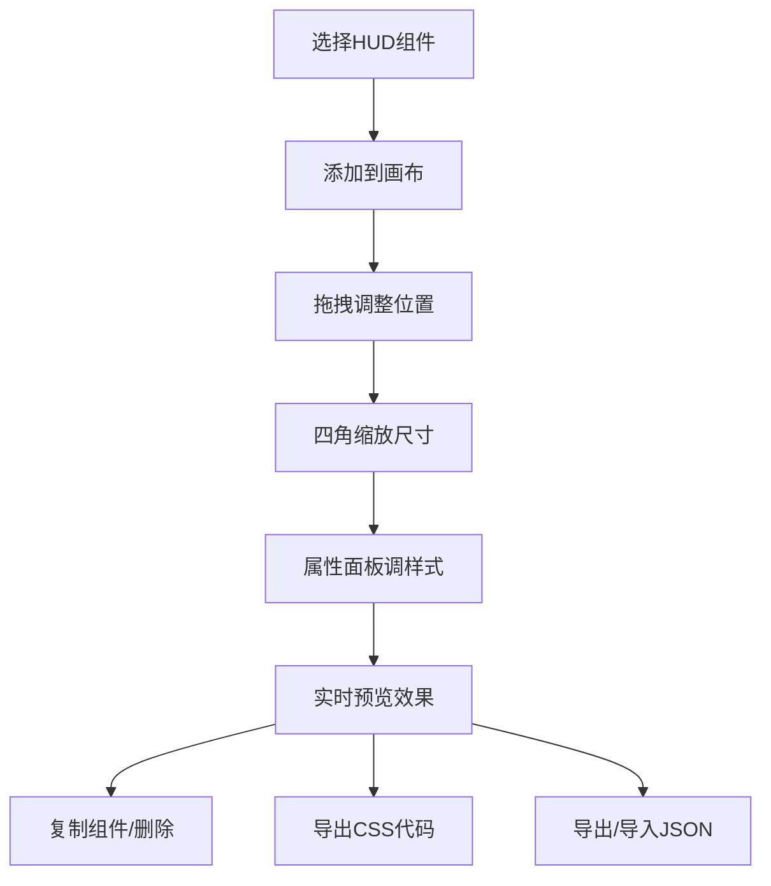

## 1. 产品概述

HUD样式实时调整与预览应用是一款面向前端开发者的可视化工具，帮助用户通过拖拽、缩放和调色HUD组件，实时生成CSS代码，加速个人主页和数字名片的原型设计流程。

- 解决的问题：前端开发者在制作HUD元素时需要反复修改CSS参数才能看到效果，拖慢设计流程
- 目标用户：前端开发者、UI设计师、游戏界面设计师
- 产品价值：将HUD样式调整效率提升80%，无需编写代码即可预览效果并直接导出可用CSS

## 2. 核心功能

### 2.1 用户角色
| 角色 | 注册方式 | 核心权限 |
|------|----------|----------|
| 前端开发者 | 无需注册 | 完整使用所有功能 |

### 2.2 功能模块
1. **主画布预览区**：拖拽、缩放HUD组件，实时预览效果
2. **左侧操作面板**：HUD组件库、预设主题切换、导入导出
3. **右侧属性面板**：样式编辑、CSS代码实时生成预览

### 2.3 页面详情
| 页面名称 | 模块名称 | 功能描述 |
|-----------|----------|-----------|
| 主应用页 | HUD组件库 | 6种HUD模板（十字准心、速度指示条、雷达图、迷你地图、血条、任务文本），支持添加、复制、删除 |
| 主应用页 | 拖拽画布 | 960x640px画布，支持拖拽移动、四角缩放（40x40px最小尺寸），拖拽时半透明虚线轮廓反馈 |
| 主应用页 | 属性面板 | 颜色选择器（ChromePicker，支持alpha）、边框样式、背景填充（纯色/渐变）、阴影、圆角、旋转角度 |
| 主应用页 | CSS代码生成 | 实时生成CSS代码，包含-moz-、-webkit-前缀，支持单组件和整体导出 |
| 主应用页 | 预设主题 | 5种预设主题（赛博朋克绿、军事黄、科幻蓝、极简白、复古棕） |
| 主应用页 | 导入导出 | JSON配置导入导出 |
| 主应用页 | 状态栏 | 显示选中组件名称、坐标、尺寸信息 |

## 3. 核心流程

用户从左侧组件库选择HUD组件添加到画布 → 在画布上拖拽调整位置和尺寸 → 在右侧属性面板调整样式 → 实时预览效果 → 复制/导出CSS代码或JSON配置

## 4. 用户界面设计

### 4.1 设计风格
- 主背景：#1a1a2e
- 侧边栏/属性面板背景：#16213e
- 文字：#e0e0e0
- 高亮色：#0f3460
- 画布背景：#0a0a1a
- 按钮：玻璃拟态效果，背景rgba(255,255,255,0.1)，圆角12px，悬停rgba(255,255,255,0.2)，0.2s过渡
- 字体：Orbitron（标题）+ JetBrains Mono（代码）

### 4.2 页面设计概述
| 页面名称 | 模块名称 | UI元素 |
|-----------|----------|--------|
| 主应用页 | 左侧面板 | 玻璃拟态按钮、组件图标、预设切换、滚动区域 |
| 主应用页 | 中央画布 | 虚线边界2px #333、拖拽虚线轮廓rgba(0,150,255,0.4)、缩放手柄 |
| 主应用页 | 右侧面板 | ChromePicker颜色选择器、滑块、下拉框、代码预览区（深色滚动条 |
| 主应用页 | 底部状态栏 | 组件名称、坐标(x,y)、尺寸(w×h) |

### 4.3 响应式
- 桌面端（≥1200px）：左中右三栏布局
- 平板端（768px-1200px）：属性面板折叠为底部抽屉
- 移动端（<768px）：侧边栏变为顶部可收缩工具栏

### 4.4 动画效果
- 组件添加：scale 0.8→1.0，opacity 0→1，0.3s
- 组件删除：反向动画
- 预设切换：依次0.05s间隔，颜色过渡0.4s ease
- 拖拽鼠标指针：grabbing
