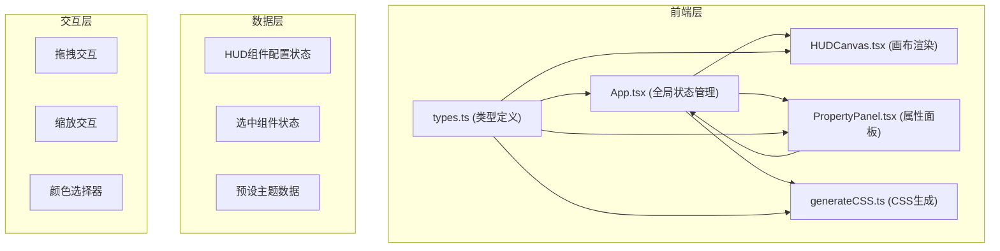

## 1. 架构设计



## 2. 技术描述

- 前端框架：React 18 + TypeScript
- 构建工具：Vite
- 状态管理：React useState/useCallback（轻量级状态提升
- 动画库：framer-motion
- 颜色选择器：react-color (ChromePicker)
- HTTP客户端：axios（预留）
- 图标：lucide-react

## 3. 项目结构

```
src/
├── App.tsx                 # 主应用组件，全局状态管理
├── components/
│   ├── HUDCanvas.tsx     # 画布组件，拖拽缩放
│   └── PropertyPanel.tsx # 属性面板，样式编辑
├── types.ts              # 类型定义
├── utils/
│   └── generateCSS.ts  # CSS生成工具
└── main.tsx             # 入口文件
```

## 4. 数据模型

### 4.1 HUDComponent 接口
- id: string
- type: 'crosshair' | 'speedbar' | 'radar' | 'minimap' | 'healthbar' | 'missiontext'
- name: string
- x: number
- y: number
- width: number
- height: number
- style: {
    color: string
    borderStyle: 'none' | 'solid' | 'dashed'
    borderWidth: number
    background: {
      type: 'solid' | 'gradient'
      color: string
      gradient?: { direction: string, colors: string[] }
    }
    shadow: { x: number, y: number, blur: number, color: string }
    borderRadius: number
    rotate: number
  }

### 4.2 PresetTheme 接口
- name: string
- colors: { primary: string, secondary: string, accent: string }
- fontFamily: string

## 5. 核心数据流

1. 用户操作 PropertyPanel → 更新 App.tsx 中的 components 状态
2. App.tsx → 传递给 HUDCanvas 渲染
3. HUDCanvas 拖拽/缩放 → 更新 components 状态
4. App.tsx → 传递给 generateCSS.ts 生成CSS
5. generateCSS.ts → 返回CSS字符串给 PropertyPanel 显示
