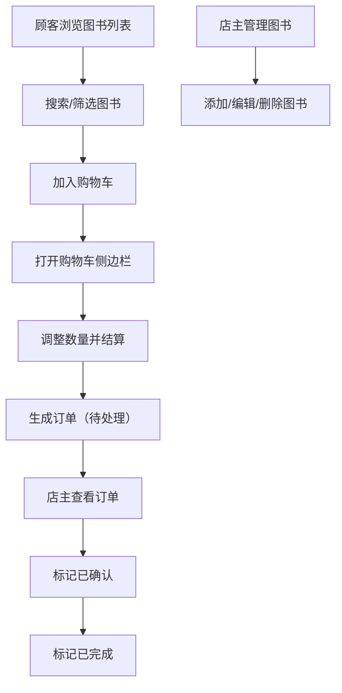

## 1. 产品概述

小鹿书屋是一款面向小型独立书店的轻量级线上运营工具，帮助店主在数字化转型过程中以极低成本实现图书库存管理、顾客在线下单和店主订单处理。
- 解决实体书店缺乏轻量级、低成本在线运营工具的痛点
- 目标用户：小型独立书店店主及到店/线上顾客

## 2. 核心功能

### 2.1 用户角色
| 角色 | 注册方式 | 核心权限 |
|------|----------|----------|
| 店主 | 默认身份 | 添加/编辑/删除图书、管理订单状态 |
| 顾客 | 无需注册 | 浏览图书、搜索筛选、加入购物车、下单结算 |

### 2.2 功能模块
1. **图书列表页（顾客视图）**：图书网格卡片展示、搜索筛选、加入购物车、购物车侧边栏结算
2. **图书管理页（店主视图）**：添加/编辑/删除图书、搜索筛选
3. **订单管理页（店主视图）**：订单列表、状态标记（已确认/已完成）、行高亮动画

### 2.3 页面详情
| 页面名称 | 模块名称 | 功能描述 |
|----------|----------|----------|
| 图书列表页 | 图书网格展示 | 以200×280px卡片展示图书封面、书名、作者、价格，底部有"加入购物车"按钮 |
| 图书列表页 | 搜索与筛选 | 按书名/作者搜索，按价格升序/降序排序 |
| 图书列表页 | 购物车侧边栏 | 从右侧滑入，展示已选图书、数量调整、总价、结算按钮 |
| 图书管理页 | 添加/编辑图书 | 表单输入书名、作者、ISBN、定价、库存数量、封面URL |
| 图书管理页 | 图书卡片管理 | 卡片底部编辑（#2d6a4f）和删除（#c1121f）按钮 |
| 订单管理页 | 订单列表 | 交替行背景，每行高60px，显示订单信息和状态 |
| 订单管理页 | 状态更新 | 标记为"已确认"或"已完成"，更新时行以#ffe066高亮0.5s |

## 3. 核心流程

顾客下单流程：顾客浏览图书列表 → 搜索/筛选找到目标图书 → 点击加入购物车 → 打开购物车侧边栏查看 → 调整数量 → 点击结算 → 生成订单（状态：待处理）

店主管理流程：店主登录管理页 → 添加/编辑/删除图书库存 → 切换到订单管理页 → 查看新订单 → 标记为"已确认" → 备货后标记为"已完成"

## 4. 用户界面设计

### 4.1 设计风格
- 主色：#2d6a4f（深森林绿），辅色：#c4b998（暖沙金），背景：#faf7f0（暖白），文字：#3a3a3a
- 按钮风格：圆角矩形，悬停时加深颜色并缩放5%，0.2s过渡动画
- 字体：Playfair Display（标题）+ DM Sans（正文）
- 布局风格：卡片网格布局，顶部导航栏，右侧滑入购物车
- 图标风格：线性简约图标（Lucide Icons）

### 4.2 页面设计概览
| 页面名称 | 模块名称 | UI元素 |
|----------|----------|--------|
| 图书列表页 | 顶部导航 | 暖白背景导航栏，品牌Logo，购物车图标按钮，切换店主/顾客视图 |
| 图书列表页 | 搜索筛选区 | 圆角8px输入框，边框#c4b998，聚焦#2d6a4f，排序下拉框 |
| 图书列表页 | 图书网格 | 200×280px卡片，圆角12px，1px #d1ccc0边框，阴影0 2px 8px rgba(0,0,0,0.06) |
| 图书列表页 | 购物车侧边栏 | 宽320px，背景#f8f5f0，0.3s ease滑入动画 |
| 订单管理页 | 订单列表 | 每行60px，交替背景#f0ebe3和#f8f5f0，状态更新#ffe066高亮0.5s |

### 4.3 响应式设计
- 桌面优先设计，移动端（<768px）卡片变为两列
- 购物车侧边栏在移动端全屏覆盖
- 搜索框宽度自适应，占卡片区域80%

### 4.4 性能要求
- 图书列表加载时间不超过1秒（本地模拟数据）
- 所有过渡动画使用CSS transform和opacity优先，避免重排
- 购物车侧边栏使用framer-motion实现流畅滑入
