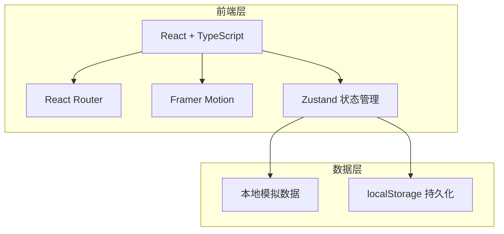
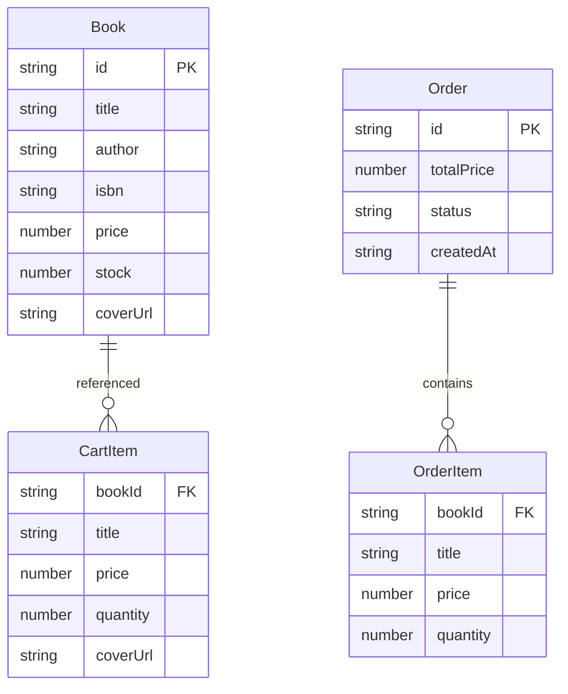

## 1. 架构设计



纯前端应用，无后端服务。所有数据存储在内存中并通过 localStorage 进行持久化。

## 2. 技术说明
- 前端：React@18 + TypeScript + Vite
- 初始化工具：vite-init（react-ts 模板）
- 状态管理：Zustand
- 路由：react-router-dom
- 动画：framer-motion
- 后端：无（纯前端）
- 数据库：无（本地模拟数据 + localStorage）

## 3. 路由定义
| 路由 | 用途 |
|------|------|
| / | 图书列表页（顾客视图），包含搜索筛选和购物车 |
| /manage | 图书管理页（店主视图），包含添加/编辑/删除图书 |
| /orders | 订单管理页（店主视图），包含订单列表和状态管理 |

## 4. API 定义
无后端API。使用 Zustand store 管理状态，数据结构定义如下：

```typescript
interface Book {
  id: string;
  title: string;
  author: string;
  isbn: string;
  price: number;
  stock: number;
  coverUrl: string;
}

interface Order {
  id: string;
  items: { bookId: string; title: string; price: number; quantity: number }[];
  totalPrice: number;
  status: '待处理' | '已确认' | '已完成';
  createdAt: string;
}

interface CartItem {
  bookId: string;
  title: string;
  price: number;
  quantity: number;
  coverUrl: string;
}
```

## 5. 服务端架构图
不适用（纯前端应用）

## 6. 数据模型

### 6.1 数据模型定义



### 6.2 初始数据
预置8-10本示例图书数据，覆盖不同类别和价格区间，确保图书列表页有丰富展示效果。
