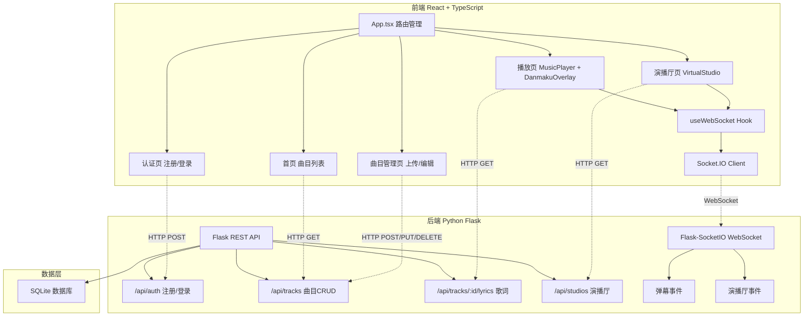
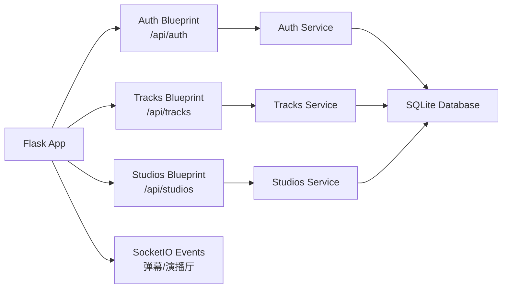
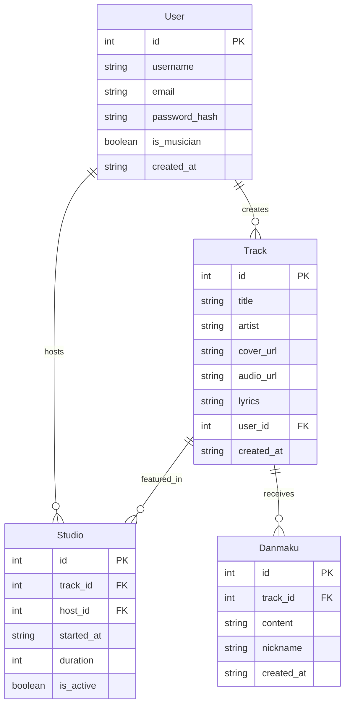

## 1. 架构设计



## 2. 技术说明

- **前端**：React@18 + TypeScript + Vite + Bootstrap + Framer Motion + Socket.IO Client + Axios + React Router DOM
- **初始化工具**：Vite
- **后端**：Python Flask + Flask-SocketIO + Flask-CORS + PyJWT + SQLite
- **数据库**：SQLite（轻量级，无需额外服务）
- **实时通信**：Flask-SocketIO (WebSocket)
- **认证**：JWT (PyJWT)

## 3. 路由定义

| 路由 | 用途 |
|------|------|
| / | 首页曲目列表，搜索过滤 |
| /play/:id | 曲目播放页，弹幕互动 |
| /studio/:id | 虚拟演播厅页面 |
| /login | 用户登录 |
| /register | 用户注册 |
| /upload | 音乐人上传曲目 |
| /edit/:id | 音乐人编辑曲目 |

## 4. API定义

### 4.1 认证相关

```typescript
interface RegisterRequest {
  username: string;
  email: string;
  password: string;
}

interface LoginRequest {
  email: string;
  password: string;
}

interface AuthResponse {
  token: string;
  user: {
    id: number;
    username: string;
    email: string;
    is_musician: boolean;
  };
}

POST /api/auth/register  -> RegisterRequest -> AuthResponse
POST /api/auth/login     -> LoginRequest -> AuthResponse
```

### 4.2 曲目相关

```typescript
interface Track {
  id: number;
  title: string;
  artist: string;
  cover_url: string;
  audio_url: string;
  lyrics: string;
  user_id: number;
  created_at: string;
}

interface TrackListResponse {
  tracks: Track[];
  total: number;
}

GET    /api/tracks              -> TrackListResponse
POST   /api/tracks              -> CreateTrackRequest -> Track
GET    /api/tracks/:id          -> Track
PUT    /api/tracks/:id          -> UpdateTrackRequest -> Track
DELETE /api/tracks/:id          -> { message: string }
GET    /api/tracks/:id/lyrics   -> { lyrics: string }
```

### 4.3 演播厅相关

```typescript
interface Studio {
  id: number;
  track_id: number;
  host_id: number;
  started_at: string;
  duration: number;
  is_active: boolean;
}

GET  /api/studios           -> Studio[]
POST /api/studios           -> { track_id: number } -> Studio
GET  /api/studios/:id       -> Studio
```

### 4.4 WebSocket事件

```typescript
client -> server:
  "danmaku_send"      { track_id: number, content: string, nickname: string }
  "studio_join"       { studio_id: number, user_id: number, nickname: string }
  "studio_chat"       { studio_id: number, user_id: number, content: string }
  "studio_leave"      { studio_id: number, user_id: number }

server -> client:
  "danmaku_receive"   { content: string, nickname: string, color: string, font_size: number }
  "studio_user_join"  { user_id: number, nickname: string, color: string }
  "studio_user_chat"  { user_id: number, nickname: string, content: string, color: string }
  "studio_host_on"    { host_nickname: string, track_title: string }
  "studio_end"        { message: string }
```

## 5. 服务器架构图



## 6. 数据模型

### 6.1 数据模型定义



### 6.2 数据定义语言

```sql
CREATE TABLE users (
    id INTEGER PRIMARY KEY AUTOINCREMENT,
    username TEXT NOT NULL UNIQUE,
    email TEXT NOT NULL UNIQUE,
    password_hash TEXT NOT NULL,
    is_musician BOOLEAN DEFAULT FALSE,
    created_at TIMESTAMP DEFAULT CURRENT_TIMESTAMP
);

CREATE TABLE tracks (
    id INTEGER PRIMARY KEY AUTOINCREMENT,
    title TEXT NOT NULL,
    artist TEXT NOT NULL,
    cover_url TEXT,
    audio_url TEXT,
    lyrics TEXT,
    user_id INTEGER NOT NULL,
    created_at TIMESTAMP DEFAULT CURRENT_TIMESTAMP,
    FOREIGN KEY (user_id) REFERENCES users(id)
);

CREATE TABLE studios (
    id INTEGER PRIMARY KEY AUTOINCREMENT,
    track_id INTEGER NOT NULL,
    host_id INTEGER NOT NULL,
    started_at TIMESTAMP DEFAULT CURRENT_TIMESTAMP,
    duration INTEGER DEFAULT 1800,
    is_active BOOLEAN DEFAULT TRUE,
    FOREIGN KEY (track_id) REFERENCES tracks(id),
    FOREIGN KEY (host_id) REFERENCES users(id)
);

CREATE TABLE danmakus (
    id INTEGER PRIMARY KEY AUTOINCREMENT,
    track_id INTEGER NOT NULL,
    content TEXT NOT NULL,
    nickname TEXT NOT NULL,
    created_at TIMESTAMP DEFAULT CURRENT_TIMESTAMP,
    FOREIGN KEY (track_id) REFERENCES tracks(id)
);

CREATE INDEX idx_tracks_user_id ON tracks(user_id);
CREATE INDEX idx_danmakus_track_id ON danmakus(track_id);
CREATE INDEX idx_studios_track_id ON studios(track_id);
CREATE INDEX idx_studios_is_active ON studios(is_active);
```
