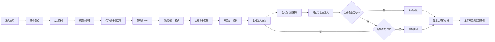

## 1. 产品概述

塔防游戏关卡编辑器与战斗模拟应用，允许玩家自定义地图路径、部署防御塔位置，并通过实时战斗模拟测试阵型策略的有效性。

- 核心目标：为塔防游戏爱好者提供一个可自定义、可测试的策略实验平台
- 目标用户：塔防游戏玩家、策略游戏爱好者
- 产品价值：将关卡设计权交给玩家，支持策略验证与战斗回放，提升游戏可玩性和创造性

## 2. 核心功能

### 2.1 用户角色

| 角色 | 注册方式 | 核心权限 |
|------|----------|----------|
| 玩家 | 无需注册 | 关卡编辑、战斗模拟、数据回放 |

### 2.2 功能模块

1. **关卡编辑器**：10x10网格地图编辑、路径绘制、防御塔放置
2. **战斗模拟引擎**：敌人波次生成、路径移动、塔攻击计算、生命值管理
3. **战斗界面**：实时渲染地图、敌人、防御塔、游戏状态面板
4. **数据持久化**：关卡保存与加载、战斗数据记录与回放
5. **信息面板**：塔详情展示、波次信息、生命值与金币显示

### 2.3 页面详情

| 页面名称 | 模块名称 | 功能描述 |
|----------|----------|----------|
| 主界面 | 关卡编辑工具栏 | 切换编辑模式（路径/塔位）、保存关卡、加载关卡、开始战斗 |
| 主界面 | 网格地图区 | 10x10网格画布，支持点击编辑路径和塔位，悬停反馈动画 |
| 主界面 | 战斗信息栏 | 显示当前波次、生命值进度条、金币数量、开始/暂停按钮 |
| 主界面 | 塔详情面板 | 点击已放置塔显示攻击力、射程、攻击目标 |
| 主界面 | 游戏结束模态框 | 显示战斗结果、重新开始选项 |

## 3. 核心流程

## 4. 用户界面设计

### 4.1 设计风格
- **主题色系**：深色科技风
  - 主背景：#0f172a（深蓝黑）
  - 面板背景：#1e293b（深石板灰）
  - 网格线：#334155（中石板灰）
  - 主色调：#3b82f6（亮蓝）
  - 生命值：#ef4444（警戒红）
  - 金币：#fbbf24（金黄）
  - 路径：#475569（灰蓝）
  - 塔位：#065f46（深绿）/ #047857（亮绿悬停）

- **按钮样式**：圆角矩形，悬停平滑过渡（0.3s ease），主按钮蓝色背景白色文字
- **字体**：现代无衬线字体，字体颜色 #e2e8f0
- **布局风格**：左主区（700x700地图）+ 右侧信息栏（280px宽），整体居中
- **动效风格**：framer-motion驱动，所有交互元素带平滑过渡

### 4.2 页面设计概述

| 页面名称 | 模块名称 | UI元素 |
|----------|----------|--------|
| 主界面 | 网格地图区 | 10x10网格（40px/格），发光边框（0 0 12px rgba(59,130,246,0.2)），路径圆角4px，塔位悬停放大1.1倍 |
| 主界面 | 战斗信息栏 | 背景#0f172a，圆角16px，波次字体18px颜色#f8fafc，红色生命值进度条，黄色金币数字 |
| 主界面 | 塔详情面板 | 背景#334155，圆角12px，0.3秒fade-in动画，显示攻击力、射程、目标 |
| 主界面 | 游戏结束模态框 | 居中，宽400px，背景#1e293b，圆角24px，0.4s scale动画 |
| 主界面 | 防御塔渲染 | 16x16蓝色方块，顶端旋转金色光环（透明度0.3）指示射程 |
| 主界面 | 敌人渲染 | 直径12px红色圆点，带拖尾动画 |

### 4.3 响应式

- 桌面端优先设计，固定布局适配标准屏幕
- 主内容区居中对齐，最小分辨率支持1280x720

### 4.4 动画与交互细节

- **网格悬停**：可放置塔位悬停时从#065f46变为#047857，放大1.1倍，0.2s过渡
- **按钮交互**：所有按钮悬停背景色变化，0.3s缓动
- **敌人移动**：红色圆点带拖尾效果，沿路径平滑移动
- **塔攻击效果**：金色光环旋转，攻击时轻微闪烁
- **模态框弹出**：0.4s scale动画从0.8到1.0
- **面板切换**：0.3s fade-in/out过渡

## 5. 性能要求

- 战斗引擎保持60FPS稳定运行
- 敌人数量达到20个时帧率不低于50FPS
- 战斗更新间隔16ms（约60FPS）
- 塔攻击计算每0.5秒执行一次
