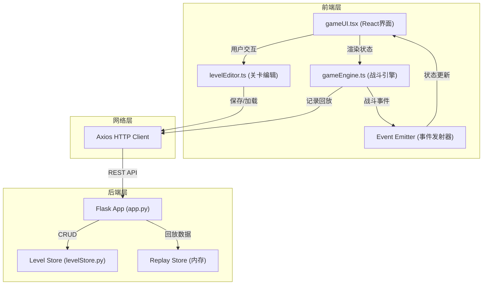
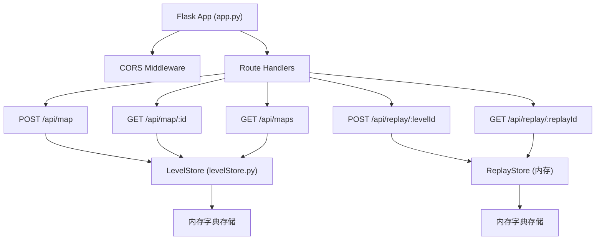
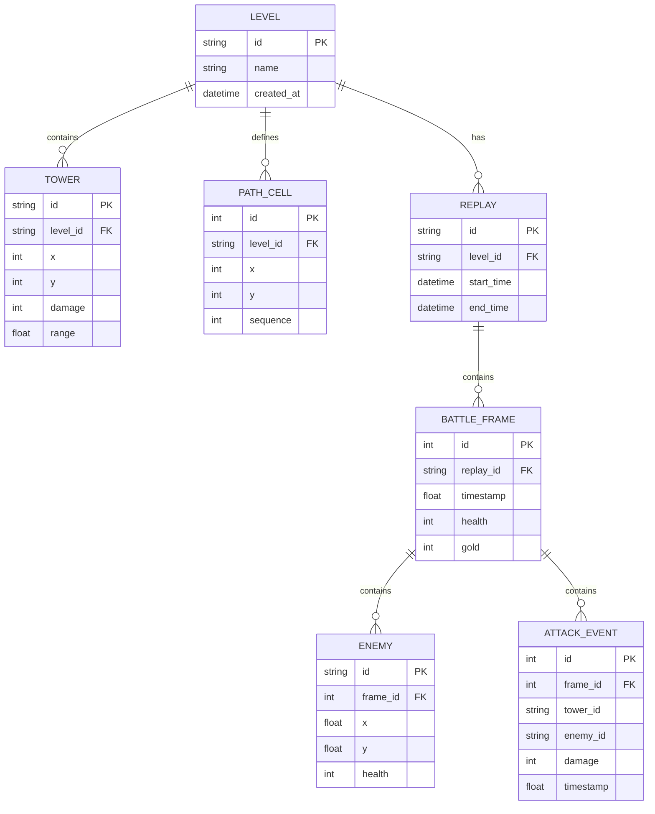

## 1. 架构设计



## 2. 技术描述

- **前端框架**: React@18 + TypeScript@5 + Vite@5
- **前端构建**: Vite@5 + @vitejs/plugin-react@4
- **动画库**: framer-motion@11
- **HTTP客户端**: axios@1
- **后端框架**: Python Flask@3
- **数据存储**: 内存存储（关卡仓库 + 回放仓库）
- **包管理**: npm (前端) / pip (后端)

### 2.1 前端技术栈详解

| 技术 | 版本 | 用途 |
|------|------|------|
| React | ^18.2.0 | 用户界面组件化开发 |
| React DOM | ^18.2.0 | DOM渲染 |
| TypeScript | ^5.3.0 | 类型安全 |
| Vite | ^5.0.0 | 构建工具与开发服务器 |
| @vitejs/plugin-react | ^4.2.0 | React JSX支持 |
| framer-motion | ^11.0.0 | 动画效果 |
| axios | ^1.6.0 | HTTP请求 |
| @types/react | ^18.2.0 | React类型定义 |
| @types/react-dom | ^18.2.0 | React DOM类型定义 |
| @types/node | ^20.10.0 | Node.js类型定义 |

### 2.2 后端技术栈

| 技术 | 版本 | 用途 |
|------|------|------|
| Python | ^3.9 | 运行环境 |
| Flask | ^3.0.0 | Web框架 |
| flask-cors | ^4.0.0 | 跨域支持 |

## 3. 项目结构

```
auto132/
├── package.json          # 前端依赖配置
├── vite.config.js        # Vite构建配置
├── tsconfig.json         # TypeScript配置
├── index.html            # 入口HTML
├── src/
│   ├── levelEditor.ts    # 关卡编辑模块
│   ├── gameEngine.ts     # 战斗引擎模块
│   └── gameUI.tsx        # 用户界面模块
└── backend/
    ├── app.py            # Flask应用主文件
    └── levelStore.py     # 内存关卡仓库
```

## 4. API 定义

### 4.1 TypeScript 类型定义

```typescript
// 格子类型
type CellType = 'empty' | 'path' | 'tower_slot';

// 位置坐标
interface Position {
  x: number;
  y: number;
}

// 防御塔配置
interface Tower {
  id: string;
  position: Position;
  damage: number;
  range: number;
  attackSpeed: number;
  lastAttackTime: number;
  targetId: string | null;
}

// 敌人配置
interface Enemy {
  id: string;
  position: Position;
  health: number;
  maxHealth: number;
  speed: number;
  pathIndex: number;
  reward: number;
}

// 关卡配置
interface LevelConfig {
  id?: string;
  name: string;
  grid: CellType[][];
  path: Position[];
  towers: Tower[];
  createdAt?: number;
}

// 战斗状态
interface GameState {
  isRunning: boolean;
  isPaused: boolean;
  currentWave: number;
  totalWaves: number;
  health: number;
  maxHealth: number;
  gold: number;
  enemies: Enemy[];
  towers: Tower[];
  gameOver: boolean;
  victory: boolean;
}

// 战斗帧数据（用于回放）
interface BattleFrame {
  timestamp: number;
  enemies: Enemy[];
  towers: Tower[];
  health: number;
  gold: number;
  attackEvents: AttackEvent[];
}

// 攻击事件
interface AttackEvent {
  towerId: string;
  enemyId: string;
  damage: number;
  timestamp: number;
}

// 回放数据
interface ReplayData {
  levelId: string;
  frames: BattleFrame[];
  startTime: number;
  endTime: number;
}
```

### 4.2 REST API 接口

| 方法 | 路径 | 描述 | 请求体 | 响应 |
|------|------|------|--------|------|
| POST | /api/map | 保存关卡配置 | `LevelConfig` | `{ id: string, success: boolean }` |
| GET | /api/map/:id | 获取关卡配置 | - | `LevelConfig` |
| GET | /api/maps | 获取所有关卡列表 | - | `LevelConfig[]` |
| POST | /api/replay/:levelId | 记录战斗回放数据 | `ReplayData` | `{ success: boolean, replayId: string }` |
| GET | /api/replay/:replayId | 获取回放数据 | - | `ReplayData` |
| GET | /api/health | 健康检查 | - | `{ status: 'ok' }` |

### 4.3 API 响应示例

**POST /api/map 响应:**
```json
{
  "success": true,
  "id": "level_abc123",
  "message": "Level saved successfully"
}
```

**GET /api/map/:id 响应:**
```json
{
  "id": "level_abc123",
  "name": "My Level",
  "grid": [["empty", "path", "..."], ["..."]],
  "path": [{"x": 0, "y": 5}, {"x": 1, "y": 5}, "..."],
  "towers": [{"id": "t1", "position": {"x": 2, "y": 3}, "..."}],
  "createdAt": 1703712000000
}
```

## 5. 后端架构



## 6. 数据模型

### 6.1 实体关系图



### 6.2 核心数据结构（Python）

```python
# levelStore.py
class LevelStore:
    def __init__(self):
        self.levels: Dict[str, dict] = {}
        self.replays: Dict[str, dict] = {}
    
    def save_level(self, level_data: dict) -> str:
        """保存关卡并返回ID"""
        level_id = f"level_{uuid.uuid4().hex[:8]}"
        level_data['id'] = level_id
        level_data['createdAt'] = time.time()
        self.levels[level_id] = level_data
        return level_id
    
    def get_level(self, level_id: str) -> Optional[dict]:
        """获取关卡配置"""
        return self.levels.get(level_id)
    
    def save_replay(self, level_id: str, replay_data: dict) -> str:
        """保存回放数据"""
        replay_id = f"replay_{uuid.uuid4().hex[:8]}"
        replay_data['replayId'] = replay_id
        replay_data['levelId'] = level_id
        self.replays[replay_id] = replay_data
        return replay_id
    
    def get_replay(self, replay_id: str) -> Optional[dict]:
        """获取回放数据"""
        return self.replays.get(replay_id)
```

## 7. 核心模块设计

### 7.1 关卡编辑模块 (levelEditor.ts)

**核心功能:**
- 初始化10x10网格，每格40x40像素
- 支持点击切换格子类型（empty → path → tower_slot → empty）
- 自动追踪路径顺序（从左到右连接的路径）
- 防御塔放置逻辑（仅能在tower_slot上放置）
- 关卡数据序列化与API调用

**关键方法:**
```typescript
class LevelEditor {
  grid: CellType[][];
  path: Position[];
  towers: Tower[];
  editMode: 'path' | 'tower';
  
  toggleCell(x: number, y: number): void;
  setEditMode(mode: 'path' | 'tower'): void;
  placeTower(x: number, y: number): boolean;
  removeTower(towerId: string): void;
  generatePath(): Position[];
  async saveLevel(name: string): Promise<string>;
  async loadLevel(id: string): Promise<void>;
  exportConfig(): LevelConfig;
}
```

### 7.2 战斗引擎模块 (gameEngine.ts)

**核心功能:**
- 16ms固定时间步长更新（~60FPS）
- 敌人波次生成（共5波：3、5、8、10、12）
- 敌人沿路径匀速移动（0.5格/秒）
- 塔自动攻击计算（射程2格，每0.5秒10点伤害）
- 生命值与金币系统
- 事件发射器与UI通信
- 战斗帧数据记录（用于回放）

**关键方法:**
```typescript
class GameEngine extends EventEmitter {
  state: GameState;
  levelConfig: LevelConfig;
  lastUpdateTime: number;
  waveTimer: number;
  attackTimers: Map<string, number>;
  replayFrames: BattleFrame[];
  
  loadLevel(config: LevelConfig): void;
  start(): void;
  pause(): void;
  resume(): void;
  reset(): void;
  private update(deltaTime: number): void;
  private spawnWave(waveNumber: number): void;
  private updateEnemies(deltaTime: number): void;
  private updateTowers(currentTime: number): void;
  private checkCollisions(): void;
  private recordFrame(): void;
  async saveReplay(): Promise<string>;
}
```

**事件列表:**
- `stateUpdate`: 游戏状态更新
- `enemySpawned`: 敌人生成
- `enemyKilled`: 敌人被击杀
- `towerAttacked`: 塔攻击
- `gameOver`: 游戏结束
- `victory`: 游戏胜利
- `waveStarted`: 波次开始

### 7.3 用户界面模块 (gameUI.tsx)

**核心组件:**
- `GameApp`: 主应用组件，管理全局状态
- `GridCanvas`: 网格地图画布组件
- `InfoPanel`: 右侧信息面板
- `TowerInfoPopup`: 塔详情弹窗
- `GameOverModal`: 游戏结束模态框
- `Toolbar`: 编辑工具栏

**动画效果 (framer-motion):**
- 塔位悬停：scale(1.1)，0.2s过渡
- 塔详情面板：fade-in，0.3s
- 模态框：scale(0.8→1.0)，0.4s
- 按钮悬停：背景色过渡，0.3s ease
- 敌人移动：平滑位置插值
- 金色光环：rotation动画，透明度0.3

## 8. 性能优化策略

1. **Canvas渲染**: 使用Canvas 2D API绘制游戏元素，减少DOM节点
2. **对象池**: 敌人生成与销毁使用对象池，避免频繁GC
3. **空间分区**: 塔攻击检测使用网格空间分区，减少碰撞检测次数
4. **requestAnimationFrame**: 使用浏览器原生动画帧调度
5. **状态更新节流**: UI状态更新限制在每帧一次，避免频繁重渲染
6. **事件批量处理**: 战斗事件批量发送给UI，减少React重渲染次数
