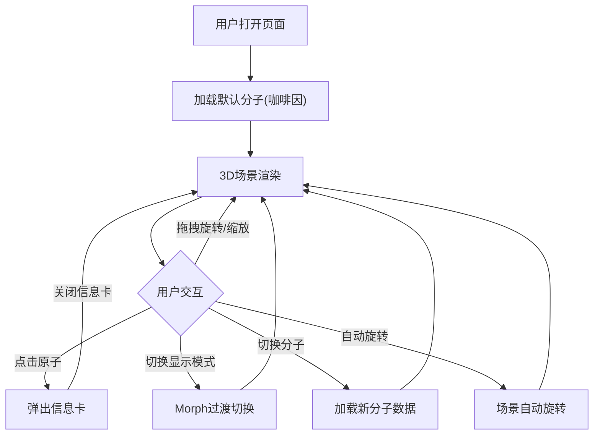

## 1. 产品概述

分子结构三维可视化工具，面向化学爱好者与学生在浏览器中交互式查看分子3D结构。
- 核心价值：以直观的3D旋转模型方式理解分子空间结构，支持球棍/空间填充两种显示模式，点击原子即可查看元素信息
- 目标用户：化学学习者、教育工作者、科学爱好者

## 2. 核心功能

### 2.2 功能模块

1. **3D分子场景页**：Three.js三维渲染、原子球体与键圆柱体、交互旋转缩放、原子点击信息展示
2. **控制面板**：显示模式切换、自动旋转开关、分子选择器、重置视角

### 2.3 页面详情

| 页面名称 | 模块名称 | 功能描述 |
|----------|----------|----------|
| 3D分子场景 | 三维渲染区 | 基于Three.js渲染分子原子球体与键圆柱体，半透明网格地面，渐变背景 |
| 3D分子场景 | 原子交互 | 鼠标拖拽旋转、滚轮缩放、点击原子弹出信息卡（元素名、坐标、化学性质） |
| 3D分子场景 | 显示模式 | 球棍模型（原子球+键圆柱）与空间填充模型（大球无键），0.3秒Morph过渡 |
| 3D分子场景 | 自动旋转 | 场景自动旋转动画，可开关 |
| 控制面板 | 模式切换 | 球棍/空间填充按钮切换，选中态高亮 |
| 控制面板 | 分子选择 | 下拉选择咖啡因、维生素C、水分子 |
| 控制面板 | 视角重置 | 一键重置相机到初始位置 |
| 原子信息卡 | 信息展示 | 显示元素符号、原子序号、坐标、描述，含复制坐标按钮 |

## 3. 核心流程

用户打开页面 → 默认加载咖啡因分子 → 通过鼠标拖拽旋转/缩放查看3D结构 → 点击原子查看信息卡 → 切换显示模式（球棍/空间填充） → 切换其他分子 → 开启/关闭自动旋转

## 4. 用户界面设计

### 4.1 设计风格

- 主色调：深蓝紫渐变（#0d0d2b → #1a1a3e），科技暗色主题
- 强调色：#3a86ff（按钮选中态）、#38b000（自动旋转开启）、#6c757d（自动旋转关闭）
- 按钮样式：圆角胶囊/圆角矩形，悬停上移2px + 发光投影
- 字体：等宽字体用于原子信息，系统字体用于UI
- 布局：全屏3D场景，控制面板浮于左上角，信息卡固定右侧

### 4.2 页面设计概览

| 页面名称 | 模块名称 | UI元素 |
|----------|----------|--------|
| 3D分子场景 | 渲染区 | 100vw×100vh全屏，渐变背景，半透明网格地面 |
| 3D分子场景 | 控制面板 | 左上角20px偏移，毛玻璃半透明卡片，圆角16px |
| 3D分子场景 | 原子信息卡 | 右侧20px偏移，距顶400px，毛玻璃黑底，180×120px |
| 3D分子场景 | 原子球体 | 碳#555555、氧#ff3333、氮#3050f8、氢#ffffff |
| 3D分子场景 | 键圆柱体 | 半径0.12，颜色#aaaaaa |

### 4.3 响应式

- 桌面优先设计，全屏3D渲染区
- 窗口宽度 < 768px 时：控制面板折叠为顶部50px小条，按钮横排图标化；信息卡宽度缩至140px，距右边界10px

### 4.4 3D场景指引

- 环境：半透明网格地面（#888888，0.15透明度），渐变背景
- 灯光：环境光强度0.4 + 方向光右上角（#ffffff，强度0.8）
- 相机：初始位置(10, 8, 12)看向原点，OrbitControls交互
- 交互：鼠标拖拽旋转、滚轮缩放、点击原子拾取
- 动画：显示模式切换0.3秒Morph过渡，自动旋转动画
- 性能：帧率 ≥ 45fps
