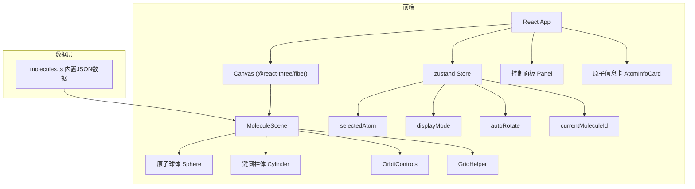
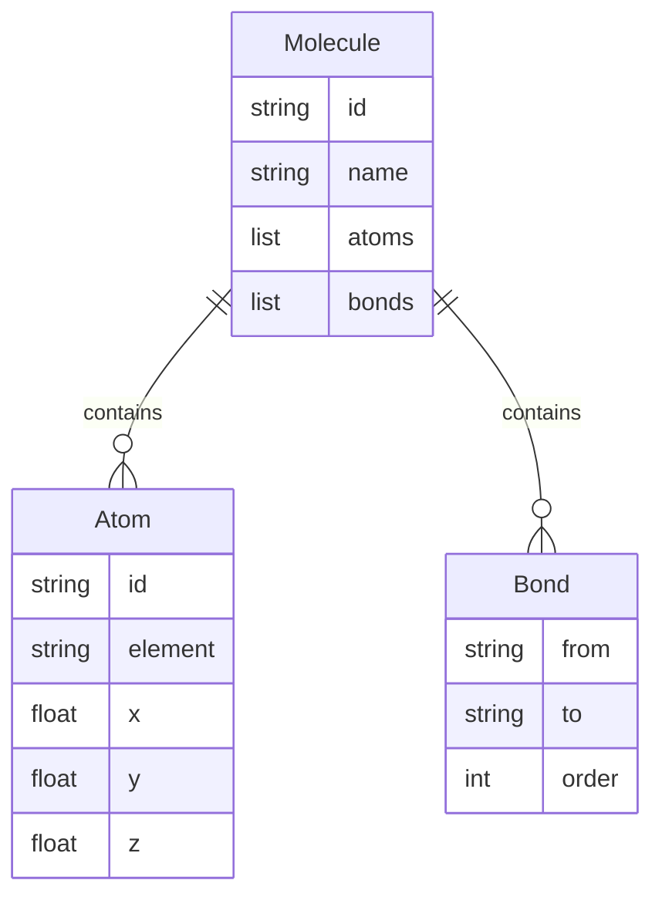

## 1. 架构设计



## 2. 技术说明

- 前端：React@18 + TypeScript + Three.js + @react-three/fiber + @react-three/drei
- 构建工具：Vite + @vitejs/plugin-react
- 状态管理：zustand
- 样式：CSS（毛玻璃效果、渐变、动画）
- 初始化工具：vite-init（react-ts模板）
- 后端：无（纯前端，内置分子数据）

## 3. 路由定义

| 路由 | 用途 |
|------|------|
| / | 单页面3D分子可视化工具 |

## 4. 数据模型

### 4.1 数据模型定义



### 4.2 核心TypeScript接口

```typescript
interface Atom {
  id: string;
  element: 'C' | 'O' | 'N' | 'H';
  x: number;
  y: number;
  z: number;
}

interface Bond {
  from: string;
  to: string;
  order: number;
}

interface Molecule {
  id: string;
  name: string;
  atoms: Atom[];
  bonds: Bond[];
}
```

## 5. 文件结构

```
├── index.html
├── package.json
├── vite.config.js
├── tsconfig.json
├── src/
│   ├── main.tsx          # React入口
│   ├── App.tsx           # 主组件，集成Canvas/Panel/AtomInfoCard
│   ├── types.ts          # TypeScript接口定义
│   ├── style.css         # 全局样式
│   ├── data/
│   │   └── molecules.ts  # 3种分子内置数据
│   ├── components/
│   │   ├── MoleculeScene.tsx  # Three.js场景组件
│   │   ├── Panel.tsx          # 控制面板组件
│   │   └── AtomInfoCard.tsx   # 原子信息卡片组件
│   └── store/
│       └── useStore.ts   # zustand全局状态
```
