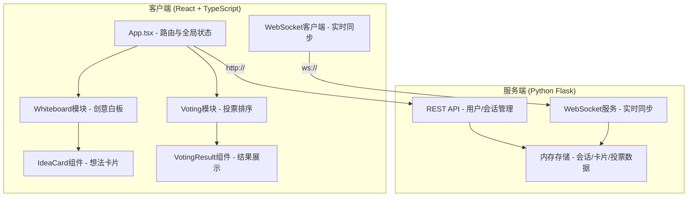

# 团队脑暴与创意投票排序应用 - 技术架构文档

## 1. 整体架构

### 1.1 架构概览



### 1.2 技术选型

| 层级 | 技术 | 版本 | 说明 |
|------|------|------|------|
| 前端框架 | React | 18.x | UI组件化开发 |
| 语言 | TypeScript | 5.x | 类型安全 |
| 构建工具 | Vite | 5.x | HMR热更新，快速构建 |
| 动画 | framer-motion | 11.x | 声明式动画库 |
| 列表动画 | react-flip-toolkit | 7.x | FLIP动画，列表重排 |
| HTTP | axios | 1.x | HTTP客户端 |
| 后端框架 | Flask | 3.x | 轻量Python Web框架 |
| WebSocket | Flask-SocketIO | 5.x | WebSocket实时通信 |
| CORS | flask-cors | 4.x | 跨域支持 |

---

## 2. 前端架构

### 2.1 目录结构

```
src/
├── App.tsx                  # 主应用组件：路由+全局状态
├── whiteboard/
│   ├── Whiteboard.tsx       # 白板容器：卡片渲染+拖拽管理
│   ├── IdeaCard.tsx         # 单卡片：编辑+颜色标签
│   └── utils.ts             # 工具：碰撞检测/布局算法
├── voting/
│   ├── VotingBoard.tsx      # 投票面板：热门区+拖拽投票
│   └── VotingResult.tsx     # 结果页：排名+动画展示
├── api/
│   └── websocket.ts         # WebSocket客户端封装
└── types/
    └── index.ts             # 全局TypeScript类型
```

### 2.2 全局类型定义 (`src/types/index.ts`)

```typescript
// 用户
interface User {
  id: string;
  nickname: string;
  avatar: string;      // 头像颜色hash
  isHost: boolean;     // 是否创建者
  status: 'editing' | 'browsing';
}

// 想法卡片
interface IdeaCard {
  id: string;
  sessionId: string;
  content: string;
  authorId: string;
  authorName: string;
  color: string | null;  // 标签颜色
  x: number;             // 白板X坐标
  y: number;             // 白板Y坐标
  zIndex: number;        // 层级
  votes: string[];       // 投票用户ID列表
  createdAt: number;
}

// 会话
interface Session {
  id: string;            // 6位会话码
  title: string;
  description: string;
  hostId: string;
  phase: 'brainstorm' | 'voting' | 'result';
  votingEndAt: number | null;  // 投票结束时间戳
  users: User[];
  cards: IdeaCard[];
  createdAt: number;
}

// WebSocket消息类型
type WSMessageType = 
  | 'user_join'         // 用户加入
  | 'user_leave'        // 用户离开
  | 'card_create'       // 创建卡片
  | 'card_update'       // 更新卡片（内容/颜色）
  | 'card_move'         // 移动卡片
  | 'card_delete'       // 删除卡片
  | 'vote_add'          // 投票
  | 'vote_remove'       // 取消投票
  | 'phase_change'      // 阶段切换
  | 'cursor_update'     // 光标同步（可选）
```

### 2.3 状态管理方案

使用 React Context + useReducer 管理全局状态，避免引入额外依赖：

```
AppState
  ├── session: Session | null
  ├── currentUser: User | null
  ├── loading: boolean
  └── error: string | null
```

### 2.4 组件通信流

```
用户操作 → 组件事件处理 
              → 乐观更新本地state
              → 发送WebSocket消息
                    → 服务端广播
                          → 其他客户端接收 → 更新本地state
```

### 2.5 性能优化策略

1. **卡片拖拽性能**
   - 使用 `transform: translate(x, y)` 而非 `top/left`
   - 拖拽时设置 `will-change: transform`
   - 节流高频mousemove事件（requestAnimationFrame）
   - `React.memo` 包裹 IdeaCard 组件避免无关重渲染

2. **动画优化**
   - 仅动画 `transform` 和 `opacity` 属性
   - 使用 `framer-motion` 的 `layout` prop 做FLIP
   - 列表重排使用 `react-flip-toolkit` 的 `Flipper`

3. **WebSocket优化**
   - 合并移动消息（节流16ms≈60fps）
   - 消息体最小化，仅发送变更字段
   - 使用二进制或压缩JSON（可选）

---

## 3. 后端架构

### 3.1 目录结构

```
backend/
├── app.py              # Flask应用入口
├── requirements.txt    # Python依赖
├── session_store.py    # 会话内存存储
└── ws_handlers.py      # WebSocket事件处理器
```

### 3.2 依赖列表 (`requirements.txt`)

```
Flask==3.0.0
Flask-SocketIO==5.3.6
flask-cors==4.0.0
python-socketio[client]==5.11.0
eventlet==0.35.2
```

### 3.3 内存数据结构 (`session_store.py`)

```python
# 全局存储（生产环境应替换为Redis）
sessions: Dict[str, Session] = {}
user_sessions: Dict[str, str] = {}  # user_id -> session_id

class Session:
    session_id: str          # 6位码
    title: str
    description: str
    host_id: str
    phase: str               # brainstorm / voting / result
    voting_end_at: float | None
    users: Dict[str, User]   # user_id -> User
    cards: Dict[str, Card]   # card_id -> Card
    votes: Dict[str, Set[str]]  # card_id -> {user_id, ...}
```

### 3.4 REST API 设计

| 方法 | 路径 | 功能 | 请求体 | 响应 |
|------|------|------|--------|------|
| POST | `/api/sessions` | 创建会话 | `{title, description, nickname}` | `{sessionId, user}` |
| POST | `/api/sessions/join` | 加入会话 | `{sessionId, nickname}` | `{session, user}` |
| GET | `/api/sessions/:id` | 获取会话详情 | - | `Session` |

### 3.5 WebSocket 事件设计

```
客户端 → 服务端
─────────────────────────────────
join_session        {sessionId, userId}
create_card         {cardId, x, y, content}
update_card         {cardId, content?, color?}
move_card           {cardId, x, y, zIndex}
delete_card         {cardId}
add_vote            {cardId}
remove_vote         {cardId}
start_voting        {}  (仅host)
heartbeat           {}

服务端 → 客户端 (广播)
─────────────────────────────────
user_joined         {user}
user_left           {userId}
card_created        {card}
card_updated        {cardId, updates}
card_moved          {cardId, x, y, zIndex}
card_deleted        {cardId}
vote_added          {cardId, userId}
vote_removed        {cardId, userId}
phase_changed       {phase, votingEndAt}
error               {message}
```

### 3.6 会话码生成算法

```python
import random
import string

def generate_session_code(existing_codes: set) -> str:
    """生成6位字母数字唯一会话码"""
    chars = string.ascii_uppercase + string.digits
    while True:
        code = ''.join(random.choices(chars, k=6))
        if code not in existing_codes:
            return code
```

---

## 4. 核心模块详细设计

### 4.1 白板模块 (Whiteboard.tsx)

**核心逻辑：**
1. 双击空白 → 生成cardId → 发送create_card → 本地乐观渲染
2. 卡片拖拽：mousedown记录偏移 → mousemove更新transform → mouseup发送move_card
3. 渲染优化：将卡片位置map单独存储，避免全量重渲染

**关键hooks：**
```
useWhiteboardDrag()    // 封装拖拽逻辑
useCardPosition()      // 卡片位置订阅
```

### 4.2 投票模块 (VotingBoard.tsx)

**核心逻辑：**
1. 判断当前用户投票数（3张上限）
2. HTML5 Drag & Drop API 或自定义拖拽实现
3. 拖入热门区检测：bounding box碰撞检测
4. 投票状态变更 → WebSocket广播 → 重排

### 4.3 碰撞检测工具 (`utils.ts`)

```typescript
// AABB碰撞检测
export function checkCollision(
  rect1: { x: number; y: number; w: number; h: number },
  rect2: { x: number; y: number; w: number; h: number }
): boolean

// 点是否在矩形内
export function pointInRect(
  px: number, py: number,
  rect: { x: number; y: number; w: number; h: number }
): boolean

// 生成不重叠随机位置
export function generateRandomLayout(
  existingCards: IdeaCard[],
  containerW: number, containerH: number,
  cardW: number, cardH: number
): { x: number; y: number }
```

---

## 5. 数据同步与一致性

### 5.1 乐观更新策略

```
用户操作 (如移动卡片)
    ↓
立即更新本地UI (用户无延迟感)
    ↓
发送WS消息到服务端
    ↓
服务端校验后广播给所有人
    ↓
本地收到广播 (丢弃自己的消息，已乐观更新)
    ↓
其他客户端更新UI
```

### 5.2 冲突解决

使用 **最后写入优先(LWW)** 策略，基于时间戳：
- 每个操作附带 `timestamp: Date.now()`
- 服务端记录每个字段最后修改时间
- 当收到旧操作时，丢弃不予广播

### 5.3 用户状态管理

- 心跳机制：每30秒发送心跳包
- 异常断线：SocketIO自动重连，重连后拉取全量状态
- 正常离开：发送 `user_leave` 事件广播

---

## 6. 安全考虑

1. **会话码随机性**：使用加密安全随机数（避免可预测）
2. **输入校验**：前后端双重校验（标题20字，描述60字，内容120字）
3. **XSS防护**：React默认转义，用户内容不直接使用dangerouslySetInnerHTML
4. **权限控制**：仅host可发起投票；后端校验userId与会话关联
5. **投票防刷**：后端记录每张卡每个用户只能投1票

---

## 7. 构建与部署

### 7.1 前端启动命令
```bash
npm install
npm run dev     # 开发服务器 (Vite HMR)
```

### 7.2 后端启动命令
```bash
cd backend
pip install -r requirements.txt
python app.py   # 默认端口5000
```

### 7.3 环境变量
```
# 前端 (.env)
VITE_API_URL=http://localhost:5000
VITE_WS_URL=http://localhost:5000

# 后端
FLASK_ENV=development
SECRET_KEY=your-secret-key
```

---

## 8. 验收测试清单

| 测试项 | 预期结果 |
|--------|---------|
| 创建会话 | 返回唯一6位码，可加入 |
| 并发创建50张卡片 | 全部渲染成功无丢失 |
| 单卡片连续拖拽10s | 帧率稳定>45fps |
| 双人同时编辑不同卡片 | 双方实时同步 |
| 投票上限校验 | 第4张拖入热门区被拒绝 |
| 倒计时结束 | 自动切换到结果页面 |
| 页面刷新后重连 | 恢复会话状态 |
| 768px以下响应式 | 侧边栏变为悬浮按钮 |
| WebSocket断网重连 | 自动重连同步最新状态 |
