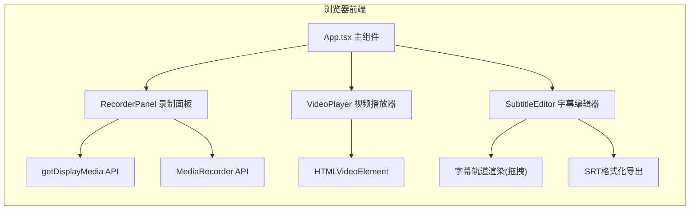

## 1. 架构设计



## 2. 技术栈说明
- **前端框架**：React@18 + TypeScript@5
- **构建工具**：Vite@5 + @vitejs/plugin-react
- **动画库**：framer-motion@11（用于UI过渡动画）
- **网络库**：axios@1（预留API调用能力）
- **初始化方式**：使用vite-init脚手架创建react-ts模板

## 3. 目录结构
```
.
├── package.json
├── vite.config.ts
├── tsconfig.json
├── index.html
└── src/
    ├── App.tsx                    # 主组件，状态管理与模块协调
    ├── main.tsx                   # 应用入口
    ├── index.css                  # 全局样式与CSS变量
    └── components/
        ├── RecorderPanel.tsx      # 录制控制面板
        ├── VideoPlayer.tsx        # 视频播放器
        └── SubtitleEditor.tsx     # 字幕编辑器
```

## 4. 核心数据模型

### 4.1 Subtitle 字幕数据结构
```typescript
interface Subtitle {
  id: string;              // 唯一标识 (UUID)
  startTime: number;       // 开始时间 (秒)
  endTime: number;         // 结束时间 (秒)
  text: string;            // 字幕文本内容
}
```

### 4.2 App 状态管理
```typescript
// 录制状态
type RecordingState = 'idle' | 'recording' | 'stopped';

// 全局状态（React useState 管理）
- recordingState: RecordingState    // 录制状态机
- videoBlobUrl: string | null       // 视频Blob URL
- videoDuration: number             // 视频总时长(秒)
- currentTime: number               // 当前播放时间(秒)
- isPlaying: boolean                // 是否正在播放
- subtitles: Subtitle[]             // 字幕数组
- selectedSubtitleId: string | null // 当前选中字幕ID
```

## 5. 组件通信机制

### 5.1 数据流（自上而下Props）
- **App → RecorderPanel**：recordingState, onRecordingComplete(Blob回调)
- **App → VideoPlayer**：videoBlobUrl, onTimeUpdate, onDurationChange, onPlayingChange
- **App → SubtitleEditor**：subtitles, currentTime, videoDuration, selectedSubtitleId

### 5.2 事件回调（自下而上）
- **RecorderPanel → App**：录制完成回调 `(blob: Blob) => void`
- **VideoPlayer → App**：时间更新 `(time: number) => void`、时长获取、播放状态变化
- **SubtitleEditor → App**：添加字幕、删除字幕、更新字幕、选中字幕、导出SRT

### 5.3 快捷键分发
- VideoPlayer监听空格键（播放/暂停）
- SubtitleEditor监听N键（添加）和Delete键（删除）
- Toast提示通过App统一管理显示

## 6. 关键技术实现点

### 6.1 屏幕录制实现
```
调用链：
navigator.mediaDevices.getDisplayMedia({video: true, audio: true})
  → 获取MediaStream
  → new MediaRecorder(stream, {mimeType: 'video/webm'})
  → recorder.ondataavailable 收集chunks
  → recorder.onstop 合并为Blob
  → URL.createObjectURL(blob) 得到可播放URL
```

### 6.2 字幕轨道渲染
- 每个字幕块宽度 = `(endTime - startTime) / videoDuration * containerWidth`
- 字幕块左偏移 = `startTime / videoDuration * containerWidth`
- 拖拽使用mousedown/mousemove/mouseup事件链，更新startTime保持时长不变

### 6.3 SRT导出格式
```
序号
HH:MM:SS,mmm --> HH:MM:SS,mmm
字幕文本
空行分隔
```
时间格式化函数将秒数转换为SRT标准时间戳。

### 6.4 性能优化策略
- 字幕拖拽使用requestAnimationFrame节流DOM更新
- video元素timeupdate事件使用useRef存储currentTime避免过度re-render
- framer-motion仅用于关键UI过渡动画，避免过度动画影响性能
- 字幕轨道使用transform定位而非left/top，启用GPU合成

## 7. 快捷键与Toast机制
| 按键 | 触发条件 | 动作 | Toast内容 |
|------|----------|------|----------|
| Space | 视频已加载 | 切换播放/暂停 | 播放中 / 已暂停 |
| N (小写n) | 视频已加载 | 在currentTime处添加3秒字幕块 | 已添加字幕 |
| Delete / Backspace | 有选中字幕 | 删除选中字幕 | 已删除字幕 |

Toast显示：固定定位在播放器顶部，使用framer-motion入场/退场动画，setTimeout 2000ms后自动移除。
