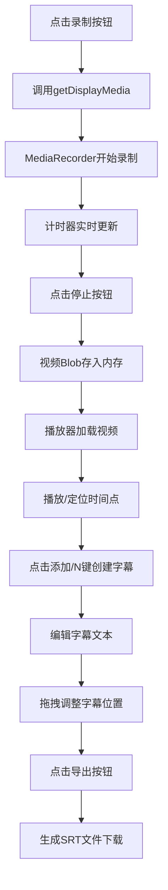

## 1. 产品概述
一款基于浏览器的实时屏幕录制与字幕编辑工具，解决教学视频、游戏实况录制后手动添加字幕耗时且难以与时间轴精确对齐的痛点问题。
- 核心目标用户：教育工作者、内容创作者、游戏主播
- 产品价值：在浏览器中一站式完成屏幕录制、字幕编辑与SRT导出，无需安装任何专业软件

## 2. 核心功能

### 2.1 用户角色
| 角色 | 注册方式 | 核心权限 |
|------|----------|----------|
| 普通用户 | 无需注册，直接使用 | 屏幕录制、字幕编辑、SRT导出 |

### 2.2 功能模块
1. **录制控制面板**：录制按钮、录制时长计时器、状态显示
2. **视频播放器**：视频播放/暂停、进度显示、时间同步
3. **字幕编辑器**：字幕轨道可视化、文本编辑、添加/删除字幕块、SRT导出
4. **快捷键系统**：空格键控制播放、N键添加字幕、Delete键删除字幕

### 2.3 页面详情
| 页面名称 | 模块名称 | 功能描述 |
|----------|----------|----------|
| 主应用页面 | 录制控制面板 | 点击红色按钮开始屏幕捕获，录制中显示实时计时器，停止后视频存入内存 |
| 主应用页面 | 视频播放器 | Canvas中渲染video元素，支持全屏自适应，空格键控制播放/暂停，实时同步currentTime |
| 主应用页面 | 字幕轨道条 | 水平滚动区域，彩色字幕块按时间比例显示，支持拖拽调整位置，点击选中高亮 |
| 主应用页面 | 字幕编辑面板 | 选中文本输入框实时编辑字幕内容，修改即时同步 |
| 主应用页面 | 字幕操作区 | 在当前时间点插入空字幕、导出SRT文件下载 |
| 主应用页面 | Toast提示系统 | 快捷键操作反馈，2秒自动消失 |

## 3. 核心流程
用户点击录制按钮 → 调用getDisplayMedia选择屏幕/窗口 → MediaRecorder开始录制并启动计时器 → 用户点击停止 → 视频Blob存入内存 → 播放器加载视频 → 用户通过播放器定位到需要添加字幕的时间点 → 点击添加按钮或按N键创建字幕块 → 在右侧面板编辑文本 → 可拖拽调整字幕时间位置 → 点击导出按钮生成SRT文件并触发下载

## 4. 用户界面设计

### 4.1 设计风格
- **主色调**：紫色系 #7c3aed → #4f46e5 渐变
- **背景色**：#0f0f23（暗黑主题）
- **文字色**：#e2e8f0
- **辅助色**：录制按钮 #e63946，添加按钮 #16a34a，分隔线 #2a2a3c
- **按钮风格**：圆角矩形，悬停过渡动画0.2s ease
- **字体**：计时器使用monospace字体，正文使用系统无衬线字体
- **布局风格**：桌面端左右布局（播放器+轨道+右侧编辑面板），移动端垂直堆叠
- **动效**：所有交互元素具有0.2s-0.3s平滑过渡，按钮悬停缩放与颜色加深效果

### 4.2 页面设计概述
| 页面名称 | 模块名称 | UI元素 |
|----------|----------|--------|
| 主应用页面 | 录制控制面板 | 红色圆角录制按钮(#e63946→#c1121f, hover 1.05倍缩放)，mono字体计时器(半透明黑底圆角8px) |
| 主应用页面 | 视频播放器 | 宽度100%最大900px自适应高度，顶部Toast提示(#333背景圆角6px, 2s消失) |
| 主应用页面 | 字幕轨道条 | #1e1e2e背景高40px水平滚动，彩色渐变字幕块(2px间距)，选中高亮边框 |
| 主应用页面 | 字幕输入框 | 宽100%，#2a2a3c背景1px边框圆角8px，聚焦时#7c3aed边框+紫色阴影 |
| 主应用页面 | 操作按钮 | 添加按钮#16a34a白色文字圆角8px，导出按钮紫色系，平滑过渡动画 |

### 4.3 响应式设计
- **桌面端(≥768px)**：字幕轨道和编辑面板水平排列，编辑面板固定宽度约280px
- **移动端(<768px)**：字幕轨道和编辑面板垂直堆叠，编辑面板宽度100%
- **触控优化**：字幕块最小触摸区域40px，拖拽操作支持触摸事件

### 4.4 性能指标
- 录制过程主线程帧率 ≥ 30fps
- 字幕拖拽响应延迟 < 100ms
- 视频加载与播放流畅无卡顿
- 字幕轨道渲染性能优化（避免不必要重绘）
