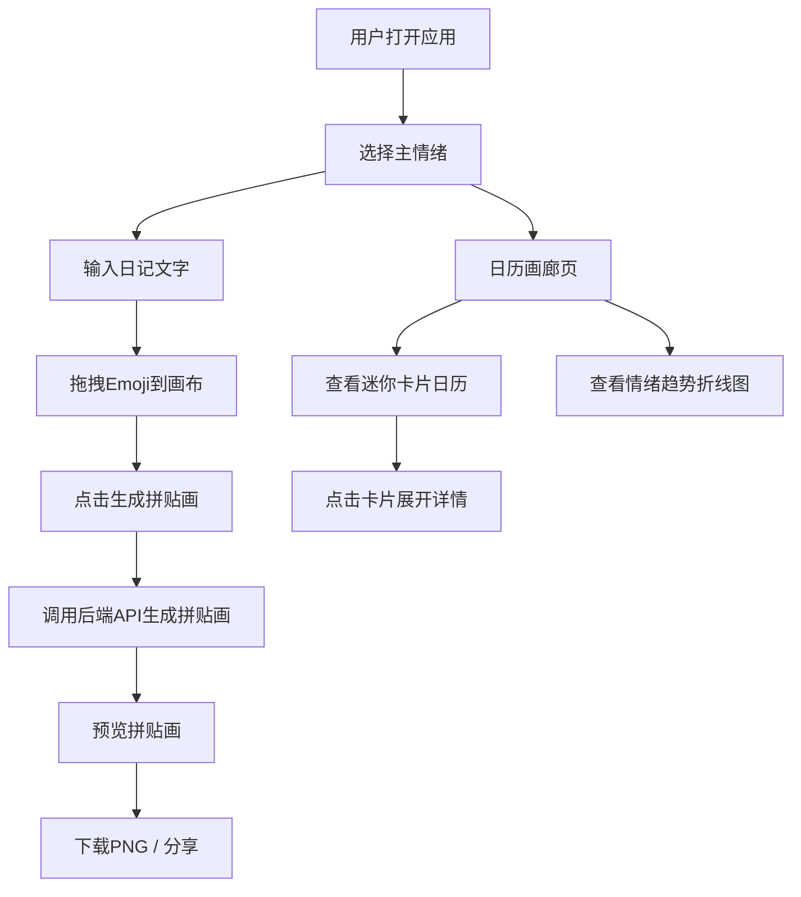

## 1. 产品概述

灵感画布是一款云端情绪日记与拼贴画生成器，让用户通过文字、颜色和Emoji记录每日情绪，系统基于情绪关键词自动生成视觉拼贴画，保存在云端画廊中与他人分享。目标用户为注重情感表达与视觉美学的年轻群体。

## 2. 核心功能

### 2.1 用户角色

| 角色 | 注册方式 | 核心权限 |
|------|----------|----------|
| 普通用户 | 无需注册（本地体验） | 创建、浏览、分享情绪日记与拼贴画 |

### 2.2 功能模块

1. **情绪日记页**：情绪选择器、日记文字输入、Emoji拖拽画布、拼贴画生成与预览
2. **日历画廊页**：迷你卡片日历视图、D3情绪趋势折线图、按月切换与滑动浏览
3. **拼贴画详情页**：拼贴画大图预览、PNG下载、日记内容回顾

### 2.3 页面详情

| 页面名称 | 模块名称 | 功能描述 |
|----------|----------|----------|
| 情绪日记页 | 情绪选择器 | 8种主情绪选择，每种对应主题色（开心#FFD93D、悲伤#6C5B7B、焦虑#E84545、平静#81B29A、兴奋#FF6F61、愤怒#FF4757、疲惫#A29BFE、感恩#F8B500），选中后界面主题色联动变化 |
| 情绪日记页 | 日记文字输入 | 2-3句自由文字输入，字数提示，情绪关键词自动提取 |
| 情绪日记页 | Emoji拖拽画布 | 最多5个Emoji拖拽到画布上自由排列组合，支持拖拽移动与缩放 |
| 情绪日记页 | 拼贴画生成按钮 | 调用后端API生成拼贴画，生成过程不阻塞主线程超过200ms |
| 日历画廊页 | 迷你卡片日历 | 每日情绪以48px圆角8px迷你卡片展示，背景用情绪色渐变，点击展开完整内容 |
| 日历画廊页 | 月度切换 | 支持按月切换，左右滑动浏览 |
| 日历画廊页 | 情绪趋势图 | D3绘制平滑折线图，数据点带tooltip显示日期和情绪类型 |
| 拼贴画详情页 | 拼贴画预览 | 1920x1080分辨率拼贴画展示，包含情绪主色渐变背景、Unsplash图片（滤镜处理）和Emoji装饰 |
| 拼贴画详情页 | 下载功能 | 支持下载为PNG格式 |

## 3. 核心流程

用户打开应用 → 选择主情绪 → 输入日记文字 → 拖拽Emoji到画布 → 点击生成拼贴画 → 系统根据情绪关键词和模板自动生成拼贴画 → 预览并下载 → 日历视图中查看历史记录和情绪趋势

## 4. 用户界面设计

### 4.1 设计风格

- **主背景色**：米白色 #FFF8F0
- **卡片样式**：圆角16px，轻阴影 0 4px 15px rgba(0,0,0,0.08)
- **按钮动画**：弹性缩放（点击时0.1s缩到0.95，然后弹回1.0）
- **字体**：手绘感中文字体（标题用ZCOOL KuaiLe，正文用Noto Sans SC）
- **布局**：桌面端左右分栏，移动端单列堆叠
- **情绪色板**：开心#FFD93D、悲伤#6C5B7B、焦虑#E84545、平静#81B29A、兴奋#FF6F61、愤怒#FF4757、疲惫#A29BFE、感恩#F8B500

### 4.2 页面设计概述

| 页面名称 | 模块名称 | UI元素 |
|----------|----------|--------|
| 情绪日记页 | 情绪选择器 | 圆形色块按钮排列，选中态放大1.2倍+光环动画，渐变色背景 |
| 情绪日记页 | 文字输入区 | 手绘风边框文本域，底部字数提示，情绪色下划线 |
| 情绪日记页 | Emoji画布 | 200x200虚线边框区域，Emoji拖入后可自由移动，framer-motion拖拽动画 |
| 情绪日记页 | 生成按钮 | 大圆角渐变按钮，弹性缩放动画，生成中旋转加载图标 |
| 日历画廊页 | 迷你卡片日历 | 7列网格，每格48px卡片，情绪色渐变背景，圆角8px |
| 日历画廊页 | 趋势图 | D3平滑折线图，情绪色编码数据点，hover tooltip |
| 日历画廊页 | 月度导航 | 左右箭头+月份标题，framer-motion滑动切换 |
| 拼贴画详情页 | 预览区 | 居中大图展示，圆角12px，阴影加深 |
| 拼贴画详情页 | 下载按钮 | 底部固定，渐变色，弹性动画 |

### 4.3 响应式适配

- 桌面端（>768px）：情绪日记页左右分栏（左侧输入+右侧画布），日历画廊7列网格
- 移动端（≤768px）：情绪日记页单列堆叠，日历画廊改为2列网格布局
- 触摸优化：Emoji拖拽支持touch事件，按钮点击区域≥44px

### 4.4 拼贴画模板风格

1. **电影海报风**：大字标题+暗角+胶片质感滤镜
2. **复古邮票风**：锯齿边框+泛黄底色+复古色调
3. **极简几何风**：纯色块+线条分割+留白
4. **水彩晕染风**：柔和渐变+水墨扩散效果
5. **像素马赛克风**：像素化处理+网格装饰+8-bit配色
