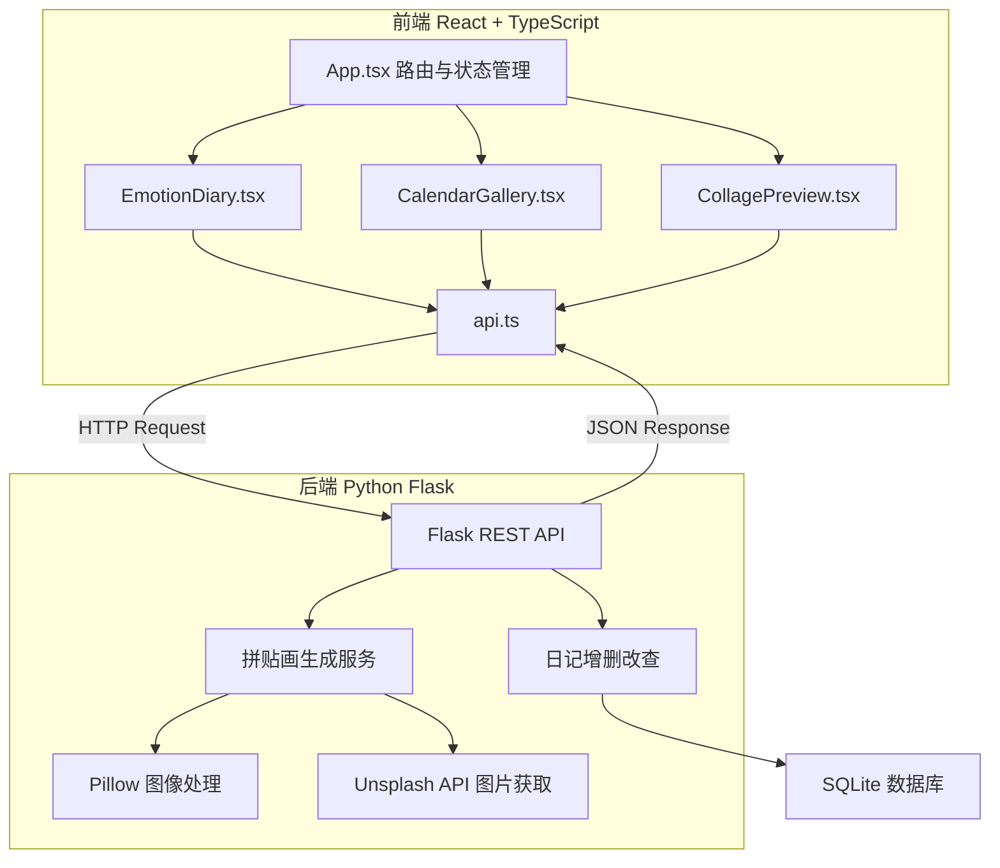
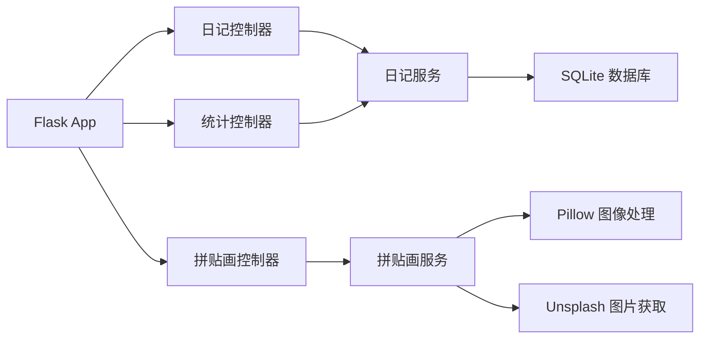
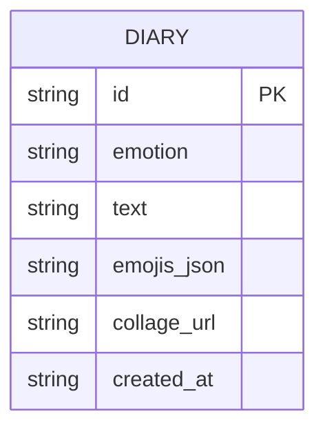

## 1. 架构设计



## 2. 技术说明

- **前端**：React@18 + TypeScript + Vite + TailwindCSS + Framer Motion + D3.js + html-to-image
- **初始化工具**：Vite
- **后端**：Python Flask（RESTful API）
- **数据库**：SQLite（轻量级本地存储）
- **图像生成**：Pillow（Python图像处理库）+ Unsplash API
- **状态管理**：Zustand

## 3. 路由定义

| 路由 | 用途 |
|------|------|
| `/` | 日历画廊首页，展示情绪日历与趋势图 |
| `/diary/new` | 新建情绪日记页 |
| `/diary/:id` | 日记详情与拼贴画预览 |

## 4. API 定义

### 4.1 日记相关

```typescript
interface Diary {
  id: string;
  emotion: EmotionType;
  text: string;
  emojis: EmojiItem[];
  collageUrl?: string;
  createdAt: string;
}

type EmotionType = 'happy' | 'sad' | 'anxious' | 'calm' | 'excited' | 'angry' | 'tired' | 'grateful';

interface EmojiItem {
  emoji: string;
  x: number;
  y: number;
  scale: number;
}

// GET /api/diaries?month=YYYY-MM - 获取某月日记列表
// GET /api/diaries/:id - 获取单篇日记
// POST /api/diaries - 创建日记
// DELETE /api/diaries/:id - 删除日记
```

### 4.2 拼贴画生成

```typescript
interface CollageRequest {
  emotion: EmotionType;
  text: string;
  emojis: string[];
  template: 'movie_poster' | 'vintage_stamp' | 'minimal_geo' | 'watercolor' | 'pixel_mosaic';
}

interface CollageResponse {
  collageUrl: string;
  template: string;
}

// POST /api/collage/generate - 生成拼贴画
```

### 4.3 情绪统计

```typescript
interface EmotionStats {
  date: string;
  emotion: EmotionType;
}

// GET /api/stats?month=YYYY-MM - 获取某月情绪统计数据
```

## 5. 服务端架构图



## 6. 数据模型

### 6.1 数据模型定义



### 6.2 数据定义语言

```sql
CREATE TABLE diaries (
    id TEXT PRIMARY KEY,
    emotion TEXT NOT NULL,
    text TEXT NOT NULL,
    emojis_json TEXT NOT NULL DEFAULT '[]',
    collage_url TEXT,
    created_at TEXT NOT NULL DEFAULT (datetime('now'))
);

CREATE INDEX idx_diaries_created_at ON diaries(created_at);
CREATE INDEX idx_diaries_emotion ON diaries(emotion);
```
