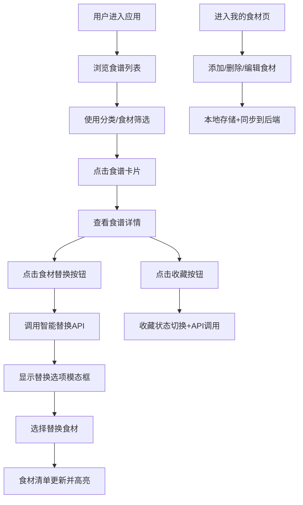

## 1. 产品概述

在线食谱分享与智能食材替换应用，帮助用户浏览、收藏食谱，并根据家中现有食材智能推荐可行的食材替换方案。解决用户"有什么食材能做什么菜"以及"缺少某食材如何替代"的核心痛点。

- 核心目标：为家庭烹饪爱好者提供便捷的食谱 discovery 和智能食材替换服务
- 目标用户：家庭主妇/煮夫、烹饪新手、注重健康饮食的人群
- 市场价值：通过智能算法减少食材浪费，提升烹饪成功率和用户粘性

## 2. 核心功能

### 2.1 用户角色
| 角色 | 注册方式 | 核心权限 |
|------|----------|----------|
| 普通用户 | 无需注册（本地存储+后端同步） | 浏览食谱、收藏食谱、管理个人食材库、使用智能替换功能 |

### 2.2 功能模块
1. **食谱列表页**：食谱网格展示、分类筛选、食材筛选、搜索功能、瀑布流布局
2. **食谱详情页**：食谱信息展示、食材清单、步骤说明、智能食材替换、收藏功能
3. **我的食材页**：食材增删改管理、标签式展示、本地与云端同步
4. **收藏夹**：已收藏食谱列表、快速访问
5. **智能替换引擎**：基于用户现有食材推荐替换方案、替换率计算

### 2.3 页面详情
| 页面名称 | 模块名称 | 功能描述 |
|---------|---------|----------|
| 食谱列表页 | 筛选栏 | 分类下拉选择、食材关键词输入、0.1s防抖实时过滤 |
| 食谱列表页 | 食谱网格 | 瀑布流布局（>=768px两列，<768px单列）、卡片悬停动画、淡入加载效果 |
| 食谱列表页 | 空状态 | 无匹配结果时显示插画和提示文字 |
| 食谱详情页 | 顶部导航 | 滚动时固定、高度56px、白底阴影、收藏数量徽标 |
| 食谱详情页 | 左右布局 | 左栏60%封面图（骨架屏加载）、右栏食谱信息 |
| 食谱详情页 | 难度星级 | 5个SVG星星，选中黄色#FFD43B，未选灰色#D1D5DB |
| 食谱详情页 | 食材清单 | 每项带替换按钮、替换后橙色#FFF3E0高亮 |
| 食谱详情页 | 步骤说明 | 垂直时间线分隔、编号圆圈标记 |
| 食谱详情页 | 替换模态框 | 宽420px、圆角16px、显示替代食材及替换率 |
| 我的食材页 | 食材标签 | 背景#F3F4F6、圆角6px、删除叉号、悬停变#E5E7EB |
| 我的食材页 | 食材管理 | 添加、删除、编辑食材，本地存储+后端同步 |
| 通用 | 收藏按钮 | 心形图标，未收藏灰#9CA3AF，已收藏红#E0245E，spring动画 |

## 3. 核心流程

## 4. 用户界面设计

### 4.1 设计风格
- 主色调：#F97316（橙色），营造温暖、有食欲的氛围
- 辅色调：#FEF3C7（浅橙色），用于背景和强调
- 文字主色：#1F2937，次要文字：#6B7280
- 卡片样式：圆角12px、白底#ffffff、阴影0 2px 8px rgba(0,0,0,0.08)，悬停上浮4px
- 按钮过渡：所有交互元素0.2s ease-out过渡
- 字体选择：标题使用Playfair Display（优雅衬线），正文使用Lato（清晰无衬线）

### 4.2 页面设计概览
| 页面名称 | 模块名称 | UI元素 |
|---------|---------|--------|
| 食谱列表页 | 筛选栏 | 下拉框样式统一、输入框带图标、橙色焦点态 |
| 食谱列表页 | 食谱卡片 | 封面图顶部、名称加粗、作者小字、收藏按钮右上角、悬停上浮+阴影扩散 |
| 食谱列表页 | 瀑布流布局 | 列间距16px、行间距20px、卡片尺寸240x320px |
| 食谱详情页 | 封面大图 | 宽度100%、圆角16px、渐变骨架屏加载 |
| 食谱详情页 | 食材替换按钮 | 蓝色文字、悬停下划线、点击弹出模态框 |
| 食谱详情页 | 时间线步骤 | 左侧垂直灰线、步骤圆圈1-*、连接线渐变 |
| 我的食材页 | 标签容器 | 流式布局、间距8px、输入框带添加按钮 |
| 通用 | 导航栏 | 高度56px、白底#ffffff、阴影0 1px 4px rgba(0,0,0,0.05)、滚动固定 |
| 通用 | 收藏徽标 | 红色圆形#E0245E、白色数字、右上角定位 |

### 4.3 响应式设计
- 设计原则：桌面优先，移动端自适应
- 断点：>=768px显示两列瀑布流，<768px显示单列
- 移动端优化：触控区域>=44x44px、导航栏简化、模态框全屏适配
- 布局容器：最大宽度1200px、水平居中、左右padding 20px

### 4.4 动效设计
- 卡片悬停：translateY(-4px)、box-shadow扩大、0.2s ease-out
- 收藏按钮：scale(0.8) → scale(1)、spring物理动画、0.3s
- 列表加载：opacity 0→1、translateY(8px)→0、staggered延迟、0.3s
- 模态框：backdrop模糊、scale(0.9)→1、0.25s ease-out
- 骨架屏：渐变动画pulse、背景#f3f4f6

## 5. 性能要求
- 首屏加载时间：<=1.5秒（模拟慢速3G网络）
- 滚动帧率：>=50 FPS
- 图片优化：WebP格式、懒加载、合适尺寸
- 防抖处理：搜索输入0.1s防抖
- 代码分割：路由级懒加载
