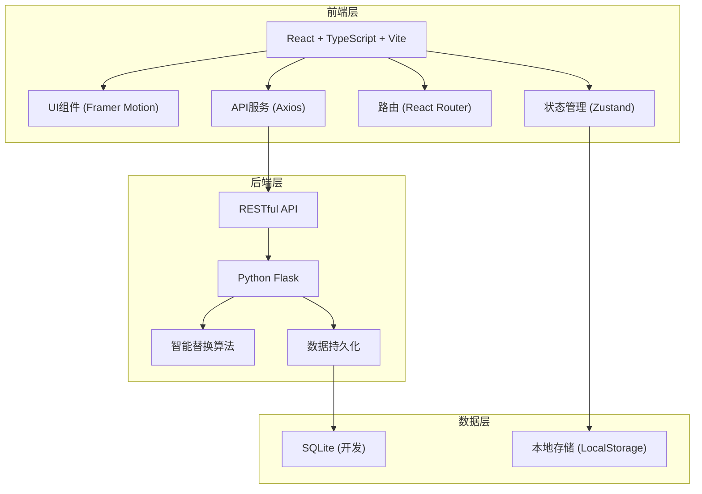
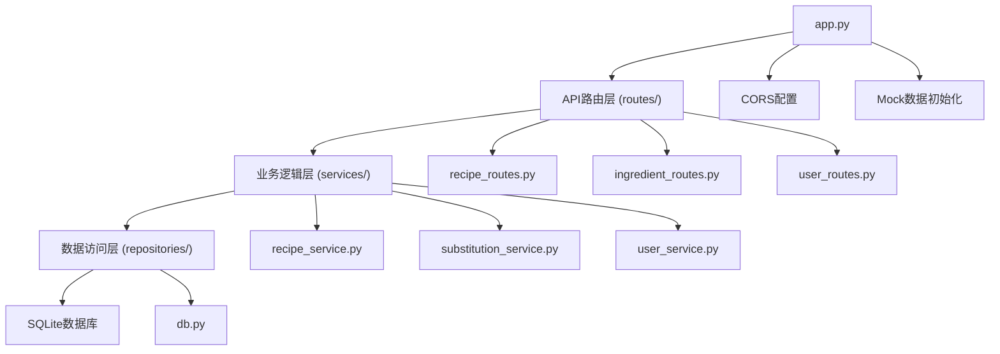
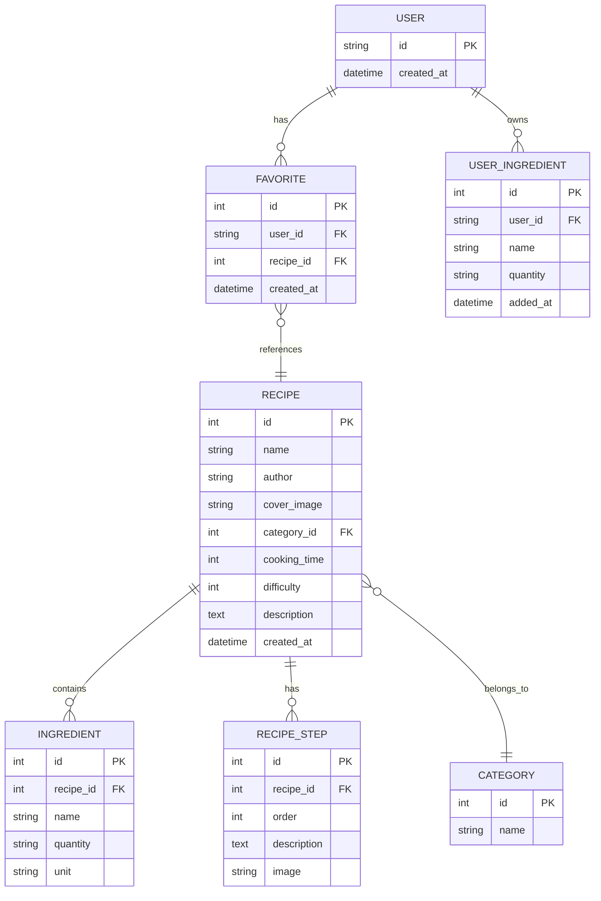

## 1. 架构设计



## 2. 技术选型

### 2.1 前端技术栈
- **框架**: React 18 + TypeScript
- **构建工具**: Vite 5（开启严格模式）
- **路由**: React Router DOM 6
- **HTTP客户端**: Axios
- **动画库**: Framer Motion
- **状态管理**: Zustand
- **图标**: Lucide React
- **TypeScript配置**: 严格模式，target ES2020

### 2.2 后端技术栈
- **框架**: Python Flask 3
- **API架构**: RESTful
- **数据库**: SQLite（轻量级，便于演示）
- **数据序列化**: JSON
- **CORS处理**: flask-cors

### 2.3 核心依赖版本
| 依赖 | 版本 | 用途 |
|------|------|------|
| react | ^18.2.0 | 前端框架 |
| react-dom | ^18.2.0 | React DOM |
| react-router-dom | ^6.20.0 | 路由管理 |
| axios | ^1.6.0 | HTTP请求 |
| framer-motion | ^10.16.0 | 动画效果 |
| zustand | ^4.4.0 | 状态管理 |
| lucide-react | ^0.294.0 | 图标库 |
| typescript | ^5.3.0 | 类型系统 |
| vite | ^5.0.0 | 构建工具 |
| flask | ^3.0.0 | 后端框架 |
| flask-cors | ^4.0.0 | 跨域处理 |

## 3. 路由定义

| 路由路径 | 页面组件 | 用途 |
|---------|---------|------|
| `/` | RecipeList | 食谱列表页（首页） |
| `/recipe/:id` | RecipeDetail | 食谱详情页 |
| `/ingredients` | MyIngredients | 我的食材页 |
| `/favorites` | Favorites | 收藏夹页 |

## 4. API 定义

### 4.1 TypeScript 类型定义

```typescript
// 食谱类型
interface Recipe {
  id: number;
  name: string;
  author: string;
  coverImage: string;
  category: string;
  cookingTime: number; // 分钟
  difficulty: number; // 1-5
  description: string;
  ingredients: Ingredient[];
  steps: RecipeStep[];
  createdAt: string;
}

// 食材类型
interface Ingredient {
  id: number;
  name: string;
  quantity: string;
  unit: string;
  isReplaced?: boolean;
  originalName?: string;
}

// 食谱步骤
interface RecipeStep {
  id: number;
  order: number;
  description: string;
  image?: string;
}

// 替换建议
interface SubstitutionSuggestion {
  originalIngredient: string;
  substitutes: {
    name: string;
    matchRate: number; // 0-100
    notes: string;
  }[];
}

// 用户食材
interface UserIngredient {
  id: number;
  name: string;
  quantity?: string;
  addedAt: string;
}

// 收藏记录
interface Favorite {
  id: number;
  recipeId: number;
  recipe: Recipe;
  createdAt: string;
}
```

### 4.2 API 端点

| 方法 | 路径 | 描述 | 请求参数 | 响应 |
|------|------|------|---------|------|
| GET | `/api/recipes` | 获取食谱列表（支持筛选） | `category?: string`, `ingredient?: string` | `Recipe[]` |
| GET | `/api/recipes/:id` | 获取食谱详情 | - | `Recipe` |
| GET | `/api/recipes/categories` | 获取所有分类 | - | `string[]` |
| POST | `/api/ingredients/substitute` | 获取食材替换建议 | `{ original: string, userIngredients: string[] }` | `SubstitutionSuggestion` |
| GET | `/api/user/ingredients` | 获取用户食材列表 | - | `UserIngredient[]` |
| POST | `/api/user/ingredients` | 添加用户食材 | `{ name: string, quantity?: string }` | `UserIngredient` |
| DELETE | `/api/user/ingredients/:id` | 删除用户食材 | - | `{ success: boolean }` |
| GET | `/api/user/favorites` | 获取收藏列表 | - | `Favorite[]` |
| POST | `/api/user/favorites` | 添加收藏 | `{ recipeId: number }` | `Favorite` |
| DELETE | `/api/user/favorites/:recipeId` | 取消收藏 | - | `{ success: boolean }` |

## 5. 后端架构



### 5.1 目录结构
```
backend/
├── app.py                 # Flask应用入口
├── requirements.txt       # Python依赖
├── routes/                # API路由
│   ├── __init__.py
│   ├── recipe_routes.py
│   ├── ingredient_routes.py
│   └── user_routes.py
├── services/              # 业务逻辑
│   ├── __init__.py
│   ├── recipe_service.py
│   ├── substitution_service.py
│   └── user_service.py
├── repositories/          # 数据访问
│   ├── __init__.py
│   └── db.py
└── data/                  # 数据文件
    └── recipes.db
```

## 6. 前端目录结构

```
src/
├── App.tsx               # 主应用组件（路由+全局样式）
├── main.tsx              # 入口文件
├── pages/                # 页面组件
│   ├── RecipeList.tsx    # 食谱列表页
│   ├── RecipeDetail.tsx  # 食谱详情页
│   ├── MyIngredients.tsx # 我的食材页
│   └── Favorites.tsx     # 收藏夹页
├── components/           # 可复用组件
│   ├── RecipeCard.tsx    # 食谱卡片
│   ├── Navbar.tsx        # 导航栏
│   ├── FavoriteButton.tsx # 收藏按钮
│   ├── IngredientTag.tsx # 食材标签
│   ├── StarRating.tsx    # 星级评分
│   ├── SubstitutionModal.tsx # 替换模态框
│   └── SkeletonLoader.tsx # 骨架屏
├── services/             # API服务
│   └── api.ts            # 所有API调用封装
├── store/                # 状态管理
│   └── useStore.ts       # Zustand store
├── types/                # TypeScript类型
│   └── index.ts
├── utils/                # 工具函数
│   ├── debounce.ts       # 防抖
│   └── localStorage.ts   # 本地存储
└── styles/               # 全局样式
    └── globals.css
```

## 7. 数据模型

### 7.1 ER图



### 7.2 DDL语句

```sql
-- 分类表
CREATE TABLE categories (
    id INTEGER PRIMARY KEY AUTOINCREMENT,
    name TEXT NOT NULL UNIQUE
);

-- 食谱表
CREATE TABLE recipes (
    id INTEGER PRIMARY KEY AUTOINCREMENT,
    name TEXT NOT NULL,
    author TEXT NOT NULL,
    cover_image TEXT,
    category_id INTEGER,
    cooking_time INTEGER NOT NULL,
    difficulty INTEGER NOT NULL CHECK (difficulty BETWEEN 1 AND 5),
    description TEXT,
    created_at DATETIME DEFAULT CURRENT_TIMESTAMP,
    FOREIGN KEY (category_id) REFERENCES categories(id)
);

-- 食材表
CREATE TABLE ingredients (
    id INTEGER PRIMARY KEY AUTOINCREMENT,
    recipe_id INTEGER NOT NULL,
    name TEXT NOT NULL,
    quantity TEXT,
    unit TEXT,
    FOREIGN KEY (recipe_id) REFERENCES recipes(id) ON DELETE CASCADE
);

-- 步骤表
CREATE TABLE recipe_steps (
    id INTEGER PRIMARY KEY AUTOINCREMENT,
    recipe_id INTEGER NOT NULL,
    order_num INTEGER NOT NULL,
    description TEXT NOT NULL,
    image TEXT,
    FOREIGN KEY (recipe_id) REFERENCES recipes(id) ON DELETE CASCADE
);

-- 用户表（简化，使用设备ID）
CREATE TABLE users (
    id TEXT PRIMARY KEY,
    created_at DATETIME DEFAULT CURRENT_TIMESTAMP
);

-- 收藏表
CREATE TABLE favorites (
    id INTEGER PRIMARY KEY AUTOINCREMENT,
    user_id TEXT NOT NULL,
    recipe_id INTEGER NOT NULL,
    created_at DATETIME DEFAULT CURRENT_TIMESTAMP,
    FOREIGN KEY (user_id) REFERENCES users(id),
    FOREIGN KEY (recipe_id) REFERENCES recipes(id),
    UNIQUE(user_id, recipe_id)
);

-- 用户食材表
CREATE TABLE user_ingredients (
    id INTEGER PRIMARY KEY AUTOINCREMENT,
    user_id TEXT NOT NULL,
    name TEXT NOT NULL,
    quantity TEXT,
    added_at DATETIME DEFAULT CURRENT_TIMESTAMP,
    FOREIGN KEY (user_id) REFERENCES users(id)
);

-- 索引
CREATE INDEX idx_recipes_category ON recipes(category_id);
CREATE INDEX idx_ingredients_name ON ingredients(name);
CREATE INDEX idx_favorites_user ON favorites(user_id);
CREATE INDEX idx_user_ingredients_user ON user_ingredients(user_id);
```

## 8. 智能替换算法设计

### 8.1 算法原理
基于食材属性相似度匹配，考虑以下因素：
1. **功能相似性**：食材在烹饪中的作用（增稠、提味、蛋白源等）
2. **口感相似度**：质地、口感接近程度
3. **营养价值**：营养成分相似性
4. **用户已有食材**：优先匹配用户食材库中的食材

### 8.2 替换率计算
```
替换率 = (功能匹配度 × 0.4 + 口感匹配度 × 0.3 + 营养匹配度 × 0.3) × 100%
```

### 8.3 预设替换规则（Mock数据）
| 原食材 | 替换食材 | 替换率 | 说明 |
|--------|---------|--------|------|
| 猪肉 | 鸡肉 | 85% | 同属高蛋白肉类 |
| 牛肉 | 羊肉 | 80% | 红肉可互相替代 |
| 鸡蛋 | 豆腐 | 75% | 植物蛋白替代 |
| 牛奶 | 椰奶 | 80% | 液体成分替代 |
| 白糖 | 蜂蜜 | 70% | 甜味剂替代 |
| 生抽 | 酱油 | 95% | 同类调味品 |
| 料酒 | 黄酒 | 90% | 酒类替代 |
| 淀粉 | 玉米淀粉 | 95% | 增稠剂替代 |
| 洋葱 | 大葱 | 70% | 提香蔬菜替代 |
| 大蒜 | 蒜粉 | 80% | 香辛料替代 |
