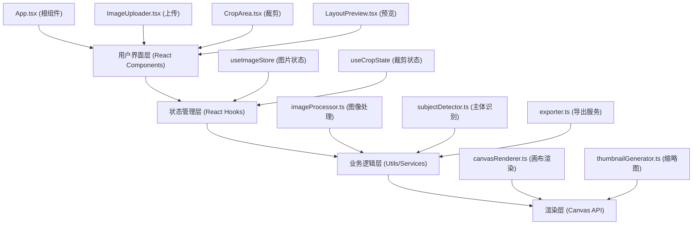

## 1. 架构设计



## 2. 技术描述

- **前端框架**：React@18 + TypeScript@5 + Vite@5
- **状态管理**：React useState/useReducer + useContext（轻量级全局状态）
- **样式方案**：CSS Modules + CSS Variables，避免使用Tailwind，追求更精细的样式控制
- **动画库**：framer-motion@11（微交互动效）
- **文件上传**：react-dropzone@14（拖拽上传）
- **Canvas工具**：canvas-size@1（Canvas尺寸检测）
- **打包工具**：Vite@5 + @vitejs/plugin-react@4
- **导出功能**：JSZip@3（ZIP打包）+ FileSaver@2（文件保存）

## 3. 项目文件结构与调用关系

```
src/
├── types/
│   └── index.ts              # 类型定义，被所有模块引用
├── utils/
│   ├── imageProcessor.ts     # 图像处理工具 → 被CropArea, LayoutPreview调用
│   ├── subjectDetector.ts    # 主体识别算法 → 被ImageUploader调用
│   ├── canvasRenderer.ts     # Canvas渲染工具 → 被CropArea调用
│   └── exporter.ts           # 导出服务 → 被App调用
├── hooks/
│   ├── useImageStore.ts      # 图片状态管理Hook → 被App调用
│   └── useCropState.ts       # 裁剪状态Hook → 被CropArea调用
├── components/
│   ├── ImageUploader.tsx     # 上传组件 → 调用subjectDetector, useImageStore
│   ├── CropArea.tsx          # 裁剪组件 → 调用canvasRenderer, imageProcessor
│   ├── LayoutPreview.tsx     # 预览组件 → 调用imageProcessor
│   ├── ThumbnailList.tsx     # 缩略图列表 → 被ImageUploader调用
│   ├── GridView.tsx          # 网格视图 → 被LayoutPreview调用
│   ├── MasonryView.tsx       # 瀑布流视图 → 被LayoutPreview调用
│   ├── ExportProgress.tsx    # 导出进度 → 被App调用
│   └── Header.tsx            # 顶部导航 → 被App调用
├── styles/
│   ├── variables.css         # CSS变量定义
│   └── global.css            # 全局样式
├── App.tsx                   # 根组件，整合所有模块
└── main.tsx                  # 入口文件
```

**数据流向说明**：
1. `ImageUploader` 接收文件 → 调用 `subjectDetector` 识别主体 → 更新 `useImageStore`
2. `CropArea` 从 `useImageStore` 读取图片 → 用户交互更新裁剪参数 → 写回 `useImageStore`
3. `LayoutPreview` 从 `useImageStore` 读取图片和裁剪参数 → 渲染预览
4. `App` 触发导出 → 调用 `exporter` 处理选中图片 → 生成ZIP下载

## 4. 核心数据模型

```typescript
// 图片数据模型
interface ImageItem {
  id: string;
  file: File;
  name: string;
  url: string;
  thumbnail: string;
  width: number;
  height: number;
  cropParams: CropParams;
  selected: boolean;
  subject?: SubjectArea;
}

// 裁剪参数
interface CropParams {
  x: number;
  y: number;
  width: number;
  height: number;
  ratio: AspectRatio;
}

// 主体区域
interface SubjectArea {
  x: number;
  y: number;
  width: number;
  height: number;
  confidence: number;
}

// 比例类型
type AspectRatio = '1:1' | '4:3' | '16:9' | 'free';

// 布局类型
type LayoutType = 'grid' | 'masonry';

// 应用状态
interface AppState {
  images: ImageItem[];
  activeImageId: string | null;
  currentRatio: AspectRatio;
  currentLayout: LayoutType;
  exportProgress: number;
  isExporting: boolean;
}
```

## 5. 性能优化策略

### 5.1 Canvas渲染优化
- 使用 `requestAnimationFrame` 进行裁剪框拖拽重绘
- 离屏Canvas预先生成缩略图和裁剪预览
- 复用Canvas上下文，避免频繁创建销毁

### 5.2 响应式优化
- 使用 `IntersectionObserver` 实现瀑布流图片懒加载
- 虚拟滚动处理大量图片预览
- 图片尺寸根据容器动态计算，避免重排重绘

### 5.3 内存管理
- 及时释放 `URL.createObjectURL` 创建的对象URL
- 大图自动压缩处理，限制最大渲染尺寸
- 组件卸载时清理事件监听器和动画帧

### 5.4 裁剪算法
- 主体识别使用边缘检测+颜色直方图分析的轻量级算法
- 裁剪框约束计算使用数学公式，避免DOM回流
- 批量处理时使用 `requestIdleCallback` 分帧处理

## 6. 性能指标

| 指标 | 目标值 | 测量方式 |
|------|--------|----------|
| 智能裁剪响应时间 | ≤2秒 | 从上传完成到裁剪框生成 |
| 拖拽帧率 | ≥30FPS | Chrome DevTools Performance面板 |
| 滚动帧率 | ≥60FPS | 瀑布流滚动测试 |
| 首次加载时间 | ≤3秒 | LCP指标 |
| 内存占用 | ≤500MB | 12张图片同时加载 |
