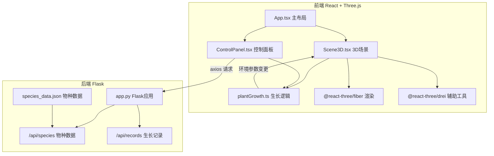
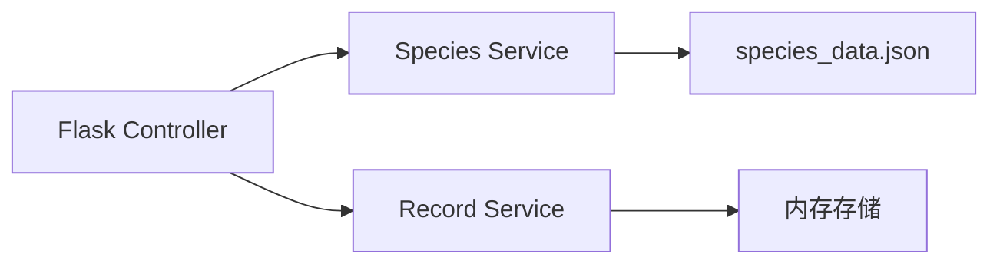
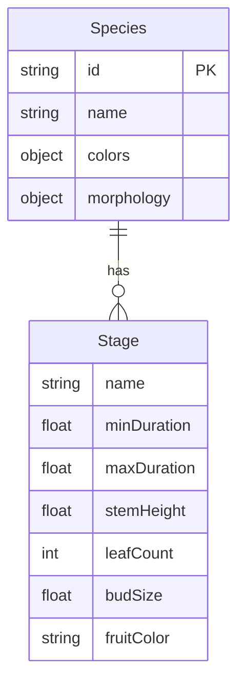

## 1. 架构设计



## 2. 技术说明

- 前端：React 18 + TypeScript + Three.js + @react-three/fiber + @react-three/drei + Vite
- 状态管理：Zustand（全局环境参数、植物物种、生长阶段）
- 样式方案：CSS Modules + CSS Variables（深色主题）
- 后端：Python Flask（物种数据API + 生长记录保存）
- 数据存储：JSON文件（species_data.json）+ 内存存储（生长记录）
- 初始化工具：vite-init（react-ts模板）

## 3. 路由定义

| 路由 | 用途 |
|------|------|
| / | 主页面，3D场景 + 控制面板 |

## 4. API定义

### 4.1 获取物种数据

```
GET /api/species
Response: [
  {
    "id": "sunflower",
    "name": "向日葵",
    "stages": [
      { "name": "seed", "duration": [5, 10], "stemHeight": 0, "leafCount": 0 },
      { "name": "sprout", "duration": [8, 12], "stemHeight": 5, "leafCount": 2 },
      ...
    ],
    "colors": { "stem": "#228B22", "leaf": "#228B22", "flower": "#FFD700", "fruit": "#8B4513" },
    "morphology": { "maxStemHeight": 150, "petalCount": [12, 24], "flowerRadius": [8, 12] }
  },
  ...
]
```

### 4.2 保存生长记录

```
POST /api/records
Body: { "species": "sunflower", "environment": { "light": 70, "water": 60, "nutrient": 50 }, "stage": "flowering", "timestamp": "..." }
Response: { "id": 1, "status": "saved" }
```

### 4.3 查询生长记录

```
GET /api/records?species=sunflower
Response: [ { "id": 1, "species": "sunflower", ... }, ... ]
```

## 5. 服务器架构图



## 6. 数据模型

### 6.1 物种数据模型



### 6.2 数据定义

**物种数据**（species_data.json）预定义三种植物：

| 物种 | 茎高范围 | 叶色变化 | 花果特征 |
|------|----------|----------|----------|
| 向日葵 | 80-150cm | #228B22→#FFD700 | 花盘半径8-12cm，花瓣12-24片 |
| 仙人掌 | 20-60cm | #2E8B57 | 刺长0.5-2cm，花冠半径3-5cm |
| 藤蔓 | 50-200cm | #32CD32→#8B4513 | 叶序交替，果实直径2-4cm |

### 6.3 文件结构

```
├── package.json
├── vite.config.ts
├── tsconfig.json
├── index.html
├── src/
│   ├── main.tsx
│   ├── App.tsx
│   ├── App.css
│   ├── components/
│   │   ├── Scene3D.tsx
│   │   └── ControlPanel.tsx
│   ├── utils/
│   │   └── plantGrowth.ts
│   └── store/
│       └── useStore.ts
├── backend/
│   ├── app.py
│   └── species_data.json
```
