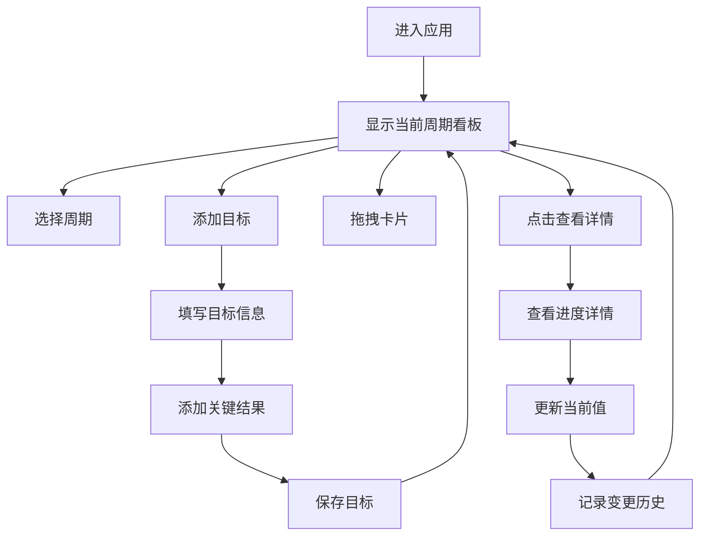

## 1. 产品概述

团队OKR目标管理与进度追踪应用，帮助团队创建季度目标、分解关键结果并实时追踪完成进度，通过可视化看板直观展示目标状态。

- 主要用途：团队OKR制定、进度跟踪、可视化展示
- 目标用户：团队负责人、项目经理、团队成员
- 产品价值：提升团队目标对齐效率，实时掌握目标进展

## 2. 核心功能

### 2.1 用户角色
| 角色 | 注册方式 | 核心权限 |
|------|----------|----------|
| 团队成员 | 默认登录 | 查看和编辑OKR，更新进度 |

### 2.2 功能模块
1. **OKR看板页面**：周期时间线、三栏看板、目标卡片、进度图表
2. **目标管理**：添加/编辑目标、设置负责人和权重、拖拽排序
3. **关键结果管理**：添加/编辑关键结果、滑块/数字输入更新进度、变更历史
4. **进度可视化**：环形进度图、进度条、三栏分类

### 2.3 页面详情
| 页面名称 | 模块名称 | 功能描述 |
|----------|----------|----------|
| OKR看板 | 周期时间线 | 展示季度周期列表，当前周期高亮，支持切换 |
| OKR看板 | 三栏看板 | 未开始/进行中/已完成三栏布局，支持卡片拖拽 |
| OKR看板 | 目标卡片 | 显示目标名称、负责人、完成百分比、关键结果列表 |
| 目标详情模态框 | 进度详情 | 展示所有关键结果进度条和变更历史 |
| 添加目标 | 浮动按钮 | 右下角浮动按钮，点击弹出添加表单 |

## 3. 核心流程

用户进入应用后，默认显示当前季度OKR周期的看板页面。用户可以：
1. 切换不同的OKR周期查看历史目标
2. 添加新的OKR周期
3. 在当前周期内添加新的目标（Objective）
4. 为每个目标添加关键结果（Key Result）
5. 通过滑块或数字输入更新关键结果的当前值
6. 将目标卡片在三栏之间拖拽移动
7. 点击目标卡片查看详细进度和变更历史

## 4. 用户界面设计

### 4.1 设计风格
- 设计风格：极简主义
- 主色调：深蓝色 #1e3a5f（标题和强调色）
- 辅助色：#f0f4f8（页面背景）
- 文字主色：#334155
- 按钮风格：圆角full浮动按钮，悬停放大1.1倍
- 卡片风格：圆角12px，白色背景，边框#e2e8f0，阴影0 4px 12px rgba(0,0,0,0.05)
- 布局风格：顶部导航栏 + 三栏看板布局
- 动画过渡：0.2s ease-in-out

### 4.2 页面设计概览
| 页面名称 | 模块名称 | UI元素 |
|----------|----------|--------|
| OKR看板 | 导航栏 | 应用名称、用户头像下拉菜单、白色背景、64px高度 |
| OKR看板 | 周期时间线 | 水平排列周期卡片、当前周期高亮、可点击切换 |
| OKR看板 | 三栏看板 | 未开始#fef2f2、进行中#fefce8、已完成#f0fdf4 |
| OKR看板 | 目标卡片 | 280px宽度、自适应高度、悬停抬起效果、framer-motion动画 |
| OKR看板 | 浮动按钮 | 右下角、#1e3a5f背景、白色文字、悬停放大 |

### 4.3 响应式设计
- 设计原则：桌面优先，响应式适配
- 平板（<=768px）：三栏变为两栏布局
- 手机（<=480px）：单栏垂直排列
- 触摸优化：拖拽支持触摸操作，按钮最小尺寸44px

### 4.4 动效设计
- 卡片悬停：transform: translateY(-4px) 0.3s ease，阴影加深
- 拖拽动画：framer-motion layoutId 平滑过渡
- 进度更新：数字滚动动画，进度条渐变过渡
- 模态框弹出：缩放+淡入效果
