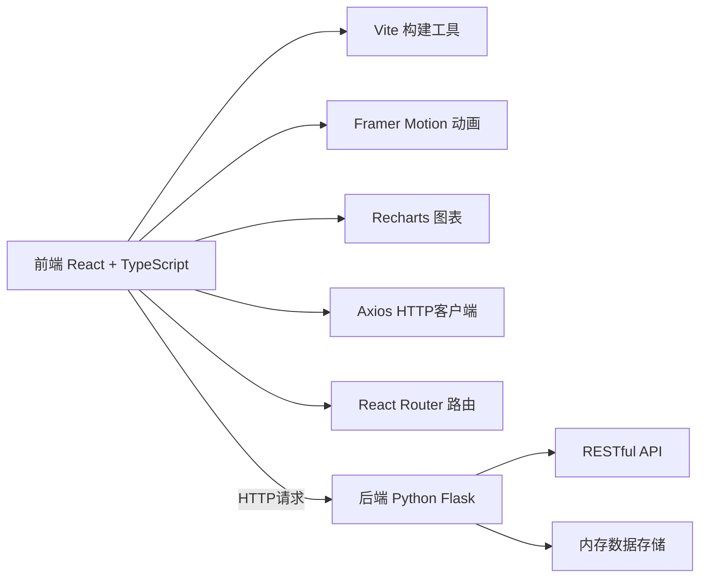
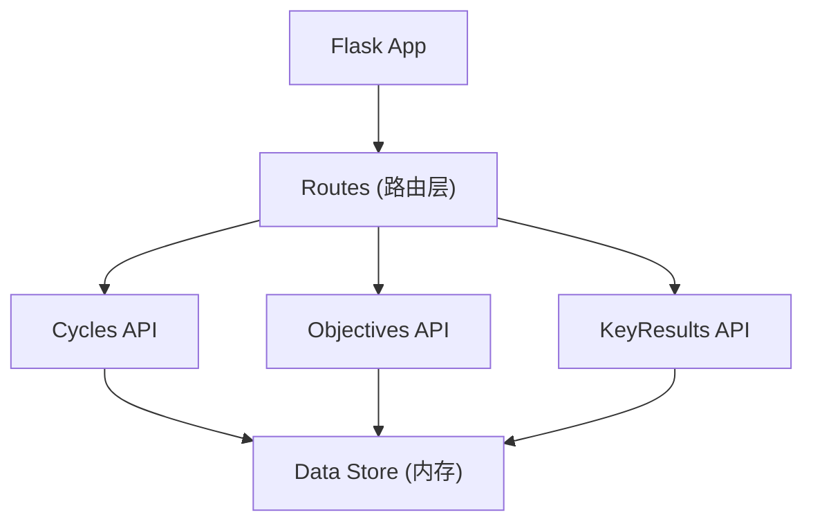
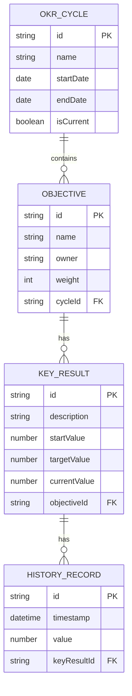

## 1. 架构设计



## 2. 技术描述

- 前端：React@18 + TypeScript + Vite@5
- UI框架：原生CSS（CSS Modules）
- 状态管理：React Hooks (useState, useEffect)
- 动画库：framer-motion@11
- 图表库：recharts@2
- HTTP客户端：axios@1
- 路由：react-router-dom@6
- 后端：Python Flask@3
- 数据存储：内存存储（开发阶段）

## 3. 路由定义

| 路由 | 用途 |
|------|------|
| / | OKR看板主页 |

## 4. API 定义

### 4.1 数据类型

```typescript
interface OKRCycle {
  id: string;
  name: string;
  startDate: string;
  endDate: string;
  isCurrent: boolean;
}

interface KeyResult {
  id: string;
  description: string;
  startValue: number;
  targetValue: number;
  currentValue: number;
  history: Array<{
    timestamp: string;
    value: number;
  }>;
}

interface Objective {
  id: string;
  name: string;
  owner: string;
  weight: number;
  keyResults: KeyResult[];
  cycleId: string;
}
```

### 4.2 API 接口

| 方法 | 路径 | 描述 |
|------|------|------|
| GET | /api/cycles | 获取所有OKR周期 |
| POST | /api/cycles | 创建新的OKR周期 |
| GET | /api/cycles/:id/objectives | 获取指定周期的所有目标 |
| POST | /api/objectives | 创建新目标 |
| PUT | /api/objectives/:id | 更新目标 |
| DELETE | /api/objectives/:id | 删除目标 |
| POST | /api/objectives/:id/keyresults | 添加关键结果 |
| PUT | /api/keyresults/:id | 更新关键结果 |

## 5. 服务器架构



## 6. 数据模型

### 6.1 实体关系



### 6.2 核心计算逻辑

- 目标完成百分比 = (所有关键结果的加权平均值)
- 关键结果完成百分比 = (currentValue - startValue) / (targetValue - startValue) * 100%
- 三栏分类规则：未开始(0-30%)、进行中(31-70%)、已完成(71-100%)

## 7. 项目文件结构

```
project/
├── backend/
│   └── app.py              # Flask后端应用
├── src/
│   ├── api/
│   │   └── okrApi.ts       # API请求封装
│   ├── components/
│   │   ├── OKRCard.tsx     # 目标卡片组件
│   │   └── ProgressChart.tsx # 进度图表组件
│   ├── pages/
│   │   └── OKRDashboard.tsx # 主看板页面
│   ├── App.tsx             # 根组件
│   └── main.tsx            # 入口文件
├── index.html
├── package.json
├── tsconfig.json
├── vite.config.ts
└── README.md
```

## 8. 性能指标

- 页面首次加载时间：≤ 2秒
- 拖拽响应延迟：≤ 100ms
- 进度图表重新渲染延迟：≤ 200ms
- 前端包体积：优化后 ≤ 300KB gzip
