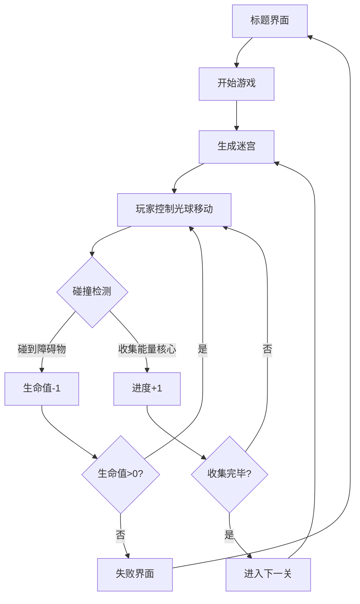

## 1. 产品概述

"节奏回廊"是一款融合音乐节奏与迷宫探索的3D科幻风格追逐游戏。玩家控制发光光球在动态生成的迷宫中穿梭，躲避随音乐节拍移动的障碍物，收集能量核心解锁下一关。

- 目标用户：音乐游戏爱好者、休闲玩家、科幻视觉风格爱好者
- 产品价值：将音乐节奏反馈与迷宫探索玩法结合，提供沉浸式的视听交互体验

## 2. 核心功能

### 2.2 功能模块
1. **音频引擎模块**：音乐节拍分析、BPM提取、节拍事件派发
2. **迷宫生成模块**：随机迷宫生成、墙体与通道数据输出
3. **玩家控制模块**：键盘/触控输入、光球移动、碰撞检测、生命值管理
4. **障碍物模块**：节拍联动障碍物生成、障碍物移动控制
5. **游戏主循环**：状态管理、关卡切换、HUD渲染、3D场景整合

### 2.3 页面详情
| 页面名称 | 模块名称 | 功能描述 |
|-----------|-------------|---------------------|
| 游戏主界面 | 3D场景渲染 | 全屏三维迷宫场景，包含光球、墙体、障碍物、粒子特效 |
| 游戏主界面 | HUD界面 | 左上角生命值、右上角分数与关卡、底部进度条 |
| 游戏主界面 | 状态覆盖层 | 标题界面、暂停界面、胜利界面、失败界面 |

## 3. 核心流程

玩家启动游戏后进入标题界面，点击开始后进入第一关。玩家通过WASD或滑动控制光球移动，躲避随节拍移动的红色障碍物，收集金色能量核心。收集完所有能量核心后进入下一关，迷宫更大更复杂。被障碍物撞到3次游戏失败。

## 4. 用户界面设计

### 4.1 设计风格
- **主色调**：深蓝紫渐变背景 (#0F0F23 → #1A1A3E)
- **强调色**：光球白色(#FFFFFF)、障碍物红色(#FF6B6B)、能量核心金色(#FFD700)、粒子青色(#00D4FF)
- **墙体色**：随机选取 (#FF6B6B、#4ECDC4、#FFE66D、#A8E6CF)，透明度0.7
- **视觉风格**：科幻赛博朋克，发光效果，粒子尘埃，节奏感动画
- **字体**：使用现代无衬线字体，HUD信息清晰易读

### 4.2 页面设计概述
| 页面名称 | 模块名称 | UI元素 |
|-----------|-------------|-------------|
| 游戏主界面 | 3D场景 | 俯视45°视角相机、迷宫墙体、发光光球、移动障碍物、漂浮粒子、爆炸特效 |
| 游戏主界面 | HUD | 左上角心形生命图标、右上角分数/关卡数字、底部进度条、节拍提示视觉反馈 |
| 状态覆盖层 | 标题界面 | 游戏名称大字、开始按钮、操作说明 |
| 状态覆盖层 | 暂停/胜利/失败 | 居中弹窗、状态文字、重新开始按钮 |

### 4.3 响应式
- 桌面端：WASD键盘控制，全屏渲染
- 移动端：触控滑动控制，自适应屏幕尺寸

### 4.4 3D场景指引
- **环境**：深蓝紫渐变背景，300个漂浮尘埃粒子，无阴影强发光对比
- **光照**：环境光+点光源跟随光球，墙体和光球自发光材质
- **相机**：俯视45°跟随相机，平滑跟随玩家移动
- **后期处理**：Bloom发光效果增强科幻感
- **性能**：粒子数量上限500，帧率目标60fps以上
