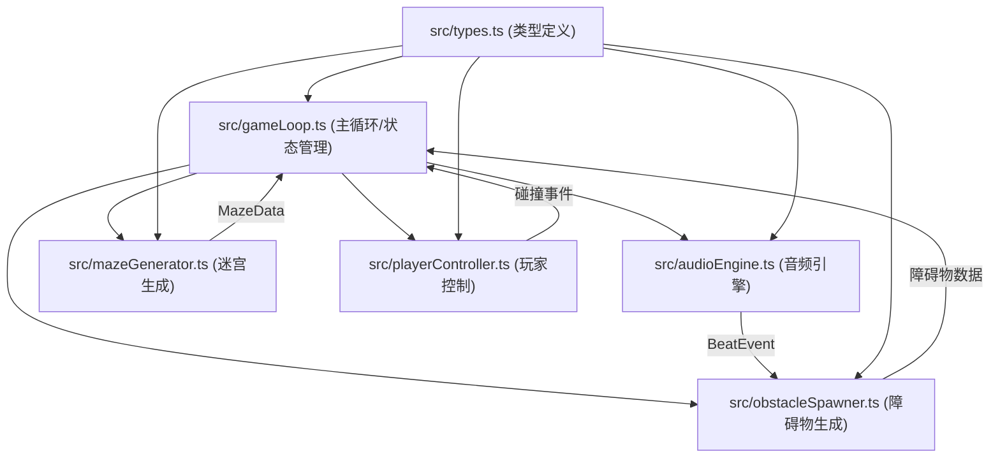
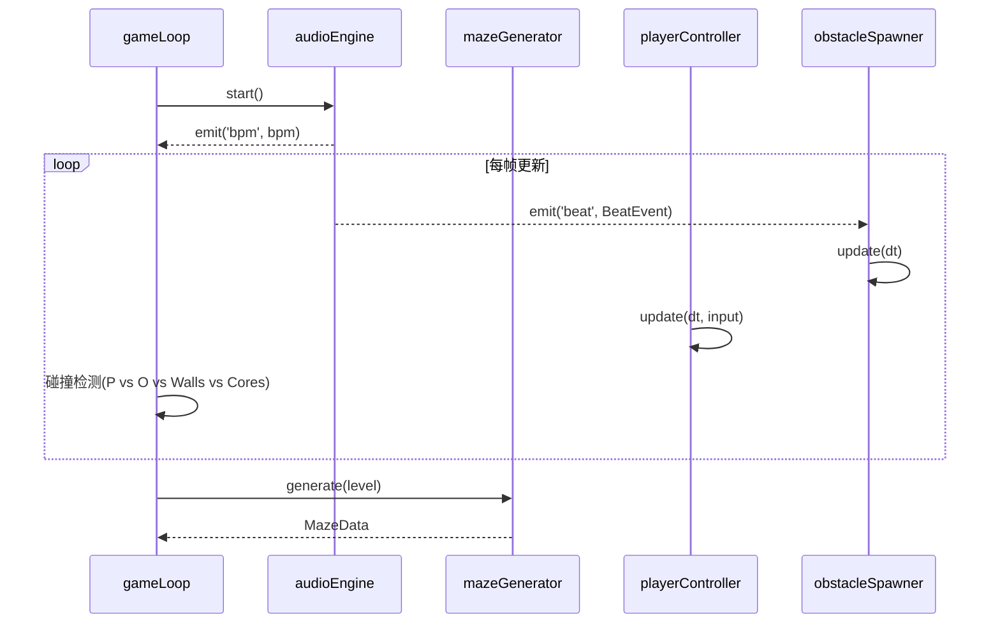

## 1. 架构设计



## 2. 技术描述

- **前端框架**: Three.js + TypeScript (原生TS，无React)
- **构建工具**: Vite
- **音频处理**: Web Audio API (AudioContext, AnalyserNode)
- **事件系统**: 自定义 EventEmitter (Node.js风格轻量实现)
- **3D渲染**: Three.js (MeshBasicMaterial/MeshStandardMaterial, PerspectiveCamera, WebGLRenderer)
- **无后端、无数据库**：纯前端单页游戏应用

## 3. 文件结构

| 文件路径 | 用途 |
|-------|---------|
| /package.json | 依赖管理与启动脚本 |
| /vite.config.js | Vite构建配置 |
| /tsconfig.json | TypeScript编译配置 |
| /index.html | 入口HTML页面 |
| /src/types.ts | 共用类型定义 |
| /src/audioEngine.ts | 音频节拍分析与事件派发 |
| /src/mazeGenerator.ts | 回溯算法迷宫生成 |
| /src/playerController.ts | 玩家输入、移动、碰撞、生命值 |
| /src/obstacleSpawner.ts | 节拍联动障碍物生成与移动 |
| /src/gameLoop.ts | Three场景、游戏主循环、关卡管理、HUD |

## 4. 核心数据模型

### 4.1 类型定义

```typescript
// GameState 游戏状态
type GameState = 'title' | 'playing' | 'paused' | 'win' | 'lose';

// BeatEvent 节拍事件
interface BeatEvent {
  time: number;        // 节拍发生时间
  bpm: number;         // 当前BPM
  intensity: number;   // 节拍强度 0~1
}

// MazeData 迷宫数据
interface MazeData {
  width: number;       // 迷宫宽度(格数)
  height: number;      // 迷宫高度(格数)
  walls: Array<{x: number, z: number}>;     // 墙体坐标
  passages: Array<{x: number, z: number}>;  // 通道坐标
}

// PlayerState 玩家状态
interface PlayerState {
  position: {x: number, z: number};
  lives: number;
  radius: number;
  isHit: boolean;
}

// Obstacle 障碍物
interface Obstacle {
  id: number;
  position: {x: number, z: number};
  direction: {x: number, z: number};
  speed: number;
  radius: number;
}

// EnergyCore 能量核心
interface EnergyCore {
  id: number;
  position: {x: number, z: number};
  collected: boolean;
}
```

### 4.2 模块间交互


