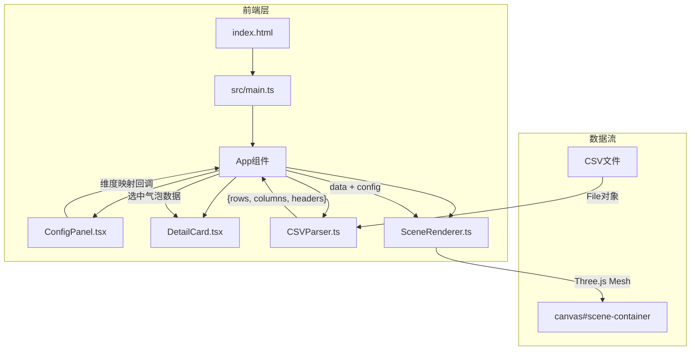

## 1. 架构设计



## 2. 技术说明
- **前端**：React@18 + TypeScript + Three.js + Vite
- **初始化工具**：vite-init (react-ts模板)
- **后端**：无
- **数据库**：无，纯前端应用

### 依赖列表
| 依赖包 | 版本 | 用途 |
|--------|------|------|
| react | ^18 | UI框架 |
| react-dom | ^18 | DOM渲染 |
| three | latest | 三维渲染引擎 |
| papaparse | latest | CSV文件解析 |
| framer-motion | latest | React动画库 |
| typescript | latest | 类型系统 |
| vite | latest | 构建工具 |
| @vitejs/plugin-react | latest | Vite React插件 |
| @types/three | latest | Three.js类型定义 |
| @types/papaparse | latest | PapaParse类型定义 |

## 3. 路由定义
| 路由 | 用途 |
|------|------|
| / | 单页应用，包含所有功能模块 |

## 4. 数据模型

### 4.1 核心数据结构

```typescript
interface ParsedData {
  rows: Record<string, string | number>[];
  columns: string[];
  headers: string[];
}

interface BubbleConfig {
  xAxis: string;
  yAxis: string;
  zAxis: string;
  sizeColumn: string;
  colorGradient: [string, string];
  minRadius: number;
  maxRadius: number;
  timeColumn?: string;
}

interface BubbleData {
  position: [number, number, number];
  radius: number;
  color: string;
  values: Record<string, string | number>;
  matrixIndex: [number, number, number];
}
```

### 4.2 文件调用关系

```
index.html
  └── src/main.ts (入口，挂载App + 初始化Three.js)
        ├── src/CSVParser.ts (CSV解析)
        │     输入: File对象
        │     输出: {rows, columns, headers}
        ├── src/SceneRenderer.ts (三维渲染)
        │     输入: ParsedData + BubbleConfig
        │     输出: Three.js场景到canvas
        │     方法: drawBubbleMatrix(), playTimeline()
        ├── src/ConfigPanel.tsx (配置面板)
        │     输入: columns列表 + 当前config
        │     输出: 回调通知config变更
        └── src/DetailCard.tsx (详情卡片)
              输入: 被点击气泡的BubbleData
              输出: 渲染卡片到body
```
