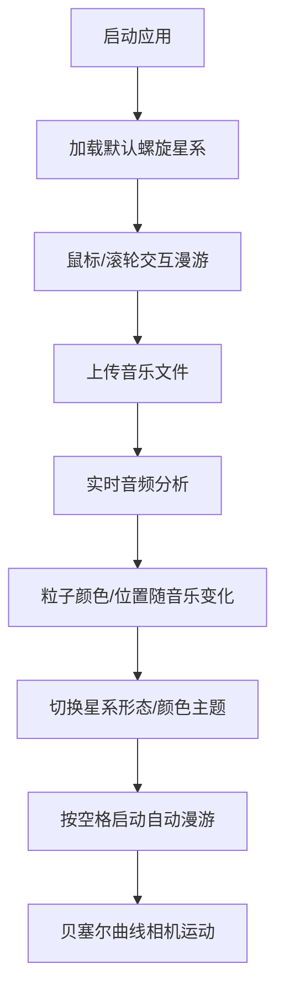

## 1. 产品概述

交互式三维粒子星系漫游应用，让用户在动态生成的粒子星系中自由探索，体验音乐可视化与沉浸式宇宙漫游。

- 核心价值：将音乐与三维粒子艺术结合，创造可交互的沉浸式视觉体验
- 目标用户：音乐爱好者、视觉艺术爱好者、创意工作者

## 2. 核心功能

### 2.1 功能模块

1. **主场景页面**：三维粒子星系渲染、相机控制、实时帧率显示
2. **控制面板**：星系形态切换、颜色主题切换、音乐文件上传

### 2.2 功能详情

| 模块名称 | 功能描述 |
|---------|---------|
| 粒子星系渲染 | 10000个粒子动态渲染，支持螺旋、椭圆、不规则三种形态平滑过渡 |
| 音乐可视化 | 音频实时频率分析，粒子颜色与位置随音乐节奏变化 |
| 视角交互 | 鼠标拖拽旋转、滚轮缩放、空格键自动漫游 |
| 主题系统 | 三套颜色主题（银河蓝紫、火焰红橙、翠绿渐变）平滑切换 |
| 性能监控 | 右上角实时FPS显示 |

## 3. 核心流程

用户打开应用 → 看到默认螺旋星系 → 通过鼠标拖拽/滚轮交互 → 上传音乐文件 → 体验音乐驱动粒子动画 → 切换星系形态/颜色主题 → 按空格键开启自动漫游

## 4. 用户界面设计

### 4.1 设计风格
- 深空暗色调背景（#0a0a1a）
- 扁平化设计，圆角现代风格
- 半透明控制面板，玻璃拟态效果
- 所有交互元素0.2s ease-out过渡动画

### 4.2 页面设计

| 页面 | 模块 | UI元素 |
|------|------|--------|
| 主场景 | 3D画布 | Three.js渲染、粒子系统、OrbitControls |
| 主场景 | FPS显示 | 右上角白色monospace字体12px，半透明背景 |
| 主场景 | 控制面板 | 右下角宽280px，圆角16px，半透明深色背景 |
| 控制面板 | 星系形态选择 | 下拉选择器（螺旋/椭圆/不规则） |
| 控制面板 | 颜色主题选择 | 下拉选择器（银河蓝紫/火焰红橙/翠绿渐变） |
| 控制面板 | 音乐上传 | 虚线边框按钮，悬停高亮效果 |

### 4.3 响应式
- Desktop-first设计，全屏沉浸式体验
- 控制面板固定定位，不随画布缩放

### 4.4 3D场景指导
- 环境光：淡蓝色#b5d5ff，强度0.3
- 方向光：白色#ffffff，强度0.6，从右上角照射
- 相机初始位置(30,20,30)，指向原点
- 粒子：圆形渐变纹理（50%透明度边缘），大小1.5-3单位
- 自动漫游：贝塞尔曲线控制点(30,20,30)→(0,40,0)→(-30,-20,30)，周期10秒
