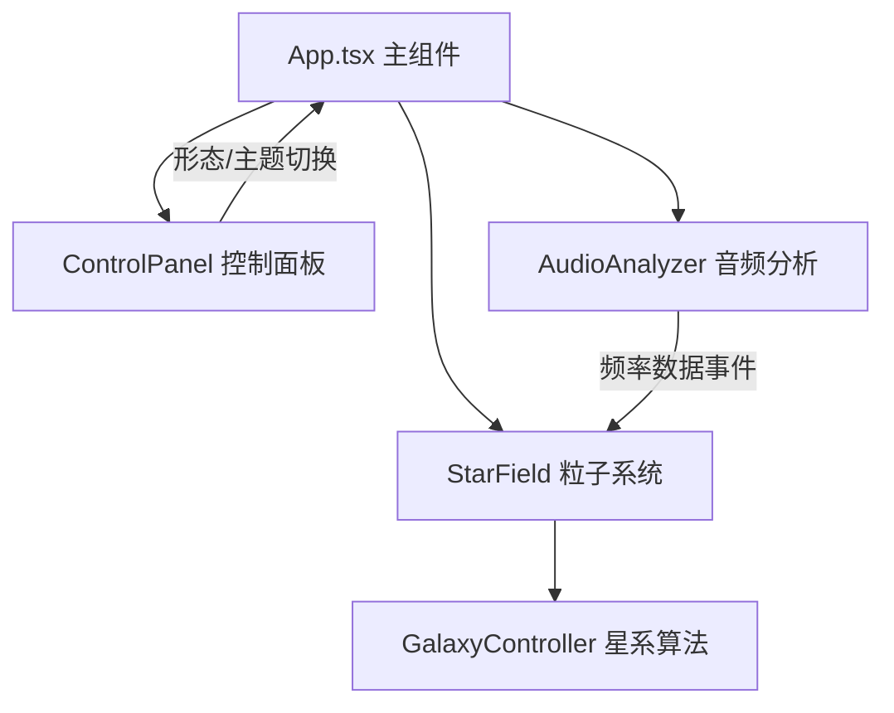

## 1. 架构设计



## 2. 技术说明

- 前端框架：React@18 + TypeScript@5
- 构建工具：Vite@5 + @vitejs/plugin-react
- 3D渲染：three@0.160 + @react-three/fiber@8 + @react-three/drei@9
- 状态管理：React useState/useRef（轻量级场景）
- 音频处理：Web Audio API

## 3. 文件结构

```
├── package.json
├── vite.config.js
├── tsconfig.json
├── index.html
└── src/
    ├── App.tsx
    ├── scene/
    │   ├── StarField.tsx
    │   └── GalaxyController.ts
    ├── audio/
    │   └── AudioAnalyzer.ts
    └── ui/
        └── ControlPanel.tsx
```

## 4. 模块定义

### 4.1 GalaxyController.ts
```typescript
type GalaxyType = 'spiral' | 'elliptical' | 'irregular';
export function generateGalaxyPositions(type: GalaxyType, count: number, radius: number): Float32Array;
```

### 4.2 AudioAnalyzer.ts
```typescript
export interface AudioData {
  frequencyAverage: number;  // 0-255
  isBeat: boolean;
}
export class AudioAnalyzer extends EventTarget {
  loadFile(file: File): Promise<void>;
  start(): void;
  stop(): void;
  getAudioData(): AudioData;
}
```

### 4.3 颜色主题定义
```typescript
export type ColorTheme = 'galaxy' | 'fire' | 'forest';
export interface ThemeColors {
  primary: string;    // 低频 0-85
  secondary: string;  // 中频 86-170
  highlight: string;  // 高频 171-255
  ambient: string;    // 环境光色
  uiAccent: string;   // UI高亮色
}
```

## 5. 性能优化

- 使用BufferGeometry attributes直接更新，避免重建几何体
- PointsMaterial而非自定义着色器，减少CPU开销
- 节拍检测限流：每500ms最多触发一次
- 目标：60FPS稳定渲染10000个粒子
