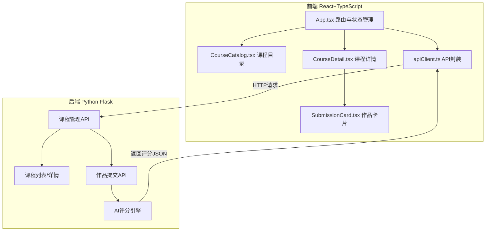
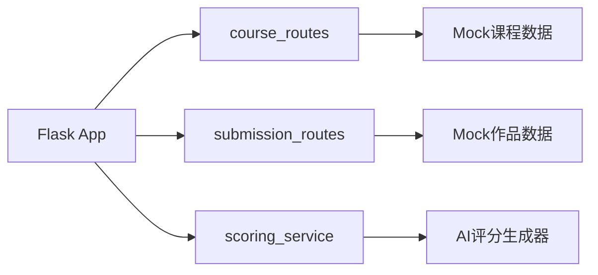
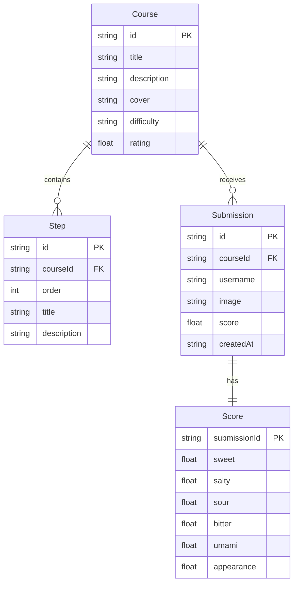

## 1. 架构设计



## 2. 技术说明
- 前端：React 18 + TypeScript + Vite + Tailwind CSS + Zustand
- 初始化工具：vite-init (react-ts模板)
- 后端：Python Flask (独立进程)
- 数据库：无持久化，使用内存Mock数据
- 图表库：Recharts（六维雷达图）
- 动画库：Framer Motion（页面过渡与微动效）
- HTTP客户端：Axios

## 3. 路由定义
| 路由 | 用途 |
|------|------|
| / | 课程目录首页，展示课程卡片网格与搜索筛选 |
| /course/:id | 课程详情页，含步骤说明、作品提交与作品排行 |

## 4. API定义

### 4.1 获取课程列表
```
GET /api/courses?search=&difficulty=
Response: [{ id, title, description, cover, difficulty, rating, steps }]
```

### 4.2 获取课程详情
```
GET /api/courses/:id
Response: { id, title, description, cover, difficulty, rating, steps[], submissions[] }
```

### 4.3 提交作品与获取评分
```
POST /api/courses/:id/submit
Body: { image: file, description: string }
Response: {
  submissionId: string,
  scores: { sweet, salty, sour, bitter, umami, appearance },
  suggestions: string[],
  overallScore: number
}
```

### 4.4 获取课程作品列表
```
GET /api/courses/:id/submissions
Response: [{ id, username, image, score, createdAt }]
```

## 5. 服务端架构图



## 6. 数据模型

### 6.1 数据模型定义



### 6.2 Mock数据定义
使用Python字典列表存储课程与作品数据，包含6门不同难度的烹饪课程，每门课程含3-5个步骤说明，以及若干示例作品提交记录。
