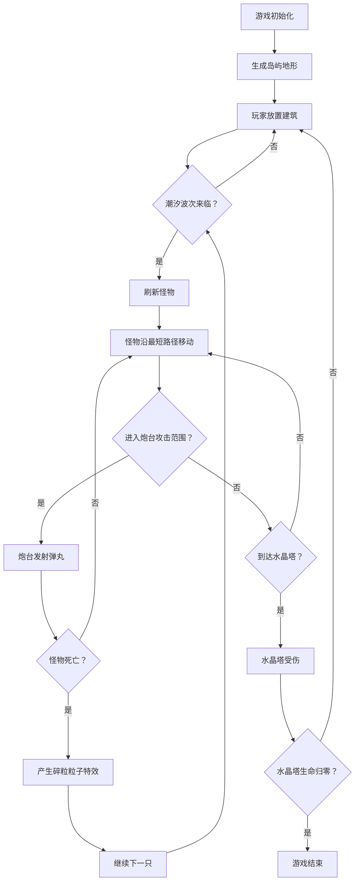

## 1. 产品概述

像素潮汐是一款塔防与资源管理混搭游戏，玩家在被海洋分割的岛屿群上建造防御塔抵御周期性来袭的潮汐怪物，同时安排工人采集木材、石头和魔法水晶来升级建筑。核心玩法融合放置炮台与资源采集，面向喜欢策略与经营类游戏的桌面端玩家。

## 2. 核心功能

### 2.1 功能模块

1. **岛屿地图编辑模块**: 30x30网格岛屿，鼠标放置炮台/工人小屋，半透明预览与弹性落成动画，地形属性影响冷却
2. **潮汐怪物进攻模块**: 怪物从四周随机刷新，BFS最短路径向水晶塔移动，周期加速，炮台自动攻击与粒子特效
3. **资源管理模块**: 工人小屋自动产出资源，右上角仪表盘实时显示，资源不足闪烁警示
4. **海洋动画模块**: 动态正弦波海面，岛屿边缘泡沫粒子动画

### 2.2 页面详情

| 页面名称 | 模块名称 | 功能描述 |
|---------|---------|---------|
| 游戏主界面 | 岛屿地图 | 30x30网格渲染，鼠标悬停预览，点击放置建筑，地形颜色区分 |
| 游戏主界面 | 资源仪表盘 | 右上角圆角矩形卡片，显示木材/石头/水晶数量，不足时红色闪烁 |
| 游戏主界面 | 炮台升级弹窗 | 点击已有炮台弹出升级面板，0.3秒淡入淡出过渡 |
| 游戏主界面 | 怪物血条 | 跟随怪物的血量条，实时显示受伤状态 |
| 游戏主界面 | 海洋背景 | 正弦波动态海面，岛屿边缘泡沫粒子 |

## 3. 核心流程

玩家进入游戏 → 系统初始化岛屿地形（柏林噪声生成） → 玩家在空白格放置炮台/工人小屋 → 每15秒一波潮汐怪物从四周刷新 → 怪物沿最短路径向中心水晶塔移动 → 炮台自动攻击范围内怪物 → 工人每3秒采集资源 → 用资源升级炮台 → 循环直至水晶塔被摧毁或玩家主动结束

## 4. 用户界面设计

### 4.1 设计风格

- **主色调**: 暗蓝色海洋（#1a3a5c ~ #2a5a8c）与暖色陆地（#f4e4c1沙滩、#6aab5e草地）对比基调
- **按钮样式**: 圆角矩形，暖色调，带弹性缩放反馈
- **字体**: Fira Mono（数字/代码风格），系统字体（UI文本）
- **布局风格**: 全屏Canvas游戏区域，右侧/顶部浮动UI面板
- **图标风格**: 像素风格资源图标（木材🪵、石头🪨、水晶💎）

### 4.2 页面设计概览

| 页面名称 | 模块名称 | UI元素 |
|---------|---------|--------|
| 游戏主界面 | 岛屿地图 | Canvas渲染30x30网格，每格40x40px，地形颜色区分，半透明预览，弹性落成动画 |
| 游戏主界面 | 资源仪表盘 | 右上角浮动，3张圆角矩形卡片(120x50px)，左图标(24x24px)右数字(Fira Mono 18px) |
| 游戏主界面 | 炮台升级弹窗 | 居中弹窗，0.3秒淡入淡出，显示升级费用与属性 |
| 游戏主界面 | 怪物血条 | 跟随怪物的绿色/红色渐变条 |
| 游戏主界面 | 海洋背景 | Canvas正弦波(波长60px,振幅8px,周期2秒)，泡沫粒子(2-3px,0.8秒) |

### 4.3 响应式

- 桌面端优先，最小宽度1280px
- Canvas游戏区域居中显示
- UI面板固定定位，不随滚动变化

### 4.4 动效规格

| 动效 | 时长 | 缓动 | 说明 |
|------|------|------|------|
| 建筑预览淡入 | 0.5秒 | linear | 半透明白色#ffffff透明度0.3 |
| 建筑落成 | 0.3秒 | ease-out弹性缩放 | 从0缩放到1 |
| 弹窗出现/消失 | 0.3秒 | 淡入淡出 | opacity 0→1 / 1→0 |
| 炮台射击 | 0.4秒间隔 | linear | 弹丸飞行速度200px/s |
| 命中粒子 | 0.3秒 | 随机扩散 | 4-6个粒子 |
| 资源不足闪烁 | 0.2秒 | 闪红色 | 卡片边框/背景闪红 |
| 海面波动 | 2秒周期 | 正弦 | 波长60px，振幅8px |
| 泡沫粒子 | 0.8秒 | 消散 | 2-3px白色粒子 |
