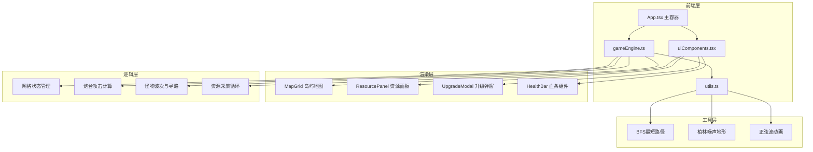

## 1. 架构设计



## 2. 技术说明

- **前端**: React@18 + TypeScript + Vite
- **状态管理**: React useState/useRef + gameEngine回调通知
- **渲染**: Canvas 2D（主游戏区域）+ React DOM（UI面板）
- **动画**: requestAnimationFrame 主循环，30fps目标帧率
- **初始化工具**: Vite
- **后端**: 无
- **数据库**: 无

## 3. 路由定义

| 路由 | 用途 |
|------|------|
| / | 游戏主界面（单页应用，无路由切换） |

## 4. 文件结构

```
├── package.json
├── index.html
├── tsconfig.json
├── vite.config.js
└── src/
    ├── main.tsx
    ├── App.tsx
    ├── gameEngine.ts
    ├── uiComponents.tsx
    └── utils.ts
```

### 4.1 各文件职责

| 文件 | 职责 |
|------|------|
| package.json | 依赖管理，启动脚本 npm run dev |
| index.html | 入口HTML，挂载点id=root |
| tsconfig.json | TypeScript严格模式，jsx: react-jsx |
| vite.config.js | React插件配置，base: ./ |
| src/main.tsx | React入口，渲染App组件 |
| src/App.tsx | 主游戏容器，管理游戏状态，调度 initGame → onBattleLoop → onUpdateResources |
| src/gameEngine.ts | 纯逻辑模块：网格状态、炮台放置与攻击、怪物波次与寻路、资源采集，回调通知App |
| src/uiComponents.tsx | React组件：MapGrid、ResourcePanel、UpgradeModal、HealthBar |
| src/utils.ts | 工具函数：BFS寻路、柏林噪声地形生成、正弦波海面动画计算 |

## 5. 核心数据模型

### 5.1 网格单元格

```typescript
interface Cell {
  x: number;
  y: number;
  terrain: "sand" | "grass" | "rock" | "shallowWater";
  building: "tower" | "workerHut" | "crystalTower" | null;
  buildingLevel?: number;
  cooldown: number;
}
```

### 5.2 炮台

```typescript
interface Tower {
  x: number;
  y: number;
  level: 1 | 2 | 3;
  range: 60;
  fireInterval: 400;
  lastFireTime: number;
  projectileColor: string;
}
```

### 5.3 怪物

```typescript
interface Monster {
  id: string;
  x: number;
  y: number;
  hp: number;
  maxHp: number;
  baseSpeed: number;
  currentSpeed: number;
  speedBoostCount: number;
  path: { x: number; y: number }[];
  pathIndex: number;
}
```

### 5.4 资源

```typescript
interface Resources {
  wood: number;
  stone: number;
  crystal: number;
}
```

### 5.5 弹丸

```typescript
interface Projectile {
  x: number;
  y: number;
  targetX: number;
  targetY: number;
  speed: 200;
  color: string;
  towerLevel: number;
}
```

### 5.6 粒子特效

```typescript
interface Particle {
  x: number;
  y: number;
  vx: number;
  vy: number;
  life: number;
  maxLife: number;
  size: number;
  color: string;
}
```

## 6. 关键算法

### 6.1 BFS最短路径寻路

从怪物当前位置到水晶塔的BFS搜索，避开建筑物（可通行地形为沙滩、草地、浅水），返回路径坐标数组。

### 6.2 柏林噪声地形生成

简化版柏林噪声，用于生成自然过渡的地形分布：浅水→沙滩→草地→岩石的渐变带。

### 6.3 正弦波海面动画

多层正弦波叠加，波长60px、振幅8px、周期2秒，颜色从#1a3a5c渐变到#2a5a8c。

## 7. 性能目标

- 目标帧率: 30fps
- Canvas渲染: 仅重绘变化区域（脏矩形优化）
- 怪物数量上限: 每波5-8只，同时在场不超过40只
- 粒子池: 复用粒子对象，避免GC压力
