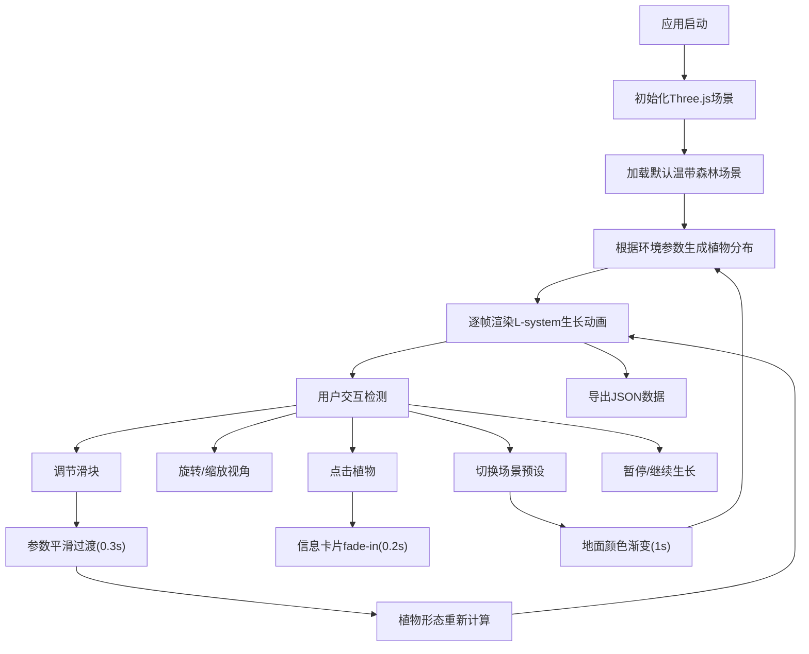

## 1. 产品概述

三维植物群落生长模拟器是一个面向生态学爱好者与游戏地图设计师的可视化工具，通过L-system算法与Three.js渲染引擎，直观展示光照、水分、温度等环境因子对植物分布与形态演变的影响。用户可以实时调节环境参数，观察不同生态系统中植物群落的动态变化过程。

## 2. 核心功能

### 2.1 功能模块清单

| 序号 | 模块名称 | 核心功能 |
|------|----------|----------|
| 1 | 三维植物生长引擎 | L-system递归生成乔木/灌木/草本，60帧生长动画，枝干/叶片颜色渐变，实时暂停/继续 |
| 2 | 环境参数控制面板 | 光照强度(0.2-1.5)、土壤湿度(0-100)、温度(5-40)滑块控制，实时响应+0.3s过渡动画 |
| 3 | 群落分布模拟 | 50x50地面网格，基于环境因子自动布局，最小间隔2单位，50-200棵植物动态调节，随机延迟淡入 |
| 4 | 交互探索系统 | 鼠标拖拽旋转(阻尼0.8)、滚轮缩放(5-40)、点击植物弹出信息卡片(0.2s fade-in) |
| 5 | 场景切换与导出 | 热带雨林/温带森林/荒漠三种预设，1s地面颜色过渡，植物群落JSON导出 |

### 2.2 功能详情

| 模块名称 | 子功能 | 功能描述 |
|----------|--------|----------|
| 植物生长引擎 | L-system规则 | 分叉角度、节间长度、叶片数量参数化，三种植物差异化规则 |
| 植物生长引擎 | 生长动画 | 60帧渐进展开，枝干#8B4513→#5C3A21，叶片#7CCD7C→#2E8B57渐变 |
| 环境控制面板 | 滑块组件 | 轨道200×6px圆角3px，手柄18px圆形#00d4ff，步长精确控制 |
| 群落分布模拟 | 环境分布图 | 光照西北→东南递减，湿度沿河流向两侧扩散分布 |
| 交互探索 | 视角控制 | OrbitControls阻尼旋转，缩放范围约束，平滑过渡 |
| 场景切换 | 预设过渡 | 地面#4a7c59/#8b6b4a/#d4b896三种主色调，ease过渡1s |

## 3. 核心流程

## 4. 用户界面设计

### 4.1 设计风格

- **主色调**：深空蓝 #0a0a1a 背景，毛玻璃控制面板，渐变青蓝 #00d4ff→#0088cc 强调色
- **视觉层次**：植物色彩明亮有层次(嫩绿→深绿)，地面网格暗蓝(#3a3a3a 0.1透明度)，边缘高对比
- **交互元素**：圆角8px按钮，悬停亮度+15% + 1.05倍缩放(0.2s ease-out)，全局默认0.3s过渡
- **字体风格**：现代无衬线字体，数字使用等宽字体提升读数清晰度

### 4.2 页面布局设计

| 区域 | 组件 | 规格参数 |
|------|------|----------|
| 全背景 | Three.js Canvas | 100vw × 100vh，深空蓝背景，50×50网格地面 |
| 右上角(≥1024px) | 环境控制面板 | 280px宽，#1a1a2e 85%透明度，12px圆角，16px内边距，backdrop-blur 10px |
| 底部(<768px) | 抽屉式面板 | 可展开/收起，同配色方案 |
| 点击植物弹出 | 信息卡片 | 200px宽，白色背景，8px圆角，0 4px 16px rgba(0,0,0,0.3)阴影 |
| 底部栏 | 场景切换+导出按钮 | 固定底部，左对齐，按钮间距8px |

### 4.3 响应式设计

- **桌面端(≥1024px)**：控制面板固定右上角，底部操作栏水平排列
- **平板端(768-1024px)**：控制面板宽度缩小至240px，保持右上角
- **移动端(<768px)**：控制面板折叠为底部抽屉，点击展开，信息卡片适配宽度

### 4.4 三维场景设计规范

- **环境氛围**：深空蓝雾化背景(Fog)，两盏方向光+环境光组合，模拟自然光照
- **摄像机配置**：PerspectiveCamera初始fov=60，位置(20, 18, 25)，lookAt中心点
- **光照系统**：AmbientLight强度0.4，DirectionalLight1 (30,50,30)强度0.8，DirectionalLight2补光
- **后处理优化**：抗锯齿开启，色调映射ACESFilmicToneMapping，输出sRGB颜色空间
- **性能预算**：50-200棵植物实例化渲染，单帧计算≤10ms，FPS≥30
