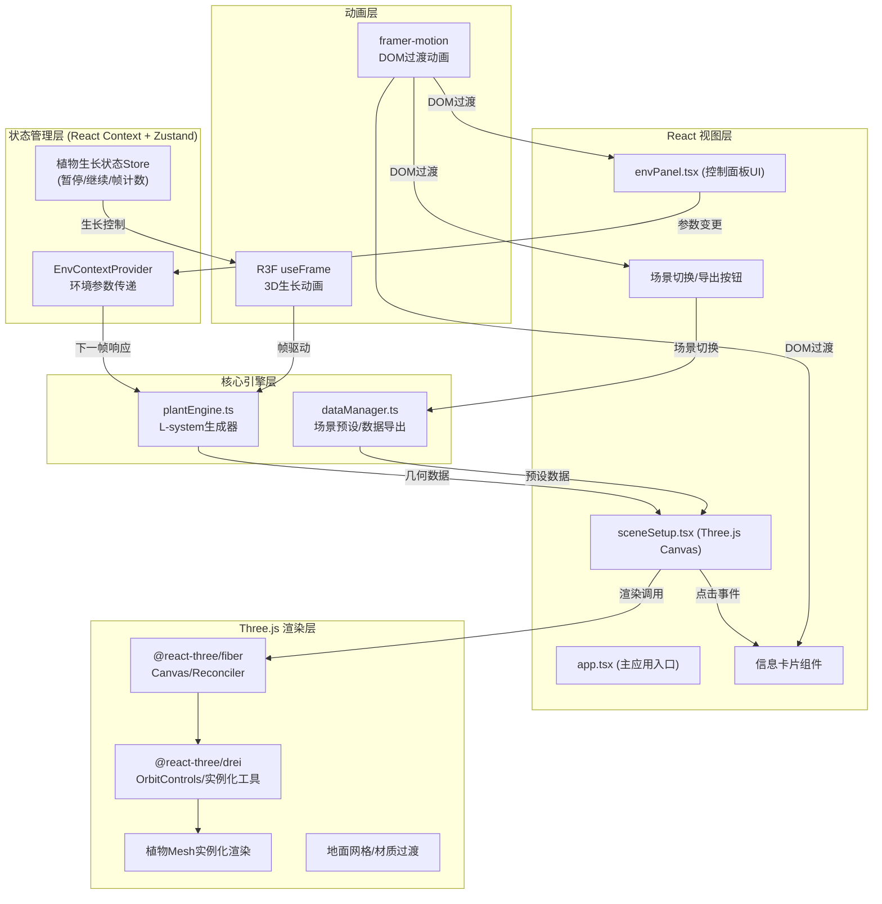

## 1. 架构设计



## 2. 技术选型说明

| 层级 | 技术 | 版本要求 | 用途 |
|------|------|----------|------|
| 前端框架 | React | ^18.2.0 | 组件化UI构建，Hooks状态管理 |
| 构建工具 | Vite | ^5.0.0 | 快速热更新，ESM原生构建 |
| 语言 | TypeScript | ^5.3.0 | 类型安全，严格模式编译 |
| 3D引擎 | three | ^0.160.0 | 底层WebGL渲染API |
| 3D React绑定 | @react-three/fiber | ^8.15.0 | React声明式Three.js渲染 |
| 3D工具库 | @react-three/drei | ^9.92.0 | OrbitControls、实例化等常用组件 |
| 动画库 | framer-motion | ^10.16.0 | DOM元素过渡动画、手势 |
| 样式方案 | 原生CSS + CSS变量 | - | 毛玻璃、滑块自定义、响应式布局 |

## 3. 目录结构与模块职责

```
auto163/
├── package.json          # 依赖声明与脚本配置
├── vite.config.js        # Vite构建配置(React插件)
├── tsconfig.json         # TypeScript严格模式配置
├── index.html            # 入口HTML(全屏、背景色、viewport)
└── src/
    ├── app.tsx           # 主应用：全局状态整合、布局容器
    ├── envPanel.tsx      # 环境控制面板：3滑块、响应式布局
    ├── plantEngine.ts    # L-system引擎：规则系统+几何生成+动画帧
    ├── sceneSetup.tsx    # 场景渲染：地面/光照/摄像机/交互/植物
    └── dataManager.ts    # 数据管理：预设场景、JSON导入导出
```

## 4. 数据模型定义

### 4.1 核心TypeScript类型

```typescript
// 环境参数
interface EnvironmentParams {
  light: number;      // 0.2 - 1.5
  moisture: number;   // 0 - 100
  temperature: number;// 5 - 40
}

// 植物类型
type PlantType = 'tree' | 'shrub' | 'grass';

// 单株植物实例
interface PlantInstance {
  id: string;
  type: PlantType;
  position: [number, number, number]; // x, y, z
  scale: number;
  rotation: number;
  params: PlantParams;
  growthFrame: number; // 0 - 60
  spawnDelay: number;  // 0 - 0.5s
}

// 植物L-system参数
interface PlantParams {
  branchAngle: number;       // 分叉角度(度)
  internodeLength: number;   // 节间长度
  leafCount: number;         // 叶片数量
  recursionDepth: number;    // 递归深度
  thicknessRatio: number;    // 粗细衰减比
}

// L-system 几何体输出
interface PlantGeometry {
  stemVertices: Float32Array;
  stemColors: Float32Array;
  leafVertices: Float32Array;
  leafColors: Float32Array;
  indices: Uint32Array;
}

// 场景预设
interface ScenePreset {
  id: 'rainforest' | 'temperate' | 'desert';
  name: string;
  groundColor: string;
  defaultEnv: EnvironmentParams;
  plantDistribution: Record<PlantType, number>; // 各类型占比
}

// 导出数据结构
interface ExportData {
  exportTime: string;
  sceneType: string;
  environment: EnvironmentParams;
  plants: Array<{
    id: string;
    type: PlantType;
    position: [number, number, number];
    scale: number;
    height: number;
    branchLevels: number;
    envScore: number;
  }>;
}
```

### 4.2 数据流向约束

1. 单向数据流：`envPanel → Context → plantEngine → sceneSetup → Canvas`
2. 禁止植物组件直接修改环境参数
3. 场景切换通过dataManager统一调度，触发地面材质动画
4. 生长帧由useFrame驱动，plantEngine为纯函数计算，不持有可变状态

## 5. 性能优化策略

| 优化点 | 技术方案 | 预期效果 |
|--------|----------|----------|
| 大量植物渲染 | `<InstancedMesh>` + 批量矩阵更新 | 200棵植物≈50 draw calls |
| L-system计算 | 缓存递归结果，仅参数变化时重算 | 单帧计算<10ms |
| 生长动画 | 线性插值顶点位置，GPU skinning替代 | 平滑60帧无卡顿 |
| 颜色渐变 | 顶点色预计算 + 帧插值 | 无运行时字符串解析 |
| 响应式布局 | CSS Media Query + framer-motion AnimatePresence | DOM重排最小化 |
| 控制面板 | React.memo + useMemo参数计算 | 滑块拖动无明显延迟 |
