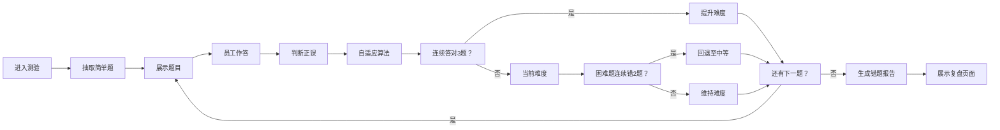

# 自适应知识测验与个性化错题复盘系统 - PRD

## 1. 产品概述

面向企业内部培训场景的自适应知识测验平台，通过智能难度调整算法为员工提供个性化测验体验，并生成针对性的错题复习报告，提升培训效率与学习效果。

- 目标用户：企业HR/培训管理员、企业员工
- 核心价值：动态调整题目难度的自适应测验、基于知识标签的个性化错题复盘
- 解决问题：传统纸质/简单电子问卷无法动态调整难度、缺乏个性化复习指导

## 2. 核心功能

### 2.1 用户角色

| 角色 | 登录方式 | 核心权限 |
|------|----------|----------|
| 员工用户 | 账号登录 | 参加测验、查看错题复盘报告 |
| 培训管理员 | 管理员账号 | 题库管理、查看测验统计看板、按部门筛选 |

### 2.2 功能模块

1. **自适应测验页**：实时难度调整、进度显示、答题反馈动画
2. **错题复盘页**：知识标签分组、环形图占比、瀑布流错题卡片、展开动画
3. **管理员看板**：完成率统计、平均正确率、难度分布柱状图、部门筛选
4. **题库管理**：题目CRUD、批量导入、难度/知识标签管理

### 2.3 页面详情

| 页面名称 | 模块名称 | 功能描述 |
|----------|----------|----------|
| 自适应测验页 | 进度条模块 | 顶部绿色进度条，随答题数平滑过渡，圆角6px，高度8px |
| 自适应测验页 | 题目卡片 | 居中显示，680px宽，16px圆角，阴影效果 |
| 自适应测验页 | 选项按钮 | 渐变蓝色按钮，悬停上移效果，正确/错误反馈背景色 |
| 自适应测验页 | 反馈提示 | 0.5秒淡入淡出，正确淡绿/错误淡红，缩放动画 |
| 错题复盘页 | 知识标签组 | 按标签分组，每个标签配环形图（半径40px，#FF6B6B） |
| 错题复盘页 | 错题卡片 | 白色背景，圆角12px，阴影，展开高度过渡动画0.3s |
| 错题复盘页 | 答案说明 | 正确答案解析与复习建议 |
| 管理员看板 | 统计概览 | 完成率、平均正确率指标卡片 |
| 管理员看板 | 难度分布图 | 柱状图，渐变#3B82F6到#A855F7，宽度60px，间距20px，动画0.5s |
| 管理员看板 | 部门筛选 | 下拉选择部门，数据联动更新 |

## 3. 核心流程

### 3.1 员工测验流程

员工进入测验 → 系统抽取简单难度题目 → 员工作答 → 系统判断正误 → 自适应算法计算下一难度 → 展示下一题 → 测验结束 → 生成错题集与复习建议

### 3.2 管理员题库管理流程

管理员登录 → 进入题库管理 → 新增/编辑/批量导入题目 → 设置难度与知识标签 → 保存至数据库

## 4. 用户界面设计

### 4.1 设计风格

- **主色调**：深蓝 #1E3A5F（背景）、白色 #FFFFFF（内容区）
- **强调色**：渐变蓝 #3B82F6 → #2563EB（按钮）、绿色 #4ECDC4（进度条）、红色 #FF6B6B（错题标记）
- **按钮样式**：圆角8px，渐变蓝色，悬停上移2px并加深阴影
- **卡片样式**：白色背景，圆角12-16px，柔和阴影
- **字体**：现代无衬线字体，标题加粗，正文清晰易读
- **间距**：统一16px间距体系
- **图标风格**：线性简约图标，与商务风格一致

### 4.2 页面设计概览

| 页面名称 | 模块名称 | UI元素 |
|----------|----------|--------|
| 自适应测验页 | 进度条 | 绿色填充 #4ECDC4，圆角6px，高度8px，宽度平滑过渡 |
| 自适应测验页 | 题目卡片 | 居中680px宽，16px圆角，阴影0 4px 20px rgba(0,0,0,0.12) |
| 自适应测验页 | 反馈动画 | 0.5s淡入淡出，正确#d4edda/错误#f8d7da，缩放1.0→1.05→1.0，0.4s |
| 错题复盘页 | 瀑布流卡片 | 初始加载0.3s延迟依次从底部滑入，translateY(20px)→0 |
| 错题复盘页 | 环形图 | 半径40px，颜色#FF6B6B，显示错题占比 |
| 错题复盘页 | 错题卡片 | 白色背景，圆角12px，阴影0 4px 16px rgba(0,0,0,0.1)，展开动画0.3s ease-out |
| 管理员看板 | 柱状图 | 渐变#3B82F6到#A855F7，柱宽60px，间距20px，动画0.5s ease-in-out |

### 4.3 响应式设计

- **设计原则**：桌面端优先，移动端适配
- **断点**：768px
- **适配策略**：
  - 桌面端（>768px）：卡片680px宽度居中，错题复盘两列瀑布流
  - 移动端（≤768px）：卡片全宽，两列布局变单列，字号适当缩小

### 4.4 动效设计

- **页面进入**：错题卡片依次从底部滑入，0.3s延迟递增
- **题目切换**：60fps流畅动画，使用CSS transition
- **反馈提示**：缩放+淡入淡出组合动画
- **图表数据变化**：0.5s ease-out过渡
- **卡片展开**：高度过渡动画0.3s ease-out
- **按钮悬停**：上移2px + 阴影加深

## 5. 性能约束

| 指标 | 要求 |
|------|------|
| 自适应引擎响应时间 | < 5ms |
| 题目切换动画帧率 | 60fps |
| 单次测验API调用次数 | ≤ 20次 |
| 首屏加载时间 | < 2s |
