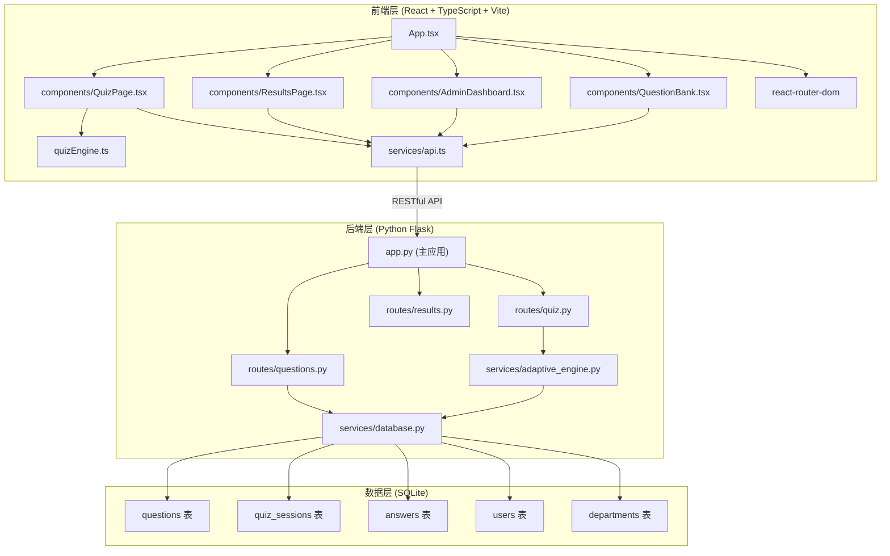
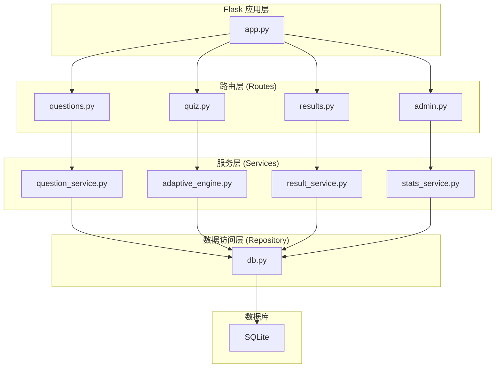
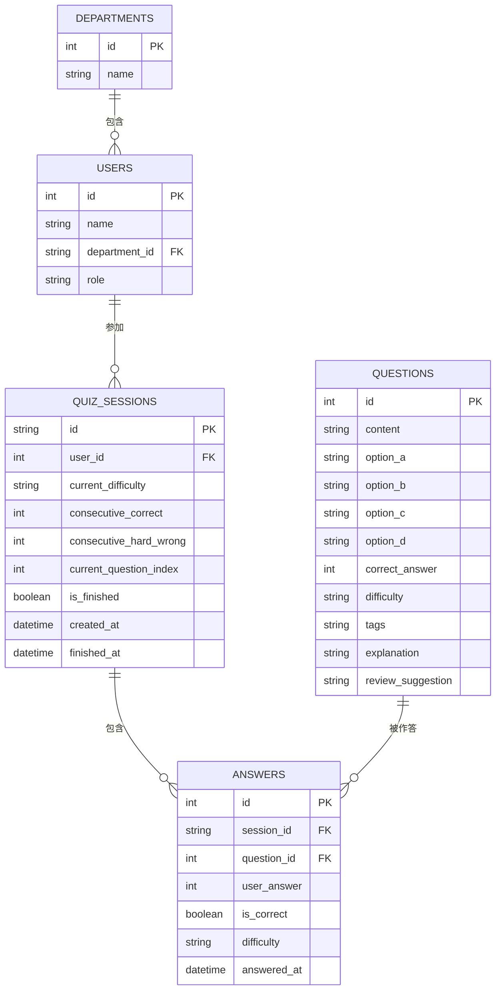

# 自适应知识测验与个性化错题复盘系统 - 技术架构文档

## 1. 架构设计



## 2. 技术栈说明

### 2.1 前端技术栈

| 技术 | 版本 | 用途 |
|------|------|------|
| React | 18.x | UI框架 |
| TypeScript | 5.x | 类型安全 |
| Vite | 5.x | 构建工具 |
| react-router-dom | 6.x | 路由管理 |
| axios | 1.x | HTTP请求 |
| framer-motion | 11.x | 动画效果 |
| recharts | 2.x | 图表库 |
| @vitejs/plugin-react | 4.x | Vite React插件 |

### 2.2 后端技术栈

| 技术 | 版本 | 用途 |
|------|------|------|
| Python | 3.10+ | 开发语言 |
| Flask | 3.x | Web框架 |
| Flask-CORS | 4.x | 跨域支持 |
| SQLite | 3.x | 数据库（内置） |
| sqlite3 | 内置 | 数据库操作 |

## 3. 文件结构与调用关系

### 3.1 前端文件结构

```
frontend/
├── package.json          # 依赖配置
├── vite.config.js        # Vite构建配置
├── tsconfig.json         # TypeScript配置
├── index.html            # 单页应用入口
├── src/
│   ├── App.tsx           # 主路由与状态管理容器
│   ├── main.tsx          # 应用入口
│   ├── quizEngine.ts     # 自适应测验引擎
│   ├── services/
│   │   └── api.ts        # API服务封装
│   ├── components/
│   │   ├── QuizPage.tsx       # 测验交互界面
│   │   ├── ResultsPage.tsx    # 结果与复盘界面
│   │   ├── AdminDashboard.tsx # 管理员看板
│   │   └── QuestionBank.tsx   # 题库管理
│   ├── types/
│   │   └── index.ts      # TypeScript类型定义
│   └── styles/
│       └── global.css    # 全局样式
```

### 3.2 数据流向说明

**测验流程数据流向：**
1. QuizPage.tsx → quizEngine.ts (提交答案)
2. quizEngine.ts → api.ts (获取下一题推荐)
3. api.ts → Flask API (请求题目数据)
4. Flask API → adaptive_engine.py (计算下一难度)
5. adaptive_engine.py → database.py (查询候选题目)
6. database.py → SQLite (查询)
7. 返回路径: SQLite → database.py → adaptive_engine.py → Flask API → api.ts → quizEngine.ts → QuizPage.tsx

**错题复盘数据流向：**
1. ResultsPage.tsx → api.ts (请求错题列表)
2. api.ts → Flask API (请求错题数据)
3. Flask API → database.py (查询错题)
4. 返回路径: SQLite → database.py → Flask API → api.ts → ResultsPage.tsx

## 4. 路由定义

| 路由路径 | 页面组件 | 说明 |
|----------|----------|------|
| `/` | QuizPage | 测验首页/开始测验 |
| `/quiz` | QuizPage | 答题页面 |
| `/results` | ResultsPage | 错题复盘页面 |
| `/admin` | AdminDashboard | 管理员看板 |
| `/admin/questions` | QuestionBank | 题库管理页面 |

## 5. API定义

### 5.1 题库管理API

| 方法 | 路径 | 功能 | 请求体 | 响应体 |
|------|------|------|--------|--------|
| GET | `/api/questions` | 获取题目列表 | `{ difficulty?, tag?, page?, pageSize? }` | `{ total, questions: Question[] }` |
| GET | `/api/questions/:id` | 获取单题详情 | - | `Question` |
| POST | `/api/questions` | 新增题目 | `Question` | `{ id, success: true }` |
| PUT | `/api/questions/:id` | 修改题目 | `Question` | `{ success: true }` |
| DELETE | `/api/questions/:id` | 删除题目 | - | `{ success: true }` |
| POST | `/api/questions/batch` | 批量导入 | `{ questions: Question[] }` | `{ count, success: true }` |

### 5.2 测验相关API

| 方法 | 路径 | 功能 | 请求体 | 响应体 |
|------|------|------|--------|--------|
| POST | `/api/quiz/start` | 开始测验 | `{ userId }` | `{ sessionId, firstQuestion }` |
| POST | `/api/quiz/next` | 获取下一题 | `{ sessionId, answer, questionId }` | `{ nextQuestion, isCorrect, isFinished }` |
| GET | `/api/quiz/:sessionId` | 获取测验状态 | - | `{ progress, currentDifficulty, answers }` |

### 5.3 结果与错题API

| 方法 | 路径 | 功能 | 请求体 | 响应体 |
|------|------|------|--------|--------|
| GET | `/api/results/:sessionId` | 获取测验结果 | - | `{ score, total, wrongAnswers, tags }` |
| GET | `/api/wrong-answers/:userId` | 获取用户错题集 | `{ tag? }` | `{ questions: WrongQuestion[], tags: TagStats[] }` |

### 5.4 管理员统计API

| 方法 | 路径 | 功能 | 请求体 | 响应体 |
|------|------|------|--------|--------|
| GET | `/api/admin/stats` | 获取统计数据 | `{ department? }` | `{ completionRate, avgAccuracy, difficultyDistribution }` |
| GET | `/api/departments` | 获取部门列表 | - | `Department[]` |

### 5.5 TypeScript类型定义

```typescript
type Difficulty = 'easy' | 'medium' | 'hard';

interface Question {
  id: number;
  content: string;
  options: string[];
  correctAnswer: number;
  difficulty: Difficulty;
  tags: string[];
  explanation: string;
  reviewSuggestion: string;
}

interface WrongQuestion extends Question {
  userAnswer: number;
  answeredAt: string;
}

interface TagStats {
  tag: string;
  totalCount: number;
  wrongCount: number;
  wrongRate: number;
}

interface QuizSession {
  id: string;
  userId: number;
  currentDifficulty: Difficulty;
  consecutiveCorrect: number;
  consecutiveHardWrong: number;
  answers: Answer[];
}

interface Answer {
  questionId: number;
  userAnswer: number;
  isCorrect: boolean;
  difficulty: Difficulty;
}

interface AdminStats {
  completionRate: number;
  avgAccuracy: number;
  difficultyDistribution: {
    easy: number;
    medium: number;
    hard: number;
  };
}
```

## 6. 服务器架构



## 7. 数据模型

### 7.1 ER图



### 7.2 DDL语句

```sql
-- 部门表
CREATE TABLE departments (
    id INTEGER PRIMARY KEY AUTOINCREMENT,
    name VARCHAR(100) NOT NULL UNIQUE
);

-- 用户表
CREATE TABLE users (
    id INTEGER PRIMARY KEY AUTOINCREMENT,
    name VARCHAR(100) NOT NULL,
    department_id INTEGER,
    role VARCHAR(20) DEFAULT 'employee',
    FOREIGN KEY (department_id) REFERENCES departments(id)
);

-- 题目表
CREATE TABLE questions (
    id INTEGER PRIMARY KEY AUTOINCREMENT,
    content TEXT NOT NULL,
    option_a VARCHAR(500) NOT NULL,
    option_b VARCHAR(500) NOT NULL,
    option_c VARCHAR(500) NOT NULL,
    option_d VARCHAR(500) NOT NULL,
    correct_answer INTEGER NOT NULL CHECK (correct_answer BETWEEN 0 AND 3),
    difficulty VARCHAR(20) NOT NULL CHECK (difficulty IN ('easy', 'medium', 'hard')),
    tags TEXT NOT NULL DEFAULT '[]',
    explanation TEXT,
    review_suggestion TEXT,
    created_at DATETIME DEFAULT CURRENT_TIMESTAMP
);

-- 测验会话表
CREATE TABLE quiz_sessions (
    id VARCHAR(36) PRIMARY KEY,
    user_id INTEGER NOT NULL,
    current_difficulty VARCHAR(20) DEFAULT 'easy',
    consecutive_correct INTEGER DEFAULT 0,
    consecutive_hard_wrong INTEGER DEFAULT 0,
    current_question_index INTEGER DEFAULT 0,
    is_finished INTEGER DEFAULT 0,
    total_questions INTEGER DEFAULT 10,
    score INTEGER DEFAULT 0,
    created_at DATETIME DEFAULT CURRENT_TIMESTAMP,
    finished_at DATETIME,
    FOREIGN KEY (user_id) REFERENCES users(id)
);

-- 答题记录表
CREATE TABLE answers (
    id INTEGER PRIMARY KEY AUTOINCREMENT,
    session_id VARCHAR(36) NOT NULL,
    question_id INTEGER NOT NULL,
    user_answer INTEGER NOT NULL,
    is_correct INTEGER NOT NULL,
    difficulty VARCHAR(20) NOT NULL,
    answered_at DATETIME DEFAULT CURRENT_TIMESTAMP,
    FOREIGN KEY (session_id) REFERENCES quiz_sessions(id),
    FOREIGN KEY (question_id) REFERENCES questions(id)
);

-- 索引
CREATE INDEX idx_questions_difficulty ON questions(difficulty);
CREATE INDEX idx_answers_session ON answers(session_id);
CREATE INDEX idx_quiz_sessions_user ON quiz_sessions(user_id);
```

### 7.3 初始数据

```sql
-- 初始部门
INSERT INTO departments (name) VALUES ('技术部'), ('市场部'), ('人力资源部'), ('财务部');

-- 初始用户
INSERT INTO users (name, department_id, role) VALUES
    ('张三', 1, 'employee'),
    ('李四', 1, 'employee'),
    ('王五', 2, 'employee'),
    ('赵六', 3, 'admin');

-- 示例题目
INSERT INTO questions (content, option_a, option_b, option_c, option_d, correct_answer, difficulty, tags, explanation, review_suggestion) VALUES
('Python中哪个关键字用于定义函数？', 'function', 'def', 'func', 'define', 1, 'easy', '["Python基础", "语法"]', 'Python使用def关键字定义函数', '复习Python函数定义语法'),
('以下哪个不是Python的数据类型？', 'list', 'tuple', 'array', 'dict', 2, 'easy', '["Python基础", "数据类型"]', 'Python没有内置array类型，有list、tuple、dict等', '复习Python基本数据类型'),
...;
```

## 8. 自适应算法设计

### 8.1 算法规则

- **初始难度**：simple（简单）
- **难度提升**：连续答对3题 → 提升一级（简单→中等→困难）
- **难度维持**：答错1题 → 维持当前难度，记录错题标签
- **难度回退**：困难题连续答错2题 → 回退至中等难度
- **响应时间**：< 5ms（前端本地计算）

### 8.2 算法流程

```
输入: 当前状态(难度、连续正确数、困难连续错误数) + 答题结果(正确/错误)
输出: 下一难度等级 + 候选题目ID

1. 计算新的连续正确数:
   - 正确: consecutiveCorrect++
   - 错误: consecutiveCorrect = 0

2. 计算困难连续错误数:
   - 错误且当前难度为困难: consecutiveHardWrong++
   - 其他情况: consecutiveHardWrong = 0

3. 难度调整:
   - 连续答对3题且当前非最高难度: 提升一级，重置连续正确数
   - 困难题连续答错2题: 回退至中等，重置困难连续错误数
   - 其他: 维持当前难度

4. 从题库中随机抽取对应难度的未答过的题目
```
