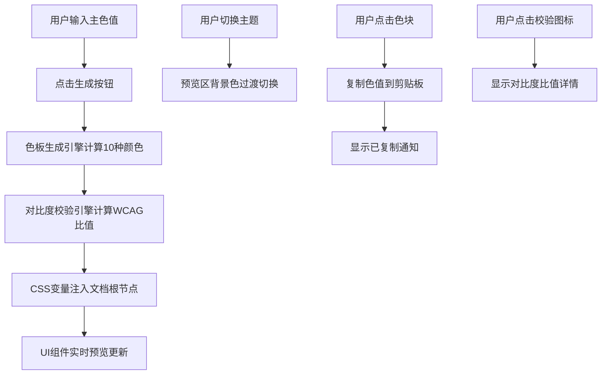

## 1. 产品概述

品牌配色方案生成与视觉一致性校验应用，帮助品牌设计师快速生成完整的品牌色板并验证无障碍对比度。

- 主要用途：输入主色值后自动生成一套完整的品牌色板，包含主色、辅色、成功色、警告色、错误色及其深浅变体
- 目标用户：品牌设计师、UI设计师、前端开发者
- 产品价值：提高配色效率，确保视觉一致性和无障碍合规性

## 2. 核心功能

### 2.1 功能模块

1. **色板生成模块**：输入十六进制主色，自动生成10色品牌色板
2. **对比度校验模块**：自动检查WCAG 2.1 AA级对比度合规性
3. **UI组件预览模块**：实时预览色板在6种常见UI组件上的效果
4. **主题切换模块**：支持浅色/深色主题预览切换

### 2.2 页面详情

| 页面名称 | 模块名称 | 功能描述 |
|---------|---------|---------|
| 主应用页面 | 色板输入区 | 十六进制颜色输入框 + 生成按钮 |
| 主应用页面 | 色板展示区 | 2行5列网格展示10个色块，支持点击复制 |
| 主应用页面 | 对比度校验区 | 色块右下角显示通过/未通过状态图标 |
| 主应用页面 | UI组件预览区 | 展示按钮、卡片、表单、导航栏等6种组件 |
| 主应用页面 | 主题切换区 | 浅色/深色主题切换按钮 |

## 3. 核心流程

## 4. 用户界面设计

### 4.1 设计风格

- 设计风格：极简干净的品牌设计风格
- 主色调：用户自定义主色驱动
- 按钮风格：圆角8px，主按钮实色填充，次按钮描边透明
- 字体：系统默认无衬线字体
- 布局风格：左右两栏布局，左侧固定400px，右侧自适应
- 阴影和圆角：精致的内阴影和外阴影，卡片圆角12-16px

### 4.2 页面设计概览

| 页面名称 | 模块名称 | UI元素 |
|---------|---------|-------|
| 主应用 | 左侧面板 | 白色背景、圆角12px、0.5px边框、4px内阴影 |
| 主应用 | 色板网格 | 2行5列、色块160x60px、圆角8px、悬停上浮动画 |
| 主应用 | 组件预览区 | flex-wrap布局、组件间距16px、组件名称标签 |
| 主应用 | 主题切换按钮 | 0.2s背景色过渡动画 |
| 主应用 | 复制通知 | 1.5s淡入淡出动画 |

### 4.3 响应式设计

- 桌面端（>768px）：左右两栏布局，左侧宽400px固定
- 移动端（≤768px）：上下堆叠布局，左右两栏均为100%宽度
- 触摸优化：可点击元素确保足够大的触摸区域

### 4.4 动效设计

- 色块悬停：向上浮动4px + 阴影变化，0.2s ease-out
- 主题切换：预览区0.4s ease-in-out渐变过渡
- 复制通知：淡入淡出动画
- 按钮悬停：亮度变化10%
- 输入框聚焦：边框颜色过渡，0.2s ease-out
- 所有动画使用 framer-motion 实现
