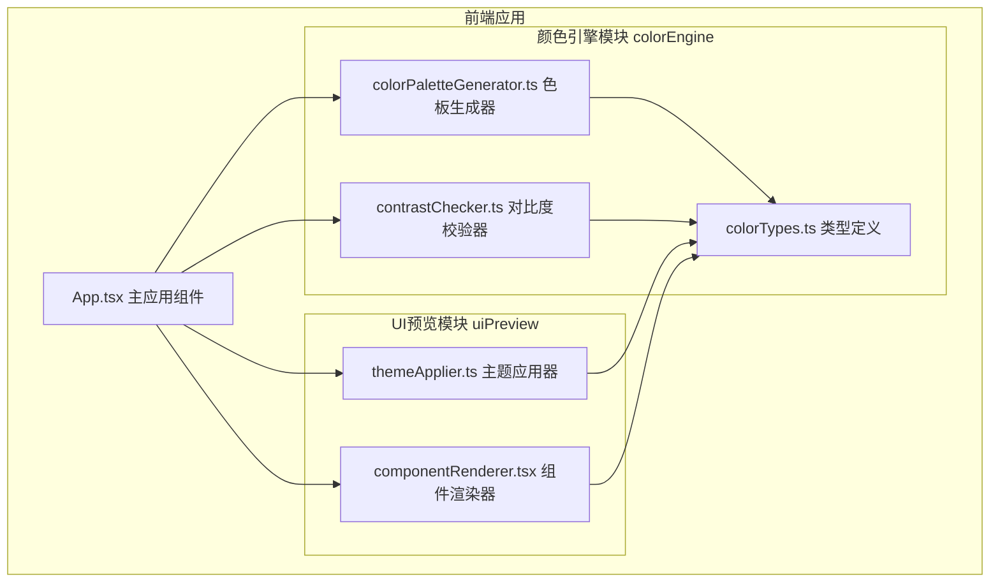

## 1. 架构设计



## 2. 技术描述

- 前端框架：React 18 + TypeScript
- 构建工具：Vite
- 动画库：framer-motion
- 颜色处理：tinycolor2
- HTTP客户端：axios（预留）
- 样式方案：CSS变量 + 内联样式

## 3. 文件结构

```
e:\solo\SoloAutoDemo\tasks\auto165\
├── package.json
├── vite.config.js
├── tsconfig.json
├── index.html
└── src\
    ├── App.tsx
    └── modules\
        ├── colorEngine\
        │   ├── colorTypes.ts
        │   ├── colorPaletteGenerator.ts
        │   └── contrastChecker.ts
        └── uiPreview\
            ├── themeApplier.ts
            └── componentRenderer.tsx
```

## 4. 核心模块说明

### 4.1 颜色引擎模块 (colorEngine)

**colorTypes.ts** - 类型定义
- ColorSwatch: 单色块接口（色值、变量名、名称）
- ColorPalette: 色板接口（主色、辅色、成功色、警告色、错误色及其变体）
- ContrastResult: 对比度校验结果接口

**colorPaletteGenerator.ts** - 色板生成器
- generatePalette(primaryHex: string): ColorPalette
- 使用 tinycolor2 进行颜色计算
- 辅色：主色调120度偏移
- 成功色：绿色系
- 警告色：橙色系
- 错误色：红色系
- 浅色变体：透明度0.2叠加白色
- 深色变体：叠加10%黑色

**contrastChecker.ts** - 对比度校验器
- checkContrast(foreground: string, background: string): ContrastResult
- 计算 WCAG 2.1 AA 级对比度
- 返回通过/未通过状态及对比度比值

### 4.2 UI预览模块 (uiPreview)

**themeApplier.ts** - 主题应用器
- applyTheme(palette: ColorPalette): void
- 生成CSS变量字符串
- 注入到文档根节点

**componentRenderer.tsx** - 组件渲染器
- ComponentRenderer组件
- 渲染6种UI组件：主按钮、次按钮、卡片、表单输入框、导航栏、进度条
- 使用CSS变量驱动样式

### 4.3 主应用组件 (App.tsx)

- 左右两栏布局
- 输入面板：颜色输入框 + 生成按钮
- 色板网格：10个色块，点击复制
- 对比度校验：状态图标展示
- UI预览区：6种组件实时预览
- 主题切换：浅色/深色背景切换
- 响应式布局适配

## 5. 性能指标

- 颜色计算和对比度校验：< 50ms
- 界面动画帧率：60fps
- 使用 CSS 变量实现主题切换，避免重渲染

## 6. 运行方式

```bash
npm install
npm run dev
```
