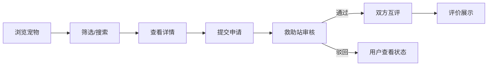

## 1. 产品概述

宠物领养助力平台是一个连接动物救助站和潜在领养人的在线平台，旨在简化宠物领养流程，提高领养成功率，建立双方信任机制。

- 主要目的：为救助站提供宠物档案管理工具，为领养人提供便捷的浏览申请渠道，通过互评机制建立信任体系
- 目标用户：动物救助站工作人员、潜在宠物领养人
- 市场价值：解决传统领养流程繁琐、信息不对称的问题，促进流浪动物领养

## 2. 核心功能

### 2.1 用户角色

| 角色 | 注册方式 | 核心权限 |
|------|----------|----------|
| 普通用户 | 无需注册（演示模式） | 浏览宠物、筛选搜索、提交领养申请、查看我的申请、发表评价 |
| 救助站管理员 | 无需注册（演示模式） | 宠物档案CRUD、领养申请审核、发表评价 |

### 2.2 功能模块

1. **首页**：宠物卡片列表、筛选侧栏、搜索框
2. **宠物详情页**：图片轮播、完整信息展示、申请领养按钮、评价列表
3. **个人中心**：我的申请列表、我的评价列表
4. **管理后台**：宠物档案管理、领养申请审核

### 2.3 页面详情

| 页面名称 | 模块名称 | 功能描述 |
|---------|----------|----------|
| 首页 | 筛选侧栏 | 多条件筛选（物种、年龄范围、体型、毛色、领养状态），实时更新结果 |
| 首页 | 搜索框 | 关键词搜索宠物名字或描述，0.2s输入防抖，匹配文本高亮 |
| 首页 | 宠物卡片列表 | 卡片式展示，280px宽，圆角16px，悬停动效，点击跳转详情 |
| 宠物详情页 | 图片轮播 | 支持手势滑动，framer-motion动画切换 |
| 宠物详情页 | 申请领养表单 | 弹窗表单，scale动画，包含姓名、电话、住址、领养理由、养宠经验 |
| 宠物详情页 | 评价列表 | 展示领养人和救助站的互评，包含星级评分和文字评价 |
| 个人中心 | 我的申请 | 列表展示申请记录，显示状态标签（待审核/已通过/已驳回） |
| 个人中心 | 我的评价 | 可展开查看评价详情 |
| 管理后台 | 申请审核 | 待审核申请列表，支持通过/驳回操作 |
| 管理后台 | 档案管理 | 创建/编辑/删除宠物档案，支持图片上传压缩 |

## 3. 核心流程

用户浏览宠物卡片 → 筛选/搜索 → 点击卡片查看详情 → 提交领养申请 → 救助站审核 → 审核通过 → 双方互评 → 评价展示

## 4. 用户界面设计

### 4.1 设计风格

- 主色：珊瑚橙 #FA8072
- 辅色：浅米色 #FFF5EE
- 背景色：#FDF2E9
- 强调文字：#4A3728
- 普通文字：#6B5B4F
- 按钮风格：圆角、主色填充、悬停过渡0.2-0.3s
- 字体：系统默认无衬线体
- 布局风格：左右两栏（左侧260px固定，右侧自适应）
- 图标风格：react-icons，简洁线性

### 4.2 页面设计概述

| 页面名称 | 模块名称 | UI元素 |
|---------|----------|--------|
| 首页 | 筛选侧栏 | 白色背景、珊瑚橙色强调、多选控件、滑块控件 |
| 首页 | 宠物卡片 | 280px宽、16px圆角、悬停阴影加深+上移4px、0.3s过渡 |
| 首页 | 搜索框 | 0.2s防抖、高亮匹配文本 |
| 宠物详情页 | 图片轮播 | 手势滑动、framer-motion动画 |
| 宠物详情页 | 申请弹窗 | 480px宽、20px圆角、scale从0.9到1.0动画 |
| 个人中心 | 申请列表 | 60px高列表项、48x48缩略图、状态标签彩色 |
| 详情页 | 星级评分 | 24px星星、选中#FBBF24、未选中#D1D5DB、悬停缩放1.2倍 |

### 4.3 响应式设计

- 桌面端：左右两栏布局，左侧筛选栏固定260px
- 移动端（<768px）：左侧栏折叠为汉堡菜单，点击从左侧滑出，0.3s ease-out动画
- 性能要求：首页卡片渲染帧率≥30fps，图片懒加载
