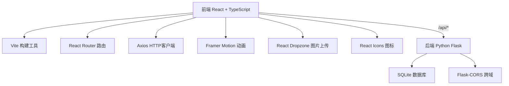
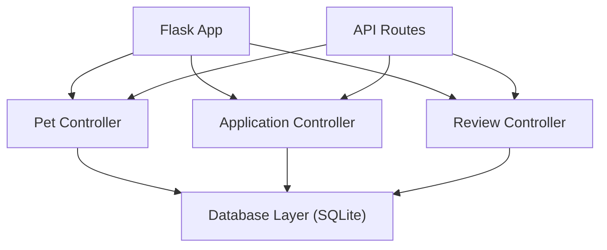
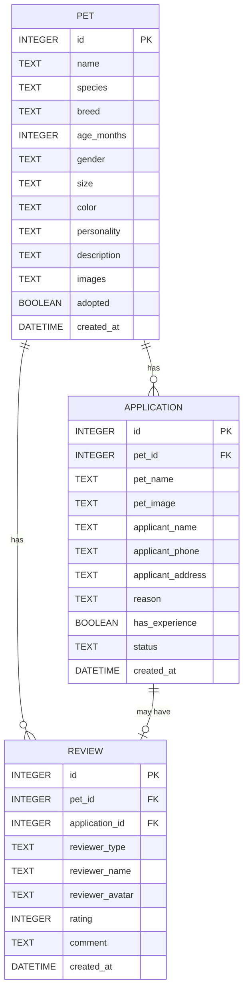

## 1. 架构设计



## 2. 技术描述

- 前端：React 18 + TypeScript + Vite
- 状态管理：React Hooks (useState, useEffect, useCallback)
- 路由：React Router DOM v6
- HTTP客户端：Axios
- 动画：Framer Motion
- 图片上传：React Dropzone
- 图标：React Icons
- 后端：Python Flask 2.x
- 数据库：SQLite 3
- 跨域：Flask-CORS
- 构建工具：Vite 5.x

## 3. 路由定义

| 路由 | 页面 | 组件 |
|------|------|------|
| / | 首页 | HomePage |
| /pets | 待领养列表 | HomePage |
| /pets/:id | 宠物详情 | PetDetailPage |
| /user | 个人中心 | UserCenterPage |
| /admin | 管理后台 | AdminDashboard |

## 4. API 定义

### 4.1 类型定义

```typescript
interface Pet {
  id: number;
  name: string;
  species: string;
  breed: string;
  ageMonths: number;
  gender: string;
  size: string;
  color: string;
  personality: string[];
  description: string;
  images: string[];
  adopted: boolean;
  createdAt: string;
}

interface Application {
  id: number;
  petId: number;
  petName: string;
  petImage: string;
  applicantName: string;
  applicantPhone: string;
  applicantAddress: string;
  reason: string;
  hasExperience: boolean;
  status: 'pending' | 'approved' | 'rejected';
  createdAt: string;
}

interface Review {
  id: number;
  petId: number;
  applicationId: number;
  reviewerType: 'adopter' | 'shelter';
  reviewerName: string;
  reviewerAvatar: string;
  rating: number;
  comment: string;
  createdAt: string;
}
```

### 4.2 接口列表

| 方法 | 路径 | 描述 |
|------|------|------|
| GET | /api/pets | 获取宠物列表（支持筛选参数） |
| GET | /api/pets/:id | 获取宠物详情 |
| POST | /api/pets | 创建宠物档案 |
| PUT | /api/pets/:id | 更新宠物档案 |
| DELETE | /api/pets/:id | 删除宠物档案 |
| GET | /api/applications | 获取申请列表 |
| POST | /api/applications | 提交领养申请 |
| PUT | /api/applications/:id/status | 更新申请状态 |
| GET | /api/pets/:id/reviews | 获取宠物评价列表 |
| POST | /api/reviews | 提交评价 |

## 5. 服务器架构图



## 6. 数据模型

### 6.1 ER图



### 6.2 DDL

```sql
CREATE TABLE IF NOT EXISTS pets (
    id INTEGER PRIMARY KEY AUTOINCREMENT,
    name TEXT NOT NULL,
    species TEXT NOT NULL,
    breed TEXT NOT NULL,
    age_months INTEGER NOT NULL,
    gender TEXT NOT NULL,
    size TEXT NOT NULL,
    color TEXT NOT NULL,
    personality TEXT NOT NULL,
    description TEXT NOT NULL,
    images TEXT NOT NULL,
    adopted BOOLEAN DEFAULT 0,
    created_at DATETIME DEFAULT CURRENT_TIMESTAMP
);

CREATE TABLE IF NOT EXISTS applications (
    id INTEGER PRIMARY KEY AUTOINCREMENT,
    pet_id INTEGER NOT NULL,
    pet_name TEXT NOT NULL,
    pet_image TEXT NOT NULL,
    applicant_name TEXT NOT NULL,
    applicant_phone TEXT NOT NULL,
    applicant_address TEXT NOT NULL,
    reason TEXT NOT NULL,
    has_experience BOOLEAN NOT NULL,
    status TEXT DEFAULT 'pending',
    created_at DATETIME DEFAULT CURRENT_TIMESTAMP,
    FOREIGN KEY (pet_id) REFERENCES pets(id)
);

CREATE TABLE IF NOT EXISTS reviews (
    id INTEGER PRIMARY KEY AUTOINCREMENT,
    pet_id INTEGER NOT NULL,
    application_id INTEGER NOT NULL,
    reviewer_type TEXT NOT NULL,
    reviewer_name TEXT NOT NULL,
    reviewer_avatar TEXT NOT NULL,
    rating INTEGER NOT NULL,
    comment TEXT NOT NULL,
    created_at DATETIME DEFAULT CURRENT_TIMESTAMP,
    FOREIGN KEY (pet_id) REFERENCES pets(id),
    FOREIGN KEY (application_id) REFERENCES applications(id)
);
```
