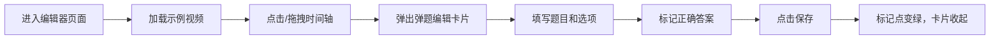
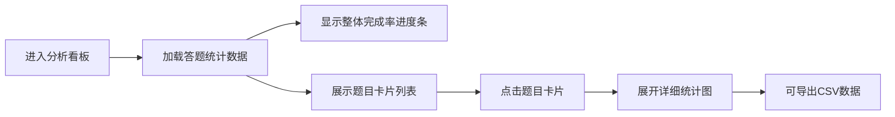

## 1. 产品概述

视频弹题编辑器与学习分析看板是一个在线教育互动工具，帮助教师在视频课程中便捷添加互动弹题，并实时分析学生答题数据。解决了手动调整弹题时机繁琐、答题统计不直观的痛点。

- 目标用户：教师（内容创作者）和学生（学习者）
- 核心价值：提升视频课程互动性，提供数据驱动的教学改进依据

## 2. 核心功能

### 2.1 用户角色

| 角色 | 注册方式 | 核心权限 |
|------|----------|----------|
| 教师 | 默认角色 | 创建编辑弹题、查看答题统计、导出数据 |
| 学生 | 默认角色 | 观看视频、作答弹题、查看答题反馈 |

### 2.2 功能模块

1. **教师端 - 时间轴编辑器**：视频时间轴可视化、拖拽创建弹题标记、弹题配置卡片
2. **教师端 - 分析看板**：整体完成率统计、单题正确率柱状图、选项分布热力图、答题时间散点图
3. **学生端 - 视频播放器**：视频播放控制、弹题自动触发、答题提交与反馈
4. **数据导出**：CSV格式答题统计导出、下载进度反馈

### 2.3 页面详情

| 页面名称 | 模块名称 | 功能描述 |
|-----------|-------------|---------------------|
| 教师编辑器 | 视频预览区 | 加载示例视频sample.mp4，支持播放暂停控制 |
| 教师编辑器 | 时间轴组件 | 100%宽度40px高的深色时间轴，显示弹题标记点，支持点击/拖拽创建 |
| 教师编辑器 | 弹题编辑卡片 | 题目文本输入、2-4个选项配置、正确答案标记、分数设置 |
| 学生播放器 | 视频播放区 | 70%宽度居中的HTML5视频播放器 |
| 学生播放器 | 弹题覆盖层 | 半透明遮罩、淡入滑入动画、答题交互、正确错误反馈 |
| 分析看板 | 统计概览 | 圆形进度条显示整体完成率 |
| 分析看板 | 题目列表 | 卡片式题目列表，点击展开详细统计 |
| 分析看板 | 数据可视化 | 正确率柱状图、选项分布热力图、答题时间散点图 |

## 3. 核心流程

### 教师创建弹题流程

### 学生答题流程

### 教师查看分析流程

## 4. 用户界面设计

### 4.1 设计风格

- **设计方向**：深色主题与浅色卡片的现代对比风格，专业教育工具质感
- **主背景色**：#0f172a（深蓝黑），营造专注沉浸感
- **卡片背景**：白色 #ffffff 或浅灰 #f8fafc，突出内容层次
- **主色调**：#3b82f6（蓝色）用于主要操作按钮
- **成功色**：#66bb6a（绿色）、#10b981（翠绿）用于正确状态
- **警告色**：#ffa726（橙色）用于待完成状态
- **错误色**：#ef4444（红色）用于错误反馈
- **文字主色**：#1e293b，辅助文字 #64748b
- **字体选择**：标题使用"Space Grotesk"，正文使用"Inter"
- **圆角**：卡片统一12px圆角，按钮8px圆角，弹题卡片20px圆角
- **阴影**：基础阴影 0 4px 12px rgba(0,0,0,0.08)，hover时加深至 0 8px 24px rgba(0,0,0,0.12)
- **动画**：统一使用0.2s-0.4s ease过渡，framer-motion实现滑入淡入缩放效果

### 4.2 页面设计概述

| 页面名称 | 模块名称 | UI元素 |
|-----------|-------------|-------------|
| 教师编辑器 | 时间轴 | 深色长条#1e1e2e，圆形标记点直径16px，状态颜色区分 |
| 教师编辑器 | 弹题卡片 | 白底阴影，input边框1px solid #d1d5db，radio+选项输入框组合，选项添加动画0.2s ease-out |
| 学生播放器 | 弹题覆盖层 | 半透明黑色遮罩，浅色渐变背景卡片，选项按钮悬停过渡0.2s ease |
| 学生播放器 | 提交按钮 | 背景#3b82f6，文字白色，点击时scale(0.95)反馈0.1s，加载旋转动画1s循环 |
| 分析看板 | 圆形进度条 | 直径80px，Conic Gradient绘制，已完成绿色，未完成灰色#e5e7eb |
| 分析看板 | 导出按钮 | 背景#10b981，文字白色，点击加载动画0.3s，toast提示背景#065f46 |

### 4.3 响应式设计

- 设计原则：Desktop-first，移动端自适应
- 断点：768px为主要响应式断点
- 视频播放器：移动端宽度100%
- 分析看板：桌面端两列网格（min-width: 320px），<768px时变为单列
- 间距调整：移动端卡片上下间距增加至16px
- 触控优化：按钮最小触控区域44px，移动端适当放大

### 4.4 动效设计

- 弹题出现：AnimatePresence实现，从底部滑入+淡入，0.4s ease
- 弹题消失：淡出+缩放，0.3s ease-in-out
- 卡片收起：缩放动画0.3s ease-in-out
- 按钮反馈：hover变亮#2563eb，阴影提升，0.2s ease
- 选项添加：高度展开+淡入，0.2s ease-out
- 加载状态：旋转动画1s循环
