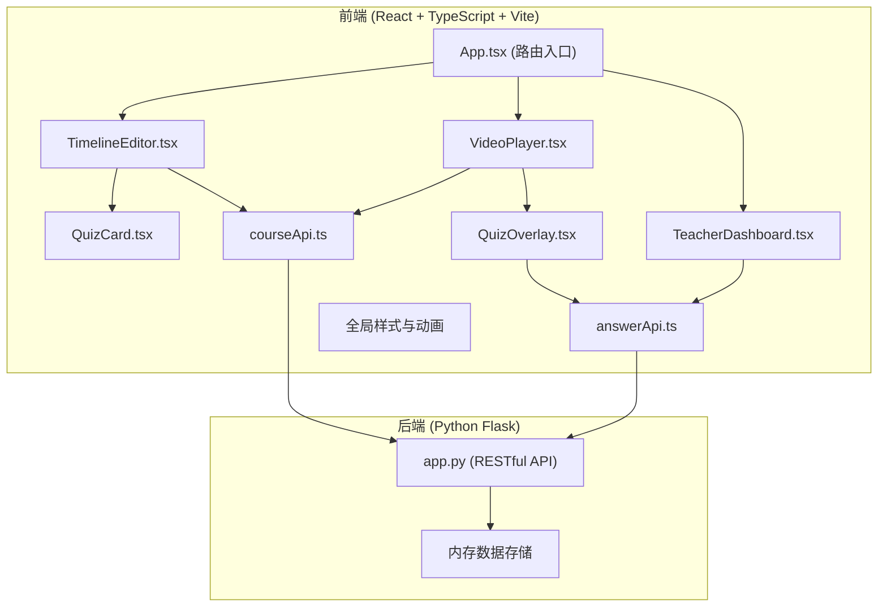
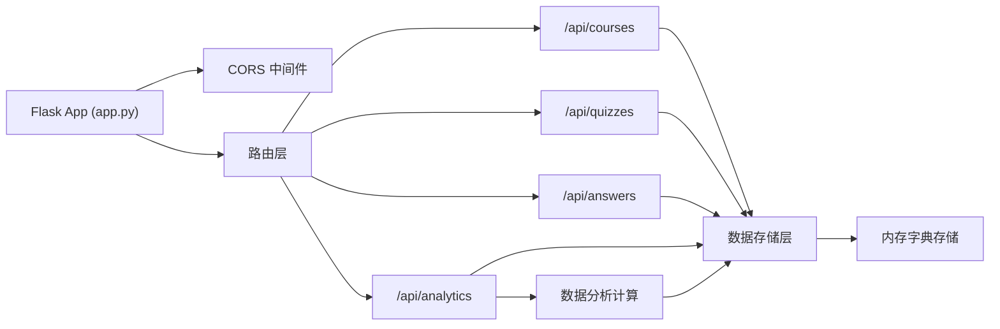
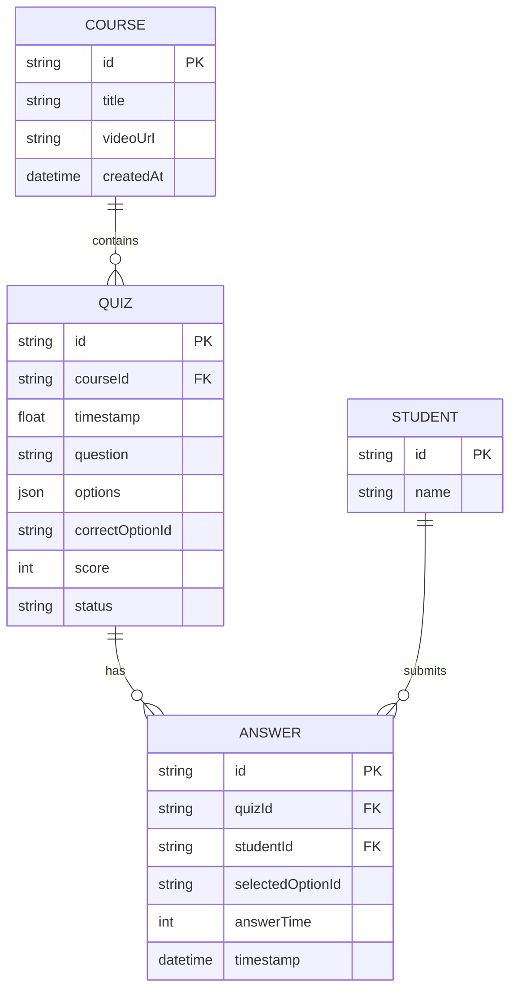

## 1. 架构设计



## 2. 技术描述

- **前端**：React 18 + TypeScript + Vite 5
- **路由**：react-router-dom 6
- **HTTP客户端**：axios
- **动画库**：framer-motion
- **图表库**：recharts
- **状态管理**：React Hooks (useState, useEffect) + 组件props传递
- **后端**：Python Flask 3.x
- **数据存储**：内存字典（模拟持久化）
- **初始化工具**：vite-init

## 3. 路由定义

| 路由 | 页面组件 | 用途 |
|-------|---------|------|
| /editor | TimelineEditor页面 | 教师端弹题编辑器 |
| /analytics | TeacherDashboard页面 | 教师端分析看板 |
| /player | VideoPlayer页面 | 学生端视频播放器 |
| / | 重定向到/editor | 默认入口 |

## 4. API 定义

### TypeScript 类型定义

```typescript
interface QuizOption {
  id: string;
  text: string;
}

interface QuizItem {
  id: string;
  courseId: string;
  timestamp: number;
  question: string;
  options: QuizOption[];
  correctOptionId: string;
  score: number;
  status: 'draft' | 'complete';
}

interface AnswerSubmission {
  quizId: string;
  studentId: string;
  selectedOptionId: string;
  answerTime: number;
  timestamp: number;
}

interface AnswerResult {
  isCorrect: boolean;
  correctOptionId: string;
  explanation: string;
}

interface QuizAnalytics {
  quizId: string;
  question: string;
  totalAttempts: number;
  correctCount: number;
  accuracy: number;
  optionDistribution: { [optionId: string]: number };
  averageAnswerTime: number;
  answerTimeDistribution: number[];
}

interface CourseAnalytics {
  courseId: string;
  totalQuizzes: number;
  totalStudents: number;
  completionRate: number;
  quizAnalytics: QuizAnalytics[];
}

interface Course {
  id: string;
  title: string;
  videoUrl: string;
  quizzes: QuizItem[];
}
```

### API 端点

| 方法 | 路径 | 描述 | 请求参数 | 响应 |
|------|------|------|----------|------|
| GET | /api/courses | 获取课程列表 | - | Course[] |
| GET | /api/courses/:id | 获取单个课程 | courseId | Course |
| GET | /api/courses/:id/quizzes | 获取课程弹题列表 | courseId | QuizItem[] |
| POST | /api/courses/:id/quizzes | 保存弹题 | courseId, quizData | QuizItem |
| PUT | /api/quizzes/:id | 更新弹题 | quizId, quizData | QuizItem |
| POST | /api/answers | 提交答案 | quizId, answer, studentId | AnswerResult |
| GET | /api/analytics/:courseId | 获取课程分析数据 | courseId | CourseAnalytics |

## 5. 服务端架构



## 6. 数据模型

### 6.1 实体关系图



### 6.2 内存数据结构

```python
# 内存存储结构
storage = {
    "courses": {
        "course_001": {
            "id": "course_001",
            "title": "示例课程",
            "videoUrl": "sample.mp4",
            "quizzes": []
        }
    },
    "quizzes": {},
    "answers": [],
    "students": {
        "student_001": {"id": "student_001", "name": "学生1"}
    }
}
```

## 7. 文件结构与调用关系

```
auto167/
├── package.json
├── vite.config.js
├── tsconfig.json
├── index.html
├── src/
│   ├── App.tsx                    # 路由入口，调用services
│   ├── main.tsx                   # React入口
│   ├── types/
│   │   └── index.ts              # 类型定义
│   ├── services/
│   │   ├── courseApi.ts          # 课程API，调用axios
│   │   └── answerApi.ts          # 答题API，调用axios
│   ├── components/
│   │   ├── editor/
│   │   │   ├── TimelineEditor.tsx  # 调用courseApi.saveQuiz
│   │   │   └── QuizCard.tsx        # 接收QuizItem props，onChange回调
│   │   ├── player/
│   │   │   ├── VideoPlayer.tsx     # 调用courseApi.getCourse
│   │   │   └── QuizOverlay.tsx     # 调用answerApi.submitAnswer
│   │   └── common/
│   │       └── CircularProgress.tsx
│   └── pages/
│       ├── EditorPage.tsx
│       ├── PlayerPage.tsx
│       └── TeacherDashboard.tsx    # 调用answerApi.getAnalytics
└── backend/
    └── app.py                     # Flask API
```

### 数据流向说明

1. **教师端编辑器数据流**：
   - TimelineEditor → courseApi.getQuizzes() → 后端 /api/courses/:id/quizzes → 渲染弹题标记
   - 用户拖拽创建 → TimelineEditor本地状态 → QuizCard编辑 → courseApi.saveQuiz() → 后端存储

2. **学生端播放器数据流**：
   - VideoPlayer → courseApi.getCourse() → 后端 /api/courses/:id → 解析弹题时间映射
   - 视频timeupdate → 检查时间点 → QuizOverlay显示 → answerApi.submitAnswer() → 后端 /api/answers

3. **分析看板数据流**：
   - TeacherDashboard → answerApi.getAnalytics() → 后端 /api/analytics/:courseId → 计算统计数据 → recharts渲染图表

## 8. 性能优化策略

- 视频预加载：使用`preload="metadata"`减少初始加载时间
- 弹题时间映射：使用Map<number, QuizItem>实现O(1)时间查找
- 列表虚拟化：100+弹题时使用虚拟滚动
- API防抖：保存操作使用300ms防抖避免频繁请求
- 图表数据缓存：分析数据使用localStorage缓存5分钟
- 动画优化：使用transform属性而非layout属性实现高性能动画

## 9. 安全考虑

- CORS配置：后端允许前端域名访问
- 输入验证：后端对所有API参数进行类型和范围校验
- XSS防护：React默认自动转义，用户输入显示前进行sanitize
- 模拟数据：不使用真实敏感数据，所有学生ID为模拟值
