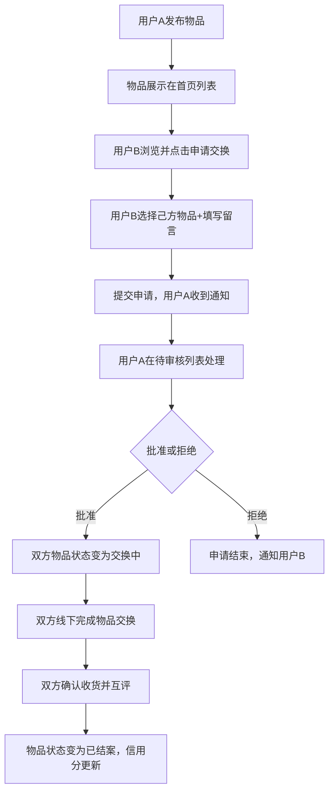
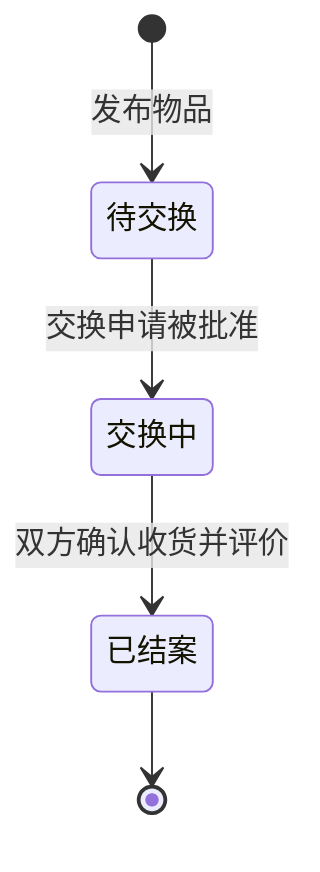

## 1. 产品概述

社区以物易物交换平台，解决社区内线下物品交换效率低、缺乏信用记录且易产生纠纷的问题。通过线上发布、申请、审核、评价的完整流程，实现闲置物品的高效流转，建立社区信用体系。

- **核心价值**：提升社区闲置物品交换效率，建立可追溯的物品流转历史和用户信用体系
- **目标用户**：社区居民，有闲置物品需要交换或寻找有用物品的用户
- **市场定位**：社区级别的信任型以物易物平台

## 2. 核心功能

### 2.1 用户角色

| 角色 | 注册方式 | 核心权限 |
|------|---------|----------|
| 普通用户 | 直接使用（演示环境） | 发布物品、浏览物品、申请交换、审核申请、信用评价 |

### 2.2 功能模块

1. **物品发布与展示模块**：物品发布表单、物品卡片列表、物品详情页
2. **交换申请与审核模块**：交换申请模态框、待审核列表、通知系统
3. **流转轨迹与信用评价模块**：物品时间轴、星级评价、信用分展示
4. **个人中心模块**：用户发布物品、交换记录、信用分展示

### 2.3 页面详情

| 页面名称 | 模块名称 | 功能描述 |
|---------|---------|----------|
| 首页 | 物品列表 | 三列网格展示物品卡片，支持品类、新旧程度、关键字筛选 |
| 物品详情页 | 物品信息展示 | 展示物品详情、流转时间轴、评价面板、交换申请入口 |
| 发布页 | 物品发布表单 | 填写物品信息、上传图片、提交发布 |
| 个人中心 | 用户信息 | 展示用户信用分、发布的物品、待审核/历史交换记录 |

## 3. 核心流程

### 用户交换主流程

### 物品状态流转

## 4. 用户界面设计

### 4.1 设计风格

- **设计方向**：极简卡片式布局，强调信任感和易用性
- **主色调**：浅灰背景 #f8f9fa，深蓝导航栏与按钮 #2c3e50
- **品类色**：家具 #ff7e67、书籍 #4ecdc4、电子产品 #45b7d1、厨具 #f9ca24、装饰 #6c5ce7、其他 #fd79a8
- **按钮样式**：圆角设计，hover时背景色加深10%，点击时缩小至0.95倍
- **字体**：系统默认无衬线字体，Google Fonts辅助
- **图标风格**：简洁线性图标，使用lucide-react

### 4.2 页面设计概述

| 页面名称 | 模块名称 | UI元素 |
|---------|---------|--------|
| 首页 | 筛选栏 | 固定高度48px，品类下拉、新旧滑块、搜索框，底部阴影 |
| 首页 | 物品卡片 | 300x200px缩略图+右侧信息，品类徽章圆角8px，新旧进度条，阴影hover效果 |
| 物品详情页 | 时间轴 | 垂直线条2px #e0e0e0，圆形节点16x16px #3498db |
| 物品详情页 | 评价面板 | 5颗48x48px星星，点击填充#ffc107带缩放动画 |
| 交换模态框 | 弹窗 | 全屏居中，宽420px圆角20px，遮罩rgba(0,0,0,0.5) |
| 通知条 | 消息提示 | 右上角弹出，宽320px高60px，slide-down动画，3秒消失 |
| 个人中心 | 信用徽章 | 圆形28px，≥110分绿色#27ae60，90-109橙色#f39c12，<90红色#e74c3c |

### 4.3 响应式设计

- **设计方式**：Desktop-first，移动端自适应
- **断点**：<768px为移动端
- **移动端适配**：
  - 导航栏变为汉堡菜单
  - 卡片间距从24px缩小为12px
  - 物品图片高度自适应
  - 单列布局替代三列网格

### 4.4 交互动效

- 页面切换：fade+slide过渡，0.4s cubic-bezier(0.4,0,0.2,1)
- 卡片悬停：阴影加深+上移2px，0.3s ease
- 按钮交互：hover背景加深，点击缩小0.95倍，0.1s ease
- 星星评分：点击缩放动画0.2s，hover放大至56x56px
- 通知弹出：0.5s slide-down动画
- 图片懒加载：占位色#e0e0e0
