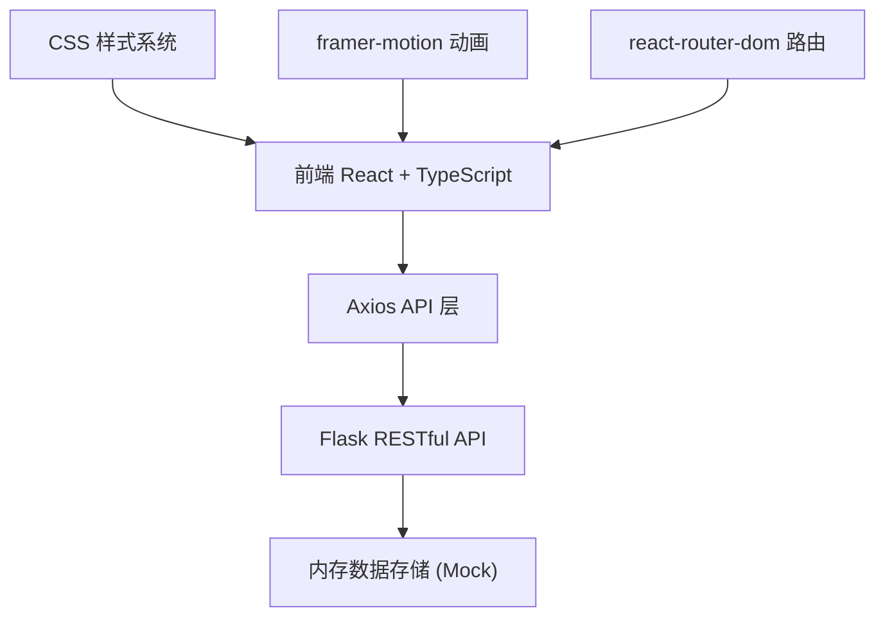
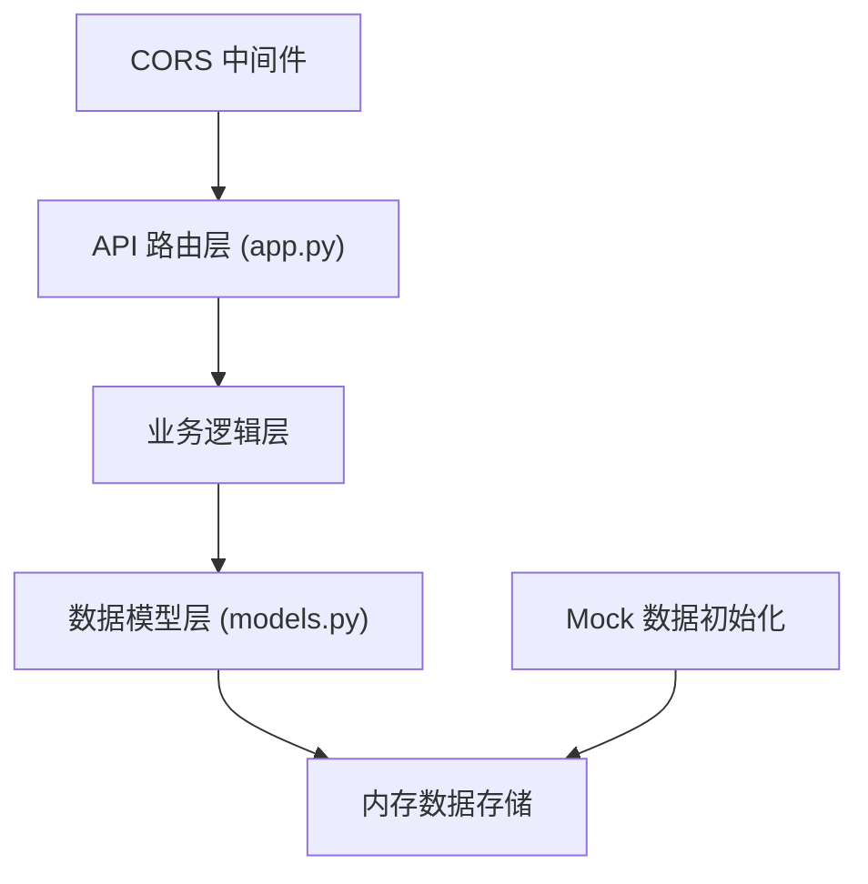
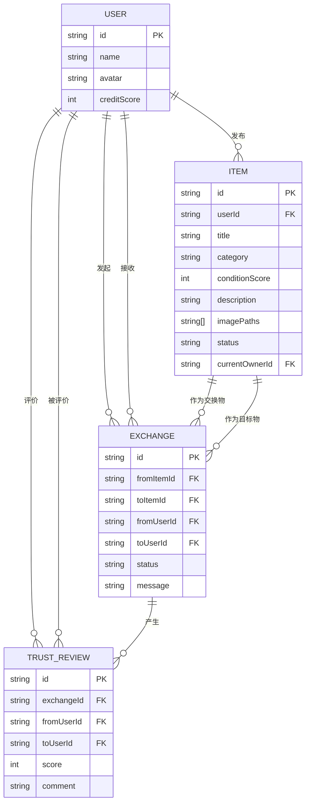

## 1. 架构设计



## 2. 技术选型说明

### 前端技术栈
- **框架**：React 18 + TypeScript
- **构建工具**：Vite 5
- **路由**：react-router-dom 6
- **HTTP客户端**：axios
- **动画库**：framer-motion
- **状态管理**：React Hooks (useState, useEffect, useContext)

### 后端技术栈
- **Web框架**：Flask (Python)
- **跨域处理**：flask-cors
- **数据存储**：内存存储（演示环境）

### 关键特性
- **代码分割**：基于路由的代码分割，实现懒加载
- **图片懒加载**：自定义懒加载Hook，占位色#e0e0e0
- **性能优化**：首次可交互时间 < 2.5秒
- **响应式设计**：Desktop-first，<768px移动端适配

## 3. 路由定义

| 路由路径 | 页面组件 | 说明 |
|---------|---------|------|
| `/` | ItemList | 首页，物品列表展示与筛选 |
| `/item/:id` | ItemDetail | 物品详情页，含时间轴与评价 |
| `/publish` | PublishItem | 物品发布页面 |
| `/user/:id` | UserProfile | 个人中心页面 |

## 4. API 接口定义

### 4.1 TypeScript 类型定义

```typescript
// 用户
interface User {
  id: string;
  name: string;
  avatar: string;
  creditScore: number;
}

// 物品
interface Item {
  id: string;
  userId: string;
  title: string;
  category: 'furniture' | 'books' | 'electronics' | 'kitchen' | 'decor' | 'other';
  conditionScore: number; // 1-5
  description: string;
  imagePaths: string[];
  status: 'available' | 'exchanging' | 'completed';
  currentOwnerId: string;
  createdAt: string;
  timelines: TimelineEvent[];
}

// 时间轴事件
interface TimelineEvent {
  type: 'publish' | 'apply' | 'approve' | 'complete' | 'confirm';
  date: string;
  description: string;
  userId?: string;
}

// 交换申请
interface Exchange {
  id: string;
  fromItemId: string;
  toItemId: string;
  fromUserId: string;
  toUserId: string;
  status: 'pending' | 'approved' | 'rejected' | 'completed';
  message: string;
  createdAt: string;
}

// 信用评价
interface TrustReview {
  id: string;
  exchangeId: string;
  fromUserId: string;
  toUserId: string;
  score: number; // 1-5
  comment: string;
  createdAt: string;
}
```

### 4.2 后端API接口

| 方法 | 路径 | 说明 | 请求体 | 响应体 |
|-----|------|------|--------|--------|
| GET | `/api/items` | 获取物品列表（支持筛选） | query: category, condition, keyword | `Item[]` |
| GET | `/api/items/:id` | 获取物品详情 | - | `Item` |
| POST | `/api/items` | 发布物品 | `{ title, category, conditionScore, description, imagePaths }` | `Item` |
| PUT | `/api/items/:id` | 更新物品信息 | `Partial<Item>` | `Item` |
| GET | `/api/users/:id` | 获取用户信息 | - | `User & { items: Item[], exchanges: Exchange[] }` |
| GET | `/api/users/:id/credit` | 获取用户信用分 | - | `{ creditScore: number }` |
| POST | `/api/exchanges` | 提交交换申请 | `{ fromItemId, toItemId, message }` | `Exchange` |
| GET | `/api/exchanges/pending/:userId` | 获取待审核列表 | - | `Exchange[]` |
| PUT | `/api/exchanges/:id/approve` | 批准交换申请 | - | `Exchange` |
| PUT | `/api/exchanges/:id/reject` | 拒绝交换申请 | - | `Exchange` |
| PUT | `/api/exchanges/:id/complete` | 完成交换 | - | `Exchange` |
| POST | `/api/reviews` | 提交信用评价 | `{ exchangeId, toUserId, score, comment }` | `TrustReview` |

## 5. 服务端架构图



## 6. 数据模型

### 6.1 ER 图



### 6.2 项目目录结构

```
auto168/
├── backend/
│   ├── app.py           # Flask主应用，API路由
│   └── models.py        # 数据模型定义
├── src/
│   ├── modules/
│   │   ├── item/
│   │   │   └── index.tsx    # 物品列表与详情页
│   │   ├── exchange/
│   │   │   └── index.tsx    # 交换申请与审核
│   │   ├── user/
│   │   │   └── index.tsx    # 个人中心
│   │   └── common/
│   │       └── ApiService.ts # API服务封装
│   ├── components/      # 通用组件
│   ├── hooks/           # 自定义Hooks
│   ├── types/           # TypeScript类型定义
│   ├── utils/           # 工具函数
│   ├── App.tsx          # 根组件
│   ├── main.tsx         # 入口文件
│   └── index.css        # 全局样式
├── package.json
├── vite.config.js
├── tsconfig.json
└── index.html
```

### 6.3 前端模块数据流向

**物品模块**：
```
后端API → ApiService.get('/items/:id') → useState存储 → 渲染物品卡片/详情 → 提交评价 → ApiService.post('/reviews') → 刷新信用分
```

**交换模块**：
```
选择交换物品 → ApiService.post('/exchanges') → 提交申请 → 监听审核状态 → ApiService.put('/exchanges/:id/approve') → 更新物品状态
```

**用户模块**：
```
ApiService.get('/users/:id') → 获取用户信息 → 展示信用分、物品列表、交换记录
```
