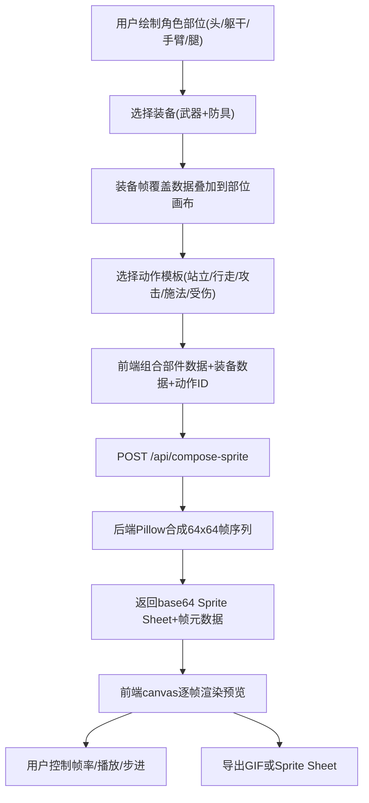

## 1. 产品概述

像素角色动画生成与预览应用——为独立游戏开发者提供一站式像素角色动画制作工具。用户可上传或绘制角色各部位（头部、躯干、手臂、腿部）的16x16像素模块，搭配武器与防具装备，系统根据预设动作模板自动合成64x64像素的Sprite序列帧动画，支持在线预览和导出为GIF或Sprite Sheet图片。

- 目标用户：独立游戏开发者、像素美术爱好者
- 核心价值：将逐帧手绘的低效流程变为"部位绘制→装备搭配→一键合成"的高效工作流，确保动作一致性

## 2. 核心功能

### 2.1 功能模块

1. **角色编辑页**：四个16x16像素画布（头部/躯干/手臂/腿部）、10色调色板、橡皮擦、装备叠加预览
2. **动画预览页**：canvas逐帧渲染、帧率调节（4-12fps）、播放/暂停/步进、进度条、动作名称标签
3. **装备选择页**：武器与防具卡片列表、选中状态叠加到角色部位、属性展示

### 2.2 页面详情

| 页面名称 | 模块名称 | 功能描述 |
|----------|----------|----------|
| 主页面 | 角色部位编辑 | 四个16x16像素网格画布，左侧10色调色板，点击绘制/右键擦除，画布间8px间距 |
| 主页面 | 装备选择 | 6件装备卡片（3武器+3防具），点击高亮选中，帧覆盖数据叠加到部位画布（透明度0.4），支持同时佩戴武器和防具 |
| 主页面 | 动画预览 | 300x300预览窗口，帧率滑块4-12fps，播放/暂停按钮，进度条，动作标签，5种动作模板切换 |
| 主页面 | 导出功能 | 导出为GIF（循环播放/透明背景）和Sprite Sheet（横排/1px白色分割线），加载动画，自动下载 |

## 3. 核心流程

用户在左栏绘制角色各部位像素 → 在右栏选择装备（装备叠加层自动覆盖到画布） → 选择动作模板 → 点击合成 → 前端将部件数据+装备数据+动作模板ID发送至后端API → 后端用Pillow按动作模板坐标偏移合成64x64帧序列 → 返回Sprite Sheet图片（base64） → 前端canvas逐帧渲染预览 → 用户调节帧率/步进/导出

## 4. 用户界面设计

### 4.1 设计风格

- **主题**：深色RPG编辑器风格
- **主背景**：#121212
- **卡片背景**：#1e1e1e
- **重要文本**：#e0e0e0
- **次要文本**：#888888
- **强调色**：#4a9eff
- **字体**：像素风显示字体（Press Start 2P）+ 清晰等宽UI字体（JetBrains Mono）
- **布局**：三栏式（左280px / 中320px / 右220px）
- **交互**：hover 0.2s ease-out颜色过渡，click 0.1s弹性缩放（scale 1.05→1.0）

### 4.2 页面设计概览

| 页面名称 | 模块名称 | UI元素 |
|----------|----------|--------|
| 主页面 | 角色编辑区(左栏) | 四个16x16像素网格画布，10色调色板(左侧)，部位名称标签，画布间距8px，宽280px |
| 主页面 | 动画预览区(中栏) | 300x300预览窗口(背景#1a1a1a)，帧率滑块(200px/6px高/圆角3px/#3a3a3a轨道/#4a9eff圆点)，播放/暂停按钮(32px圆/#4a9eff背景)，进度条(260px/8px高/圆角4px/#2a2a2a背景/#4a9eff填充)，动作标签 |
| 主页面 | 装备选择区(右栏) | 装备卡片(120px宽/圆角8px/背景#2a2a2a/边框#3a3a3a/选中边框#4a9eff)，垂直排列可滚动，宽220px |
| 主页面 | 导出按钮 | GIF导出/Sprite Sheet导出，加载旋转圆圈(24px/4px描边/#4a9eff/1s旋转) |

### 4.3 响应式设计

- 桌面端（≥1024px）：三栏水平布局
- 移动端/窄屏（<1024px）：单列纵向堆叠，每个模块可折叠（折叠后只显示标题栏，箭头旋转动画）
- 触摸优化：像素画布触摸绘制支持

### 4.4 动作模板定义

| 动作名称 | 帧数 | 描述 | 帧偏移说明 |
|----------|------|------|-----------|
| 站立(idle) | 2帧 | 待机呼吸动作 | 帧1:原位, 帧2:身体微上移1px |
| 行走(walk) | 4帧 | 左右脚交替 | 帧1:原位, 帧2:左腿前移, 帧3:原位, 帧4:右腿前移 |
| 攻击(attack) | 3帧 | 举刀→挥砍→收刀 | 帧1:手臂上举, 帧2:手臂前伸, 帧3:收回 |
| 施法(cast) | 4帧 | 举杖→念咒→释放→收杖 | 帧1:手臂上举, 帧2:微震, 帧3:能量释放, 帧4:收回 |
| 受伤(hurt) | 2帧 | 后仰→恢复 | 帧1:整体后移2px, 帧2:回原位 |
