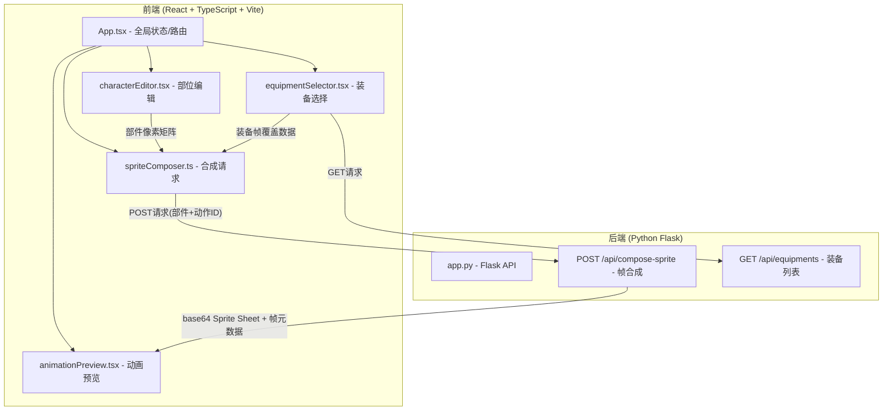

## 1. 架构设计



## 2. 技术说明

- **前端**：React 18 + TypeScript + Vite + Tailwind CSS + Zustand（状态管理）+ Framer Motion（动画）+ Axios（HTTP请求）
- **构建工具**：Vite，开发服务器端口3000
- **后端**：Python Flask + Pillow（图像合成）+ flask-cors（跨域）
- **数据存储**：无数据库，装备数据以内存JSON形式提供

## 3. 路由定义

| 路由 | 用途 |
|------|------|
| / | 主页面，包含角色编辑/装备选择/动画预览三栏布局 |

## 4. API定义

### 4.1 POST /api/compose-sprite

请求体：
```typescript
interface ComposeRequest {
  parts: {
    head: number[][];      // 16x16 像素矩阵，值为调色板索引(0-9)，-1为空
    body: number[][];
    leftArm: number[][];
    rightArm: number[][];
    leftLeg: number[][];
    rightLeg: number[][];
  };
  equipmentIds: string[];  // 选中的装备ID列表
  actionTemplateId: string; // 动作模板ID: idle|walk|attack|cast|hurt
}
```

响应体：
```typescript
interface ComposeResponse {
  spriteSheetBase64: string; // base64编码的Sprite Sheet PNG
  frameCount: number;        // 帧数
  frameWidth: number;        // 单帧宽64
  frameHeight: number;       // 单帧高64
  frameDelays: number[];     // 每帧延迟(ms)
  actionName: string;        // 动作名称
}
```

### 4.2 GET /api/equipments

响应体：
```typescript
interface Equipment {
  id: string;
  name: string;
  type: 'weapon' | 'armor';
  attack: number;
  defense: number;
  iconBase64: string;        // 32x32图标base64
  frameOverlayData: {
    targetPart: string;      // 覆盖目标部位
    pixels: number[][];      // 16x16覆盖像素矩阵
  }[];
}

interface EquipmentsResponse {
  equipments: Equipment[];
}
```

## 5. 数据流向

```
用户交互 → characterEditor(部件像素矩阵) → App(状态提升)
                                              ↓
用户交互 → equipmentSelector(装备ID列表) → App(状态提升)
                                              ↓
                              spriteComposer组合请求数据
                                              ↓
                              POST /api/compose-sprite
                                              ↓
                              Flask后端Pillow合成
                                              ↓
                              返回base64 Sprite Sheet
                                              ↓
                              animationPreview渲染预览
                                              ↓
                              导出GIF / Sprite Sheet
```

## 6. 文件结构与调用关系

```
project/
├── package.json              # 依赖和脚本
├── vite.config.js            # Vite构建配置(port 3000, React插件)
├── tsconfig.json             # TypeScript严格模式
├── index.html                # 入口HTML
├── src/
│   ├── App.tsx               # 主路由+全局状态(Zustand)，数据调度中枢
│   │   ├── ← characterEditor  部件像素数据
│   │   ├── ← equipmentSelector 装备选择数据
│   │   ├── → spriteComposer   组合合成请求
│   │   └── → animationPreview 传递SpriteSheet数据
│   ├── components/
│   │   ├── characterEditor.tsx   # 四个16x16像素画布+调色板
│   │   ├── equipmentSelector.tsx # 装备卡片列表+选中状态
│   │   └── animationPreview.tsx  # Canvas逐帧渲染+播放控制
│   └── utils/
│       └── spriteComposer.ts     # 组合请求参数+调用后端API
├── backend/
│   ├── app.py                # Flask服务(合成API+装备API)
│   └── requirements.txt      # Flask, Pillow, flask-cors
```
