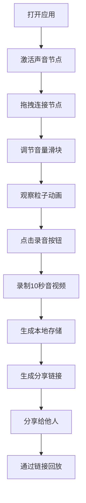

## 1. 产品概述

声音情绪可视化白噪音生成器是一款沉浸式音频可视化应用，用户通过拖拽音频节点构建混合白噪音，同时声音实时驱动抽象粒子动画，创造听觉与视觉的双重沉浸体验。

- 核心价值：将环境声音与动态视觉结合，帮助用户放松、冥想、专注或入眠
- 目标用户：需要放松、专注工作、改善睡眠的人群
- 市场定位：创新型音频可视化工具，融合声音设计与视觉艺术

## 2. 核心功能

### 2.1 用户角色

| 角色 | 注册方式 | 核心权限 |
|------|----------|----------|
| 普通用户 | 无需注册，浏览器直接使用 | 创建音频混合、调整音量、录制分享、回放分享内容 |

### 2.2 功能模块

1. **音频节点编辑器**：5种声音节点（雨声、篝火、风声、海浪、鸟鸣），可拖拽连接形成音频路径
2. **粒子可视化画布**：实时根据音频数据渲染粒子动画，粒子运动与音量关联
3. **录音与分享**：录制10秒音频+动画短视频，生成本地存储与分享链接
4. **分享回放页面**：通过分享链接回放完整的音频与粒子动画

### 2.3 页面详情

| 页面名称 | 模块名称 | 功能描述 |
|----------|----------|----------|
| 主页面 | 音频节点编辑区 | 展示5种声音节点卡片，支持音量调节、开关切换、贝塞尔曲线连线拖拽 |
| 主页面 | 粒子可视化区 | 圆形Canvas画布，实时渲染粒子系统，60fps运行，自适应性能调整 |
| 主页面 | 录音控制区 | 录音按钮、录制状态指示、录制完成提示 |
| 分享页面 | 回放区 | 加载分享数据，回放音频与粒子动画 |

## 3. 核心流程

用户打开应用 → 点击节点开关激活声音 → 拖拽连接节点形成音频路径 → 调整各节点音量 → 观察粒子动画随音量变化 → 点击录音按钮录制10秒片段 → 生成本地存储与分享链接 → 分享给他人 → 他人通过链接回放

## 4. 用户界面设计

### 4.1 设计风格

- 主背景：#0f0c29（深空深蓝）
- 侧边栏：#1a1a3e（紫罗兰暗色）
- 标题文字：#e0e0ff
- 正文文字：#b0b0d0
- 强调色：#7c3aed（紫罗兰）
- 节点配色：雨声#4ecdc4、篝火#ff6b6b、风声#c0c0c0、海浪#3498db、鸟鸣#f39c12
- 整体风格：深蓝+紫罗兰暗色科幻风格，神秘沉浸感
- 按钮：圆形录音按钮，节点卡片圆角矩形（12px圆角）
- 字体：现代无衬线字体，标题醒目，正文清晰
- 图标：使用Lucide图标库
- 动画：所有交互元素0.2s平滑过渡，点击0.1s scale(0.95)反馈，开关0.2s淡入动画

### 4.2 页面设计概述

| 页面名称 | 模块名称 | UI元素 |
|----------|----------|----------|
| 主页面 | 节点编辑区 | 圆角矩形节点卡片（宽160px高60px），音量滑块，开关按钮，贝塞尔曲线连接线 |
| 主页面 | 可视化区 | 直径500px圆形画布，径向渐变背景#1a1a2e到#16213e，粒子系统 |
| 主页面 | 控制区 | 圆形录音按钮（直径48px，背景#e74c3c） |
| 分享页面 | 回放区 | 粒子画布，播放控制，音频播放 |

### 4.3 响应式

- 宽屏（≥768px）：节点编辑区占左70%，可视化区占右30%，左右排列
- 窄屏（<768px）：节点编辑区在上，可视化区在下，上下排列
- 节点卡片：宽屏160px，窄屏自适应缩小到120px
- 触摸优化：滑块、按钮尺寸适配触摸操作

### 4.4 视觉动效

- 节点卡片：hover时轻微上浮+阴影增强，激活时边框发光
- 连接线：贝塞尔曲线，拖拽时高亮
- 粒子：从边缘向中心移动，接近中心时缩小消失，颜色随节点色浮动
- 录音按钮：点击时颜色变为#c0392b，闪烁0.3s
- 开关：边框颜色从半透明#999变为不透明节点色，0.2s淡入
