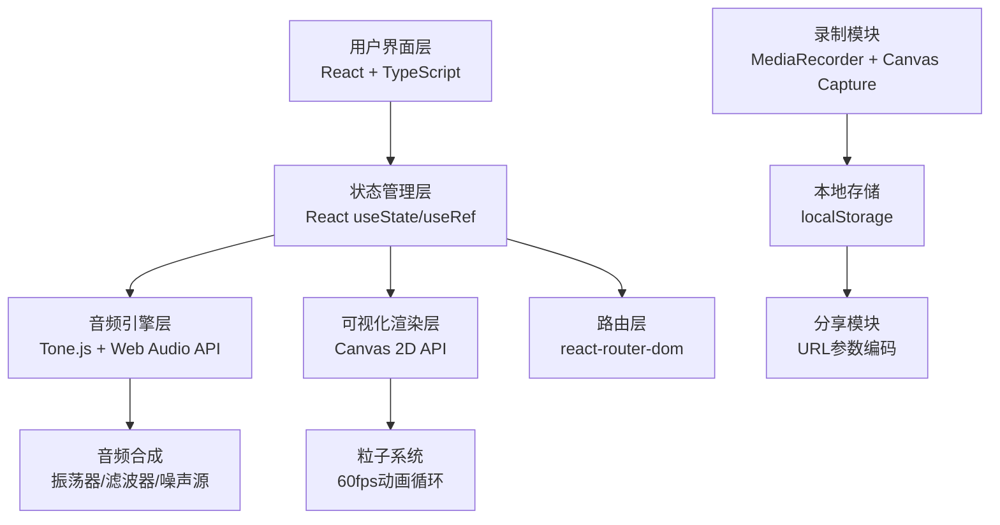

## 1. 架构设计



## 2. 技术描述

- 前端框架：React 18 + TypeScript
- 构建工具：Vite
- 音频处理：Tone.js + Web Audio API
- 可视化：Canvas 2D API
- 动画：framer-motion
- 路由：react-router-dom
- 后端：无，纯前端应用
- 数据存储：localStorage 本地存储

## 3. 项目结构

```
src/
├── App.tsx              # 主应用组件，路由与全局状态
├── components/
│   ├── NodeEditor.tsx   # 音频节点编辑器
│   └── ParticleCanvas.tsx # 粒子画布组件
└── utils/
    └── AudioEngine.ts   # 音频引擎工具类
```

## 4. 路由定义

| 路由 | 用途 |
|------|------|
| / | 主页面：节点编辑器 + 粒子可视化 + 录音控制 |
| /share/:id | 分享页面：回放录制的音频与动画 |

## 5. 核心数据模型

### 5.1 音频节点类型

```typescript
type SoundType = 'rain' | 'fire' | 'wind' | 'ocean' | 'birds';

interface AudioNode {
  id: string;
  type: SoundType;
  name: string;
  color: string;
  volume: number;  // 0-100
  enabled: boolean;
  position: { x: number; y: number };
}

interface Connection {
  id: string;
  from: string;  // 节点ID
  to: string;    // 节点ID
}
```

### 5.2 粒子数据

```typescript
interface Particle {
  x: number;
  y: number;
  vx: number;
  vy: number;
  size: number;
  color: string;
  sourceNode: string;  // 来源节点ID
  alpha: number;
}
```

### 5.3 录制数据

```typescript
interface Recording {
  id: string;
  audioData: string;      // base64编码的音频数据
  animationData: string;  // 帧数据或视频数据
  nodeStates: AudioNode[];
  connections: Connection[];
  createdAt: number;
}
```

## 6. 核心技术实现

### 6.1 音频引擎（AudioEngine）

- 使用Tone.js管理音频节点连接
- 每种声音使用不同的合成方式：
  - 雨声：白噪声 + 低通滤波器
  - 篝火：褐噪声 + 滤波 + 颤音
  - 风声：粉噪声 + 带通滤波器 + 缓慢调制
  - 海浪：正弦波 + 噪声 + 振幅调制
  - 鸟鸣：高频振荡器 + 频率调制
- 节点按连接顺序串联，最终混合输出
- 延迟控制：目标<50ms

### 6.2 粒子系统（ParticleCanvas）

- Canvas 2D渲染，requestAnimationFrame循环
- 粒子数量 = 激活节点数 × 80
- 粒子速度 = 音量值（音量50时速度50px/s）
- 粒子从边缘向中心移动，接近中心时缩小消失
- 帧率检测：<45fps时自动将粒子密度降到60%
- 颜色：节点色±20%随机浮动

### 6.3 节点编辑器（NodeEditor）

- framer-motion实现节点卡片动画
- SVG绘制贝塞尔曲线连接线
- 拖拽事件处理：节点拖拽、连线拖拽
- 响应式布局：宽屏左70%/右30%，窄屏上下排列

### 6.4 录制与分享

- MediaRecorder API录制音频
- Canvas.captureStream()录制画面
- 混合音视频生成WebM格式
- localStorage存储录制数据
- 分享链接包含录制ID参数

## 7. 性能优化

- 使用Web Audio API保证低延迟音频处理
- Canvas粒子使用对象池减少GC
- requestAnimationFrame保证60fps
- 帧率自适应降低粒子密度
- 组件懒加载减少首屏时间
- 避免不必要的重渲染（React.memo）
