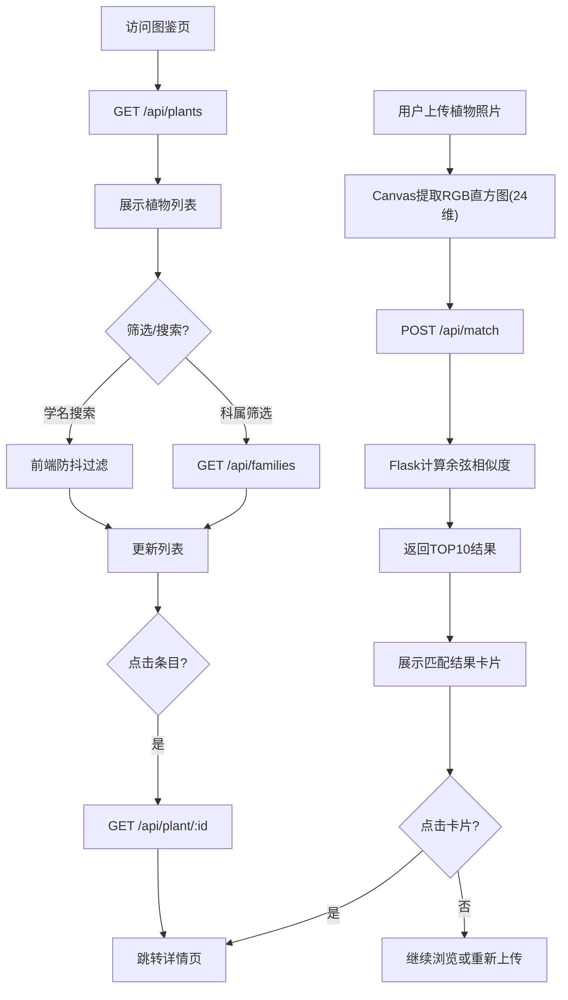

## 1. 产品概述
植物智能识别与电子图鉴Web应用，面向高校师生及自然爱好者，通过颜色直方图特征匹配（非深度学习）实现上传植物照片快速识别，同时提供完整的电子图鉴浏览、搜索和详情展示功能。
- 解决传统图鉴携带不便、缺乏智能匹配的问题
- 目标用户：田野调查研究者、科普教育师生、自然爱好者

## 2. 核心功能

### 2.1 用户角色
| 角色 | 注册方式 | 核心权限 |
|------|----------|----------|
| 普通用户 | 无需注册 | 上传识别、浏览图鉴、查看详情、本地收藏 |

### 2.2 功能模块
1. **首页（识别页）**：图片上传区、匹配结果网格
2. **图鉴浏览页**：科属筛选面板、搜索栏、植物列表（虚拟滚动）
3. **详情页**：大图轮播、形态特征、分布地图、生态图表、收藏按钮

### 2.3 页面详情
| 页面名称 | 模块名称 | 功能描述 |
|----------|----------|----------|
| 首页 | 上传区域 | 拖拽/点击上传JPG/PNG图片（最大5MB），canvas提取RGB 8bin颜色直方图（24维），POST至后端匹配API |
| 首页 | 匹配结果 | 展示TOP10相似植物卡片网格，含缩略图、学名、相似度百分比（0.3秒渐入动画），点击跳转详情 |
| 图鉴页 | 筛选面板 | 左侧固定面板，科属下拉筛选（选项来自后端API）、学名模糊搜索（300ms防抖） |
| 图鉴页 | 植物列表 | 虚拟滚动列表，每项含缩略图+学名+科属标签，点击高亮并跳转详情 |
| 详情页 | 大图轮播 | 左右箭头切换，0.4秒slide动画，object-fit:cover |
| 详情页 | 形态特征 | 文本展示，支持字体缩放 |
| 详情页 | 分布地图 | SVG中国省级行政区图，分布省份高亮#2ecc71，0.3秒填充色过渡 |
| 详情页 | 生态图表 | recharts条形图显示光照/水分/温度偏好，渐变色#27ae60→#a8e6cf |
| 详情页 | 收藏功能 | 收藏按钮，数据存储在localStorage |

## 3. 核心流程

**植物识别流程**：用户上传图片 → canvas提取24维RGB直方图 → POST /api/match → 后端计算余弦相似度 → 返回TOP10 → 前端展示结果卡片

**图鉴浏览流程**：用户访问图鉴页 → 加载所有植物列表 → 科属筛选/搜索过滤 → 点击条目 → 跳转详情页

## 4. 界面设计

### 4.1 设计风格
- 主色：#27ae60（自然绿），辅色：#2ecc71（亮绿）
- 字体：Inter无衬线字体
- 按钮：圆角按钮，主色填充，悬停加深
- 布局：卡片式布局，首页居中，图鉴页左右两栏
- 图标：lucide-react图标库

### 4.2 页面设计概览
| 页面名称 | 模块名称 | UI元素 |
|----------|----------|--------|
| 首页 | 上传区域 | 虚线圆角边框(32px)，宽400px高240px，背景#f0fff4，拖拽时边框变#27ae60+放大动画 |
| 首页 | 结果网格 | 每行最多5列，卡片宽200px圆角16px，阴影0 4px 12px rgba(0,0,0,0.06)，悬停阴影加深+上移4px |
| 图鉴页 | 筛选面板 | 固定宽240px，背景#f9fafb，圆角12px |
| 图鉴页 | 植物列表 | 每项高80px，60x60缩略图，学名+科属标签，点击背景#e8f5e9 |
| 详情页 | 轮播区 | object-fit:cover，0.4秒滑动过渡 |
| 详情页 | 分布地图 | SVG省份填充#bdc3c7，高亮#2ecc71，0.3秒过渡 |
| 详情页 | 生态图表 | recharts条形图，渐变#27ae60→#a8e6cf，末端数值标签 |

### 4.3 响应式适配
- 桌面优先设计
- 屏幕宽度<768px时：首页上传区占满宽度，匹配结果改为单列；图鉴页改为上下两栏

### 4.4 动效设计
- 页面切换：framer-motion渐入渐出
- 匹配结果卡片：0.3秒渐入动画（stagger延迟）
- 科属切换：0.2秒渐隐渐现
- 地图省份高亮：0.3秒填充色过渡
- 轮播切换：0.4秒slide动画
