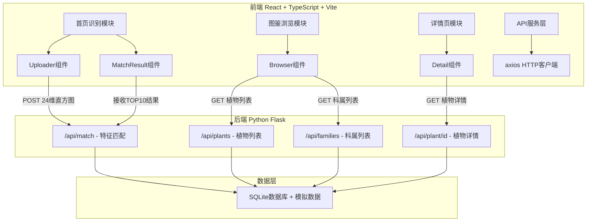
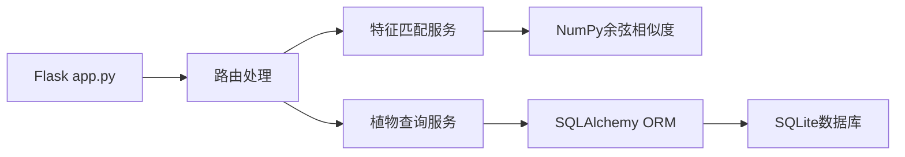
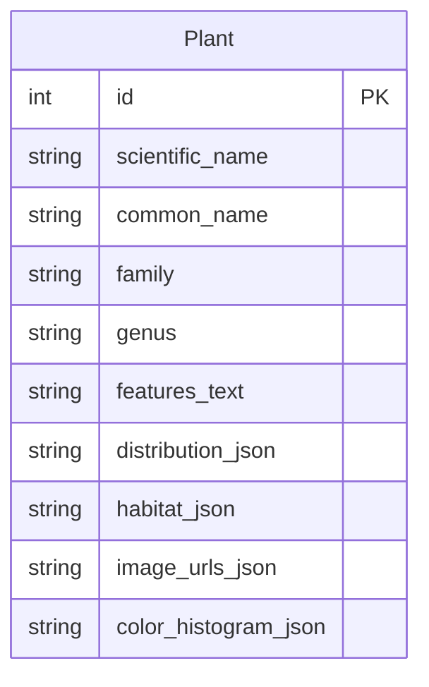

## 1. 架构设计



## 2. 技术说明
- 前端：React 18 + TypeScript + Vite + framer-motion + recharts + axios + react-router-dom
- 初始化工具：vite-init (react-ts模板)
- 后端：Python Flask + SQLAlchemy + Flask-CORS
- 数据库：SQLite（开发环境，无需额外安装PostgreSQL）
- 特征匹配：余弦相似度计算（纯NumPy实现，无深度学习依赖）

## 3. 路由定义
| 路由 | 用途 |
|------|------|
| / | 首页：植物识别上传区+匹配结果展示 |
| /browser | 图鉴浏览页：植物列表+筛选搜索 |
| /detail/:id | 植物详情页：完整信息+分布地图+生态图表 |

## 4. API定义

### 4.1 POST /api/match
请求体：
```typescript
interface MatchRequest {
  histogram: number[]; // 24维RGB颜色直方图
}
```
响应体：
```typescript
interface MatchResponse {
  results: Array<{
    id: number;
    scientific_name: string;
    common_name: string;
    family: string;
    genus: string;
    thumbnail: string;
    similarity: number; // 0~1 余弦相似度
  }>;
}
```

### 4.2 GET /api/plants
响应体：
```typescript
interface PlantsResponse {
  plants: Array<{
    id: number;
    scientific_name: string;
    common_name: string;
    family: string;
    genus: string;
    thumbnail: string;
  }>;
}
```

### 4.3 GET /api/plant/:id
响应体：
```typescript
interface PlantDetail {
  id: number;
  scientific_name: string;
  common_name: string;
  family: string;
  genus: string;
  features_text: string;
  distribution: string[]; // 省份列表
  habitat: {
    light: number;   // 0-100
    water: number;   // 0-100
    temperature: number; // 0-100
  };
  image_urls: string[];
}
```

### 4.4 GET /api/families
响应体：
```typescript
interface FamiliesResponse {
  families: string[]; // 科属列表如["蔷薇科", "菊科", ...]
}
```

## 5. 后端架构图



## 6. 数据模型

### 6.1 数据模型定义



### 6.2 数据定义语言

```sql
CREATE TABLE plant (
    id INTEGER PRIMARY KEY AUTOINCREMENT,
    scientific_name VARCHAR(200) NOT NULL,
    common_name VARCHAR(200) NOT NULL,
    family VARCHAR(100) NOT NULL,
    genus VARCHAR(100) NOT NULL,
    features_text TEXT,
    distribution_json TEXT,
    habitat_json TEXT,
    image_urls_json TEXT,
    color_histogram_json TEXT
);
```

## 7. 文件结构与调用关系

```
project/
├── package.json                    # 前端依赖和脚本
├── vite.config.js                  # Vite构建配置
├── tsconfig.json                   # TypeScript配置
├── index.html                      # 入口HTML
├── src/
│   ├── types/
│   │   └── plant.ts               # 植物数据类型定义（被所有模块引用）
│   ├── services/
│   │   └── api.ts                 # axios API服务层
│   ├── pages/
│   │   ├── Home.tsx               # 首页（识别页）
│   │   ├── Browser.tsx            # 图鉴浏览页
│   │   └── Detail.tsx             # 详情页
│   ├── components/
│   │   ├── Uploader.tsx           # 图片上传+直方图提取
│   │   ├── MatchResult.tsx        # 匹配结果卡片网格
│   │   ├── PlantList.tsx          # 虚拟滚动植物列表
│   │   ├── ImageCarousel.tsx      # 大图轮播
│   │   ├── DistributionMap.tsx    # SVG分布地图
│   │   ├── HabitatChart.tsx       # 生态习性图表
│   │   └── FilterPanel.tsx        # 筛选面板
│   ├── hooks/
│   │   └── useDebounce.ts         # 防抖Hook
│   ├── App.tsx                    # 路由配置
│   ├── main.tsx                   # 入口
│   └── index.css                  # 全局样式
├── api/
│   ├── app.py                     # Flask主应用
│   ├── models.py                  # SQLAlchemy模型
│   ├── seed.py                    # 模拟数据填充
│   └── requirements.txt           # Python依赖
└── run.py                         # Flask启动入口
```

### 数据流向
1. **识别流程**：用户图片 → canvas RGB直方图提取 → POST /api/match → Flask余弦相似度计算 → TOP10结果 → MatchResult组件渲染
2. **图鉴流程**：页面加载 → GET /api/plants + /api/families → FilterPanel筛选 + PlantList虚拟滚动渲染
3. **详情流程**：路由参数id → GET /api/plant/:id → ImageCarousel + DistributionMap + HabitatChart渲染
