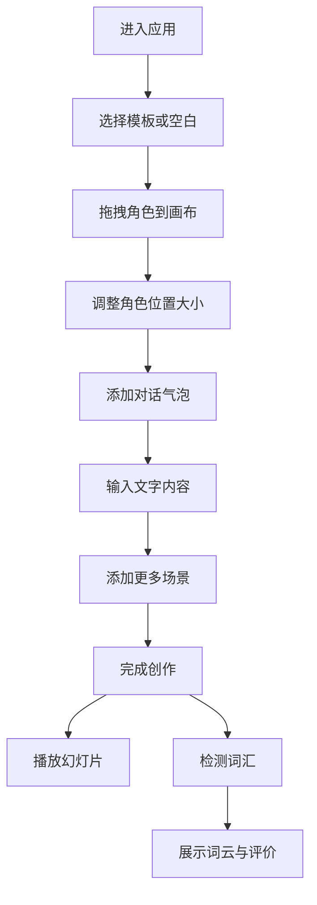

## 1. 产品概述
故事漫画家是一款帮助儿童通过创作故事漫画来学习词汇和句子的互动教育应用。针对6-10岁儿童设计，解决传统词汇学习枯燥乏味、缺乏情境化和创造性表达不足的问题。
- 通过拖拽角色、添加对话气泡的互动方式创作属于儿童故事漫画
- 结合词汇分析和词云展示，让孩子在创作中学习小学1-3年级常见词汇

## 2. 核心功能

### 2.1 用户角色
| 角色 | 使用方式 | 核心权限 |
|------|-----------|----------|
| 儿童用户 | 直接使用，无需注册 | 创作漫画、播放故事、分析词汇、使用模板 |

### 2.2 功能模块
1. **创作编辑模块**：角色拖拽、画布绘制、对话气泡、场景管理
2. **故事导出与回放模块**：多场景管理、幻灯片自动播放、手动翻页
3. **词汇评分与反馈模块**：词频统计、词汇云图、鼓励评价
4. **模板与引导模块**：预设故事模板、降低创作门槛

### 2.3 页面详情
| 页面名称 | 模块名称 | 功能描述 |
|-----------|-----------|-----------|
| 模板选择页 | 模板列表 | 展示5个预设故事模板，点击进入创作 |
| 创作编辑页 | 画布区域 | Canvas绘制角色、气泡、网格背景，支持拖拽缩放 |
| 创作编辑页 | 角色选择面板 | 8个角色，4种表情，可折叠，拖拽到画布 |
| 创作编辑页 | 工具栏 | 新建、保存、导出、检测词汇按钮 |
| 创作编辑页 | 场景导航 | 缩略图导航，支持最多5个场景 |
| 故事预览页 | 幻灯片播放 | 自动翻页3秒，淡入淡出动画0.5秒，手动翻页 |
| 词汇分析页 | 词云展示 | 词频映射字体大小，颜色随机，螺旋布局算法 |
| 词汇分析页 | 词汇统计 | 词频列表，未知词标记，鼓励性评价 |

## 3. 核心流程
用户进入应用后，可选择预设模板或空白画布开始创作。从角色库拖拽角色到画布，调整位置大小，添加对话气泡输入文字。完成多场景创作后，可播放幻灯片自动播放故事。点击检测词汇按钮，系统分析对话中的词汇，展示词云和统计结果。

## 4. 用户界面设计

### 4.1 设计风格
- 主色调：#FFB347（柑橘橙）
- 辅助色：#87CEEB（天蓝）、#98FB98（浅薄荷绿）
- 背景色：#FFF8E7（奶油色）
- 按钮圆角12px，悬停条纹渐变动画0.3秒
- 字体：Google Fonts 'Fredoka One' 显示字体，圆润可爱风格
- 图标风格：emoji风格，童趣化设计
- 整体风格：儿童友好、温暖活泼、圆润可爱

### 4.2 页面设计概述
| 页面名称 | 模块名称 | UI元素 |
|-----------|-----------|----------|
| 模板选择页 | 模板卡片 | 圆角卡片、阴影、悬停放大动画、彩色渐变 |
| 创作编辑页 | 顶部菜单 | 新建保存导出按钮、圆角12px、悬停条纹渐变 |
| 创作编辑页 | 画布区域 | 1200x700px、浅灰背景、1px虚线网格 |
| 创作编辑页 | 角色面板 | 右侧固定240px、可折叠、展开动画0.4秒ease-out |
| 创作编辑页 | 场景导航 | 底部缩略图80x60px、当前页高亮边框3px |
| 故事预览页 | 播放控制 | 上一页/下一页按钮、自动播放进度条 |
| 词汇分析页 | 词云区域 | Canvas绘制、螺旋布局、色彩丰富 |

### 4.3 响应式设计
- 桌面端（≥1024px）：右侧角色面板固定，画布完整展示
- 移动端（<1024px）：角色面板变为底部固定200px高，横向滑动
- 触控区域：所有按钮至少50px触控区域
- 画布高度：移动端自适应视口高度60%
- 移动端滑动：角色面板可横向滑动选择角色

### 4.4 动画效果
- 角色拖拽：半透明影子跟随，50%透明度
- 角色落地：0.2秒弹性缩放动画
- 面板折叠：0.4秒ease-out缓动
- 场景切换：0.4秒滑动切换动画
- 翻页动画：0.5秒淡入淡出
- 按钮悬停：白色条纹渐变动画0.3秒
