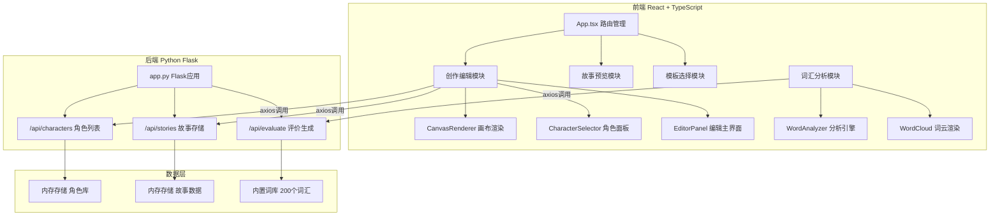
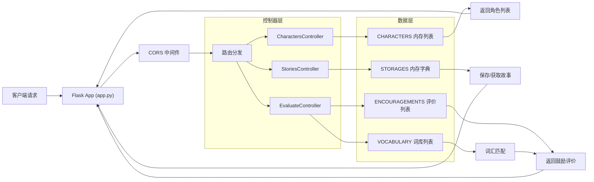
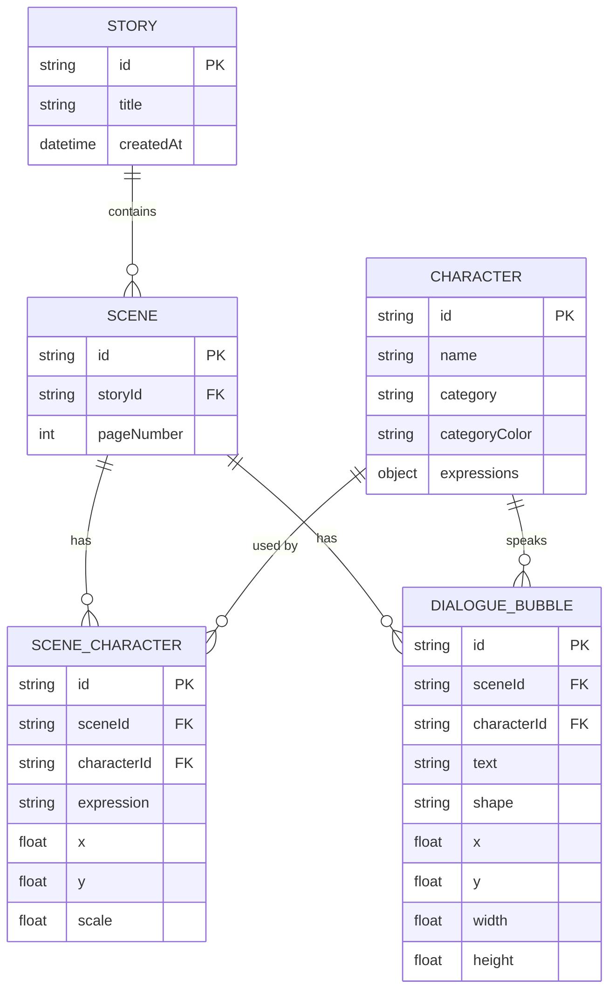

## 1. 架构设计



## 2. 技术描述

- **前端框架**: React@18 + TypeScript@5 + Vite@5
- **状态管理**: React useState/useReducer (轻量级场景)
- **路由**: React Router DOM@6
- **动画**: Framer Motion@11
- **HTTP客户端**: Axios@1
- **工具库**: uuid@9
- **后端框架**: Python Flask@3
- **后端CORS**: flask-cors@4
- **字体**: Google Fonts 'Fredoka One'
- **开发服务器端口**: 前端3000，后端5000
- **代理配置**: Vite proxy /api -> localhost:5000

## 3. 路由定义

| 路由 | 页面 | 功能 |
|------|------|------|
| `/` | 模板选择页 | 展示预设模板，选择后跳转创作页 |
| `/editor` | 创作编辑页 | 主创作界面，拖拽角色、编辑气泡、管理场景 |
| `/editor/:templateId` | 创作编辑页 | 带模板ID参数，加载预设模板 |
| `/preview` | 故事预览页 | 幻灯片自动播放，手动翻页 |
| `/analysis` | 词汇分析页 | 词云展示，词汇统计，鼓励评价 |

## 4. API 定义

### TypeScript 类型定义

```typescript
// 角色表情类型
type Expression = 'normal' | 'happy' | 'sad' | 'surprised';

// 角色类型
interface Character {
  id: string;
  name: string;
  category: 'animal' | 'professional' | 'other';
  categoryColor: string;
  expressions: Record<Expression, string>;
}

// 气泡形状
type BubbleShape = 'ellipse' | 'rectangle' | 'cloud';

// 对话气泡
interface DialogueBubble {
  id: string;
  text: string;
  shape: BubbleShape;
  x: number;
  y: number;
  width: number;
  height: number;
  characterId: string;
}

// 场景中的角色实例
interface SceneCharacter {
  id: string;
  characterId: string;
  expression: Expression;
  x: number;
  y: number;
  scale: number;
}

// 单场景
interface Scene {
  id: string;
  pageNumber: number;
  characters: SceneCharacter[];
  bubbles: DialogueBubble[];
}

// 完整故事
interface Story {
  id?: string;
  title: string;
  scenes: Scene[];
  createdAt?: string;
}

// 词频统计
interface WordStat {
  word: string;
  count: number;
  inVocabulary: boolean;
  fontSize: number;
  color: string;
  x?: number;
  y?: number;
}

// 词汇分析结果
interface AnalysisResult {
  wordStats: WordStat[];
  totalWords: number;
  vocabularyWords: number;
  unknownWords: string[];
  encouragement: string;
}
```

### API 接口定义

**GET /api/characters**
- 响应: `{ characters: Character[] }`
- 描述: 获取预设角色库（8个角色，含4种表情）

**POST /api/stories**
- 请求体: `Story`
- 响应: `{ id: string, message: string }`
- 描述: 保存故事数据

**GET /api/stories/:id**
- 响应: `Story`
- 描述: 根据ID获取故事数据

**POST /api/evaluate**
- 请求体: `{ text: string }`
- 响应: `{ encouragement: string }`
- 描述: 根据故事内容生成鼓励性评价

## 5. 服务器架构图



## 6. 数据模型

### 6.1 数据模型定义



### 6.2 内置数据定义

**角色库数据 (8个角色)**

1. 小兔子 (动物，红色系 #E8A0B0)
   - normal, happy, sad, surprised 表情
2. 小熊 (动物，橙色系 #FFB347)
3. 小猫 (动物，蓝色系 #87CEEB)
4. 小狗 (动物，绿色系 #98FB98)
5. 消防员 (职业，红色系 #E8A0B0)
6. 医生 (职业，蓝色系 #87CEEB)
7. 老师 (职业，紫色系 #6699CC)
8. 厨师 (职业，橙色系 #F2A900)

**词库数据 (200个小学1-3年级常见词汇)**
- 包含动物、自然、家庭、学习、动作等分类
- 如：爸爸、妈妈、学校、老师、同学、喜欢、美丽、快乐、小鸟、大树、太阳、月亮 等

**故事模板 (5个)**
1. 小鸟找妈妈 - 3个场景，角色出场顺序：小鸟->松鼠->妈妈
2. 小消防员的一天 - 4个场景，角色出场顺序：消防员->小猫->小熊
3. 森林运动会 - 4个场景，角色出场顺序：小兔->小熊->小猫->小狗
4. 医院小冒险 - 3个场景，角色出场顺序：医生->小熊->妈妈
5. 快乐的厨房 - 3个场景，角色出场顺序：厨师->小兔->小猫

**鼓励评价库**
- 20+条鼓励性评价，根据词汇使用情况智能匹配
