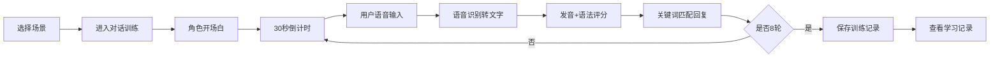

## 1. 产品概述

LinguaFlow 是一款面向语言学习者的沉浸式对话训练应用，通过模拟真实生活场景的对话练习，帮助学习者克服开口难的障碍，提供即时发音和语法反馈，持续追踪学习进度。

- **核心痛点**：语言学习者缺乏真实对话场景、开口难、无法获得即时反馈
- **目标用户**：初中级语言学习者，希望通过情景对话提升口语能力
- **产品价值**：低压力沉浸式训练、即时评分反馈、可视化学习成果

## 2. 核心功能

### 2.1 功能模块

1. **场景选择页**：4个预设场景卡片网格，点击进入对应对话训练
2. **对话训练页**：对话历史展示、语音输入、实时倒计时、即时评分面板
3. **学习记录页**：历史成绩趋势图、详细训练记录表格、数据统计

### 2.3 页面详情

| 页面名称 | 模块名称 | 功能描述 |
|----------|----------|----------|
| 场景选择页 | 场景卡片网格 | 展示4个场景卡片（餐厅点餐、机场登机、酒店入住、商场购物），悬停动画效果 |
| 场景选择页 | 页面导航 | 顶部导航栏，可切换至学习记录页 |
| 对话训练页 | 对话历史区 | 左侧60%宽度，气泡式对话展示，自定义滚动条 |
| 对话训练页 | 输入控制区 | 麦克风按钮开始录音，30秒倒计时，超时自动标记未完成 |
| 对话训练页 | 评分面板区 | 右侧35%宽度固定定位，环形发音准确度进度条 + 条形语法准确性进度条 |
| 对话训练页 | 对话引擎 | 基于关键词匹配 + 预定义对话树，8轮对话，上下文相关回复 |
| 学习记录页 | 趋势折线图 | Canvas绘制最近15次记录，x轴日期，y轴通过率，折线颜色渐变 |
| 学习记录页 | 数据统计表 | 详细记录表格，分页每页10行，悬停高亮效果 |

## 3. 核心流程

用户从首页选择场景 → 进入对话训练 → 系统角色开场 → 30秒倒计时内用户语音输入 → 语音转文字 → 发音评分 + 语法检测 → 系统根据关键词回复 → 进入下一轮 → 8轮结束后保存记录 → 查看学习数据看板

## 4. 用户界面设计

### 4.1 设计风格
- **主色调**：浅灰蓝背景 `#f0f2f5`，纯白卡片 `#ffffff`
- **强调色**：用户消息 `#409eff`，通过/高分 `#00c853`，低分/错误 `#ff4444`
- **卡片样式**：圆角 12px，阴影 `0 4px 12px rgba(0,0,0,0.08)`
- **按钮反馈**：按下时 0.1s 缩放动画 (scale 0.97)
- **字体**：中文系统字体栈，清晰易读

### 4.2 页面设计概览

| 页面名称 | 模块名称 | UI 元素 |
|----------|----------|---------|
| 场景选择页 | 场景卡片 | 图标+名称网格布局，180x120px，悬停上移4px，阴影加深 |
| 对话训练页 | 对话气泡 | 用户右对齐蓝底白字，角色左对齐灰底深字，间距8px |
| 对话训练页 | 评分卡片 | 固定定位，环形进度条（发音），条形进度条（语法） |
| 学习记录页 | 趋势图 | Canvas折线图，颜色随数值渐变 |
| 学习记录页 | 数据表格 | 行高40px，悬停背景 `#f8f9fa`，0.2s过渡 |

### 4.3 响应式设计
- **桌面端**：对话区左60% + 评分区右35%固定定位
- **移动端**（≤768px）：对话区与评分区上下排列
- **触控优化**：按钮最小触控区域 44px，手势友好

### 4.4 性能要求
- 页面切换首屏渲染 ≤ 800ms
- 语音识别响应时间 ≤ 2秒
- 动画帧率 ≥ 60fps
