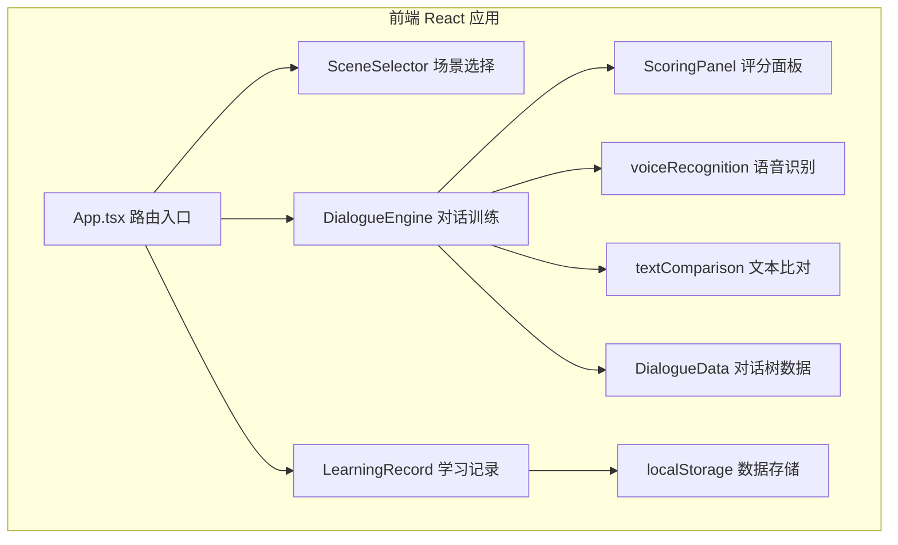

## 1. 架构设计



## 2. 技术描述

- **前端框架**：React 18 + TypeScript
- **构建工具**：Vite
- **路由管理**：react-router-dom v6
- **动画库**：framer-motion
- **语音识别**：Web Speech API（浏览器内置）
- **图表绘制**：Canvas API
- **数据存储**：localStorage
- **HTTP 客户端**：axios（预留）

### 项目初始化
- 使用 Vite + React + TypeScript 模板创建项目
- 包管理器：npm

## 3. 路由定义

| 路由路径 | 页面组件 | 用途说明 |
|----------|----------|----------|
| `/` | SceneSelector | 场景选择首页，展示4个预设场景 |
| `/dialogue/:sceneId` | DialogueEngine | 对话训练页，根据场景ID加载对应对话树 |
| `/records` | LearningRecord | 学习记录页，展示历史数据和趋势图 |

## 4. 文件结构

```
src/
├── App.tsx                  # 根组件，路由配置
├── scenes/
│   ├── SceneSelector.tsx    # 场景选择页面
│   ├── DialogueEngine.tsx   # 对话引擎核心组件
│   └── DialogueData.ts      # 预定义对话树数据
├── components/
│   ├── ScoringPanel.tsx     # 评分面板组件
│   └── LearningRecord.tsx   # 学习记录页面
└── utils/
    ├── voiceRecognition.ts  # 语音识别工具
    └── textComparison.ts    # 文本比对工具
```

## 5. 核心数据模型

### 5.1 对话数据模型

```typescript
interface DialogueTurn {
  roleLine: string;          // 角色台词
  expectedKeywords: string[]; // 期望用户输入关键词
  standardAnswer: string;    // 标准答案文本
  grammarRules: string[];    // 语法规则列表
}

interface SceneData {
  id: string;
  name: string;              // 场景名称
  roleName: string;          // 预设角色名
  turns: DialogueTurn[];     // 8轮对话数组
}
```

### 5.2 评分数据模型

```typescript
interface ScoreResult {
  pronunciationScore: number;   // 发音准确度 0-100
  grammarScore: number;         // 语法准确性 0-100
  grammarErrors: GrammarError[]; // 语法错误列表
  similarity: number;           // 编辑距离相似度 0-1
  isPassed: boolean;            // 是否通过（阈值0.6）
}

interface GrammarError {
  type: string;
  position: number;
  length: number;
  suggestion: string;
}
```

### 5.3 学习记录模型

```typescript
interface TrainingRecord {
  id: string;
  date: string;           // 日期 YYYY-MM-DD
  sceneId: string;
  sceneName: string;
  totalTurns: number;     // 总轮次
  passedTurns: number;    // 通过轮次
  avgResponseTime: number; // 平均响应时间（秒）
  grammarErrorCount: number; // 语法错误次数
  score: number;          // 综合评分
}
```

## 6. 核心算法

### 6.1 编辑距离算法（Levenshtein Distance）
- 计算两个字符串之间的最小编辑次数
- 相似度 = 1 - (编辑距离 / 最长字符串长度)
- 通过阈值：相似度 ≥ 0.6

### 6.2 语法错误检测（正则规则）
- 主谓不一致：检测 I/you/he/she/it/we/they 与动词形式匹配
- 时态错误：检测过去式、现在时、将来时标志词与动词形式匹配
- 冠词错误：检测 a/an 使用错误

### 6.3 对话树匹配逻辑
- 用户输入文本与当前轮的关键词列表匹配
- 匹配成功：角色说下一轮台词
- 匹配失败：角色给出提示或重复当前问题

## 7. 性能优化策略

- 组件按需渲染，使用 React.memo 优化
- Canvas 图表使用 requestAnimationFrame 平滑动画
- localStorage 数据批量读写
- 语音识别结果节流处理
- 图片资源预加载
